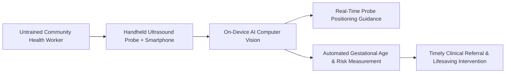

# Indira Negi - Investing in AI Hardware for Health

**Speaker(s):** Ashley Oldacre, Indira Negi · **Channel:** Google for Developers · **Date:** 2025-07-23
**Watch:** https://youtu.be/itoaY1vG2qE?si=deZ8r3s91HgdYJBI · **Format:** Interview / Podcast · **Level:** Beginner
**Topics:** Product/Startup, Machine Learning

## TL;DR

An episode of the People of AI podcast featuring Indira Negi (Senior Advisor and Deputy Director at the Bill & Melinda Gates Foundation). Traces her journey from growing up in Dehradun, India, to leading sensor engineering at Intel, pioneering smartphone ECG hardware at AliveCor, and directing global investments into AI-enabled handheld ultrasound and wearable diagnostics to eliminate maternal and neonatal mortality in low-resource settings.

## Contents

- [From the Himalayas to biosensors: engineering for human impact](#from-the-himalayas-to-biosensors-engineering-for-human-impact)
- [Wearable sensors and ECG diagnostics: Intel and AliveCor](#wearable-sensors-and-ecg-diagnostics-intel-and-alivecor)
- [Gates Foundation mission: AI hardware for maternal and newborn health](#gates-foundation-mission-ai-hardware-for-maternal-and-newborn-health)
- [AI-enabled ultrasound and the future of clinical AI assistance](#ai-enabled-ultrasound-and-the-future-of-clinical-ai-assistance)

---

## From the Himalayas to biosensors: engineering for human impact

Indira Negi grew up in Dehradun in the Himalayan foothills. Driven by a mission to reduce human suffering, she pursued electrical engineering and biosensor research at Arizona State University, developing electrochemical sensors capable of detecting physiological disease markers.

---

## Wearable sensors and ECG diagnostics: Intel and AliveCor

Negi spent over a decade at **Intel**, leading sensor engineering teams for early wearable devices and advising Intel Capital on healthcare venture investments. 

She subsequently joined **AliveCor** as VP of Product Management, bringing smartphone-connected, FDA-cleared electrocardiogram (ECG) hardware to market, democratizing access to clinical cardiac arrhythmia detection.

---

## Gates Foundation mission: AI hardware for maternal and newborn health

In 2021, Negi established the Devices and AI portfolio within the Maternal, Newborn & Child Health Discovery program at the **Bill & Melinda Gates Foundation**:
- **Global Inequity**: In Low- and Middle-Income Countries (LMICs), preventable childbirth complications cause tragic maternal and infant mortality due to acute shortages of trained sonographers and specialized hospital equipment.
- **Engineering Accessible Hardware**: Designing rugged, low-cost diagnostic devices capable of operating without steady grid electricity or continuous internet connectivity.

---

## AI-enabled ultrasound and the future of clinical AI assistance

The Gates Foundation funds innovations pairing low-cost handheld ultrasound probes with on-device computer vision models:
- **Real-Time Guidance**: Assists minimally trained community health workers to capture optimal acoustic windows by providing directional visual cues.
- **Automated Risk Scoring**: Automatically calculates gestational age, detects twin pregnancies, identifies fetal malpresentation, and flags placental complications.
- **Responsible Clinical AI**: Negi highlights the necessity of cultural localization, multi-language support, and rigorous clinical validation when deploying AI health assistants to prevent diagnostic bias.

---

## Source

Full cleaned transcript: `DATA/videos/indira-negi-ai-health-hardware-2025.json`
Raw transcript: `RAW/videos/indira-negi-ai-health-hardware-2025.md`
