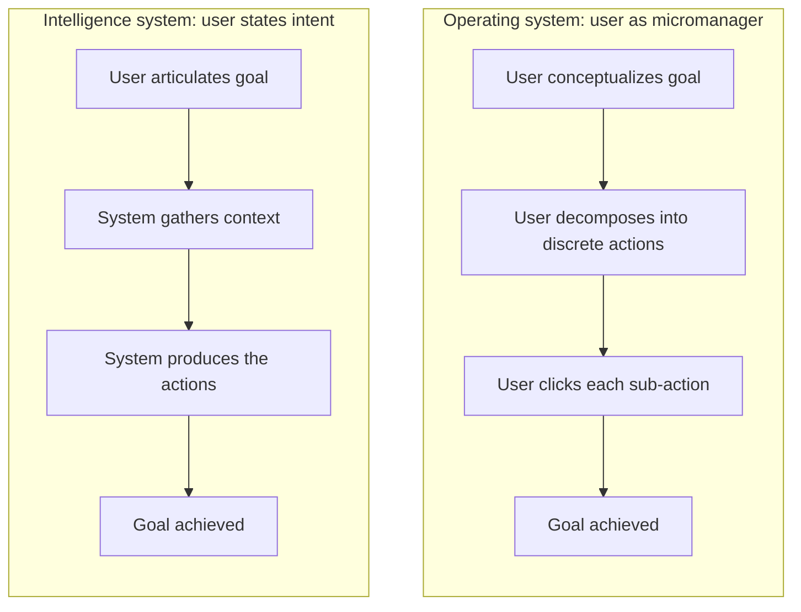
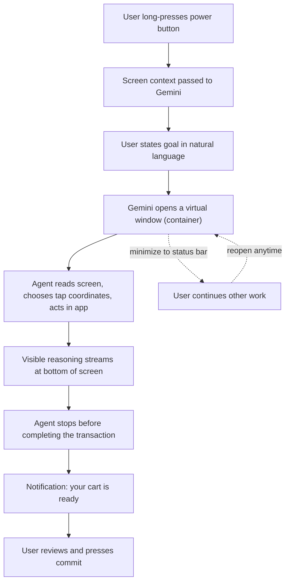
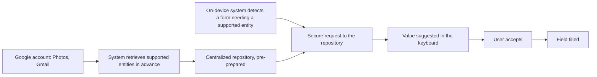
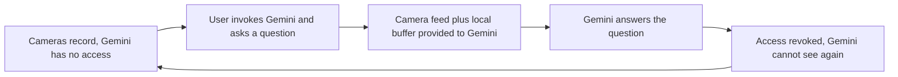

# Sameer Samat on Android 17 and the Future of Intelligent Computing

**Speaker(s):** Sameer Samat, Logan Kilpatrick · **Channel:** Google for Developers · **Date:** 2026-07-01
**Watch:** https://youtu.be/YvVsdZL2ogY?si=9AumEBct2D41ygDy · **Format:** Fireside Chat · **Level:** Intermediate
**Topics:** Android/Mobile · AI Agents · Product/Startup

## TL;DR

Sameer Samat, President of Android at Google, argues that Android's next phase is a move from an operating system, where the user micromanages every click, to an intelligence system, where the user states a goal and the platform works out the actions. He walks through the Gemini Intelligence features that start delivering that (Rambler for voice input, App Automation driving apps inside a containerized virtual window, Superfill for form fields, generative widgets, and Android Halo in the status bar), explains the deliberate decision not to say the word AI once during the Android Show, and demonstrates Gemini running on the infotainment system of an unreleased Volvo EX60 with access to the car's controls and front-facing cameras.

The through-line worth reading for is the positioning discipline: every capability here is described to consumers by its benefit, never by its underlying technology, and each agentic feature ships with an explicit trust boundary (a container the agent cannot leave, a transaction it will not complete, a camera it cannot see through until invoked).

## Contents

- [Why the Android Show never used the word AI](#why-the-android-show-never-used-the-word-ai)
- [Leading with the benefit: on-device scam detection built with DeepMind](#leading-with-the-benefit-on-device-scam-detection-built-with-deepmind)
- [Balancing on-device models across flagship and entry-level devices](#balancing-on-device-models-across-flagship-and-entry-level-devices)
- [From operating systems to intelligence systems](#from-operating-systems-to-intelligence-systems)
- [Rambler: rebuilding the keyboard around voice, with a live demo](#rambler-rebuilding-the-keyboard-around-voice-with-a-live-demo)
- [App Automation and Android's virtual window system](#app-automation-and-androids-virtual-window-system)
- [Gemini Intelligence and Superfill: never fill out a form again](#gemini-intelligence-and-superfill-never-fill-out-a-form-again)
- [Generative widgets and the beginning of generative UI in the OS](#generative-widgets-and-the-beginning-of-generative-ui-in-the-os)
- [Does the agentic shift kill apps: experiential versus transactional](#does-the-agentic-shift-kill-apps-experiential-versus-transactional)
- [Android Halo: a place in the status bar for long-running agents](#android-halo-a-place-in-the-status-bar-for-long-running-agents)
- [Voice as a native interface across form factors](#voice-as-a-native-interface-across-form-factors)
- [Gemini built into the Volvo EX60: natural language car controls](#gemini-built-into-the-volvo-ex60-natural-language-car-controls)
- [Gemini seeing the road with you: front camera grounding](#gemini-seeing-the-road-with-you-front-camera-grounding)

## Why the Android Show never used the word AI

**The Android Show** is Android's own consumer-facing broadcast event, separate from Google I/O, which is the developer conference. The distinction matters to everything in this segment: the two events have different audiences, so they get different vocabulary.

Kilpatrick opens on the scale problem the Android team lives with, which is shipping this technology to literally billions of people, and observes that Samat did not say the word AI once during the Android Show. His broader complaint is that the industry is currently focused on the technology rather than on what it does for the people holding the devices.

Samat's answer is audience discipline. The Android Show audience is largely people who use devices, are excited about technology, and want the product they already own to get better. Some are deep on AI; many are not, because the audience is much wider than a developer audience. His read on the term itself is that something is going on with the word AI: there is a reaction to it, it frightens some people, it means different things to different people, and it has become overloaded. Inside Google, and among technologists generally, it is understood as a platform shift that changes everything. But from a consumer standpoint the lesson is to lead with the benefit rather than the tech.

The feature that taught them this was **Circle to Search** (an Android feature, launched roughly two years before this conversation, that lets you search anything visible on screen without describing it in words). Hold down the Home button, the screen lights up, and you circle any object on it: the tie someone is wearing, the lake in a photo on a social post. Then you ask a question about it, such as where do I buy that, how do I get there, or what is that thing.

Samat's explanation of why it worked is the sharpest line in the segment. These things were genuinely hard to describe to Google before, and if you could describe the tie or the lake well enough to search for it, you would probably already know what it was. Circle to Search removes the requirement to put a query into words at all.

There is a great deal of machine vision behind the feature, and none of it was mentioned in how the feature was presented. They showed what you could do with it, and it took off. On other features where they led with the AI, the reception was cooler, with people responding along the lines of "I don't know about your AI, I'm not feeling that as much." So the show used the word zero times even though many of the features in it are AI powered, and Samat believes the reception was better because people were being told why something is good and helpful in their life.

**Further reading:**
- [Circle to Search on the Google Keyword blog](https://blog.google/products/search/) for the feature's own announcements and later expansions.

## Leading with the benefit: on-device scam detection built with DeepMind

Kilpatrick names the tension directly: during a platform shift everyone is asking who to bet on, and his own read is that Android is at the frontier of pushing that shift forward. He asks how it has actually shown up in the product.

Samat's framing is that the technology matters because it builds better experiences for the user, and that is what drives the team. He offers a useful signal of how much the capability floor has moved. He used to see mockups of a feature or concept from a product manager who had not been around long and have to say it was not going to work. His response now is to bring all of those back, because the tech is ready for them.

His concrete example is scam and spam protection, and it is chosen carefully: Android is very popular in a number of countries where the rate of scam and spam is high, which means a high volume of calls and text messages trying to get people to part with information they should not share.

Working with **Google DeepMind** (Google's AI research division, which also builds the Gemini model family), the team built an **on-device model** (a model that runs on the phone's own hardware rather than sending data to a server, which is what makes listening to a live call defensible from a privacy standpoint) that, with the user's permission, can listen to a call from an unknown number.

The detail that makes this work is not the model, it is the ground truth. They worked with a number of banks to make sure the model understood what a bank would never ask a customer for. Banks have consortiums and associations where they agree on those rules jointly, so there is an authoritative list of prohibited requests to train against. When the model hears one of those requests during a live call, a warning appears and the phone vibrates to say this is a scam and the user should hang up right now.

Samat treats this as the promise of the technology, and repeats the positioning rule: describe it in terms of what it does for you. Kilpatrick notes that Demis Hassabis makes the same point in planning conversations, technology that works for you, and that the unresolved tension is Google also wanting to say it is at the lead and at the frontier.

## Balancing on-device models across flagship and entry-level devices

Kilpatrick observes that several things landed at once and made on-device models legible to a general audience: the **OpenClaw** moment, the release of **Gemma 4** (Google's family of open-weight models, small enough to run locally), and people downloading the **AI Edge Gallery** app (a Google app for trying on-device models directly on a phone) and experimenting with it. The realization spread that on-device models are going to be capable enough to enable new experiences.

He then frames Android's specific bind. There are billions of devices. Running the models needs newer, more performant hardware. And the group without high-end devices is arguably the group that would benefit most.

Samat agrees the strategy is evolving right now, because on-device models are becoming seriously impressive and he thinks they are on the cusp of something amazing. Android's stated mission is to bring the best of computing to everyone in the world, which covers both flagship devices and the most basic device you can buy.

The operational answer is two distinct innovation motions:

1. **Create the future at the high end.** Flagship devices have more system resources. Before you know how to optimize a capability, you spend all the system resources you can and push the boundary of what is possible.
2. **Flow the capability down.** This is a different kind of engineering. You take the kernel of what was built at the flagship level, identify which features are most profound and most interesting, and find ways to run those on less capable hardware. Sometimes that means moving work to the server. Sometimes it means building different specialized on-device models, and working with silicon providers so those models run efficiently inside real thermal and battery constraints.

Samat describes the pattern as sinusoidal: attention swings between the two motions. Right now the focus is the flagship side because that is where the innovation is. Scam detection is one of the features already running on device, and the next phase is flowing that class of feature down over time.

## From operating systems to intelligence systems

This is the conceptual spine of the talk, and it is worth reading slowly.

Samat's claim is that for the last forty-plus years computing has cast the user as the micromanager of the system. The command line asked what you would like to do. The graphical user interface added menus and pointing devices. But in both cases the user conceptualizes the goal, decomposes it into discrete actions, and then clicks through the sub-actions one at a time. He notes the cost of this design honestly: it remains intimidating, and people still take classes to learn software.

The alternative he describes, and the phrase he uses for the next several years of Android, is a move from operating systems to **intelligence systems**. A traditional operating system manages resources. An intelligence system manages resources and context, and its job is to turn a stated goal plus the surrounding context into the actions the user wanted.

Android plans to get this right on flagship devices first. Over time Samat expects the interface itself to change and become intent-to-action oriented rather than micromanagement oriented. Every feature in the rest of this conversation is an instance of that thesis: Rambler moves input from keystrokes to intent, App Automation moves execution from taps to intent, Superfill removes a form-filling chore, and generative widgets remove the dependency on someone having built the widget you want.

## Rambler: rebuilding the keyboard around voice, with a live demo

Kilpatrick asks what changes in the shorter term, and how much voice figures in.

Samat notes that people jump straight to agents when he talks about intent to action, and that agents matter, but he is glad voice came up, because the input method is one of the fundamental parts of an operating system: how does the user tell the system what they want done. The keyboard, physical or on screen, has barely changed. The last significant addition was **autocomplete**, which he dates to roughly 2012, possibly 2013 or 2014, with swipe input as another. Kilpatrick notes he is still fighting autocomplete daily, and Samat agrees it could be a lot better.

The framing that makes the feature click: the keyboard is the perfect example of a micromanagement input system. You think about what you want to say, work out the goal of what you are trying to say, break it into specific words, then peck out the letters of those words. It is so habitual that nobody notices they are doing it.

**Rambler** is the announced feature that changes this, rolling out in summer 2026. When you tap the microphone you simply ramble. Instead of faithfully transcribing exactly what you said in dictation form, Rambler takes everything you said and distills it to what you actually wanted to say, shows it for confirmation, and then you send. Samat grounds the idea in an existing human habit: a brain dump of your ideas is productive because verbalizing surfaces things, and the listener reflects back what mattered. Rambler is the machine equivalent.

The live demo runs in **Google Messages**, using the microphone in **Google Keyboard**, which Samat notes is used hundreds of millions of times a day for voice dictation. He rambles:

> Hey there, if you're going to the store, can you pick up some fruit? Maybe like some bananas, mangoes, strawberries, and oranges. Actually, never mind the bananas. We don't need any more of those. We have plenty of those.

Two things are visible in the output. The hesitation sounds are gone, which is ordinary cleanup. More interesting, the self-correction about bananas is *resolved* rather than transcribed: the model understands the bananas are not wanted and omits them, instead of recording the reversal. That is the difference between transcription and distilling intent. He then asks it to turn the text into a list and to add some emoji, and it does both.

Asked whether it runs on device, Samat says no. Rambler currently talks to the server, and they have made it very fast.

One tuning decision is worth noting for anyone building a comparable feature: they did not want the output to read in a style people associate with a chatbot, so it is tuned for a conversational tone. That is why the first pass did not produce a list and had to be asked. Samat calls the emoji he added gratuitous but did it anyway.

Rambler works for short texts and equally well for dictating something longer such as a paper. It will be a mode you can put the microphone into, and ordinary typing remains available. Samat presents it as a major keyboard upgrade and a concrete instance of an intelligent system: the keyboard itself is now intelligent.

**Further reading:**
- [Android input method framework documentation](https://developer.android.com/develop/ui/views/touch-and-input/input-method) for how keyboards integrate with the platform.

## App Automation and Android's virtual window system

Kilpatrick frames input as step one of the transformation and on-device action as step two: Android going and clicking things in the phone, so the user speaks the intent and Android does the micromanaging.

The feature is called **App Automation**, and Kilpatrick points out it is the ideal illustration of the naming discipline from the opening segment, because the name sells the outcome rather than the technology.

Samat is candid that when they show it to people the reaction is a mix of impressed and slightly nervous, so the team worked on approachability. The main mechanism is a **virtual window system** built into Android: a containerized environment in which the designated app and Gemini both run, which the user can minimize into the status bar and return to at any time.

He grounds it in an example chosen because it has real complexity. He has a list of people coming to his barbecue on screen, with each person's party size and whether they are vegetarian. He long-presses the power button, which passes screen context to Gemini so it can see the document with him, and asks Gemini to go to **Instacart** and put what he will need for the barbecue for all these people into his cart at **Safeway**.

Two boundaries define the design:

- **The agent cannot leave the container.** It cannot use other apps. The user can watch it work, and Samat says it is sometimes fun to watch, because the model's reasoning appears at the bottom of the screen as it goes.
- **The agent stops before completing transactions.** Samat says building trust with the consumer and having that safety around it matters right now, so the agent hands back and the user presses commit. The value proposition is the time saved, not full autonomy.

The most quotable moment is the agent's own reasoning during his barbecue run. Navigating Safeway, it independently arrived at the observation that hot dog buns and hot dogs never come in matching package counts, and its visible reasoning worked through needing more buns than hot dogs and how to resolve that. It also worked out that veggie burgers were needed for the vegetarian guests, added everything, and sent a notification saying the cart was ready.

Kilpatrick asks whether containerized apps running on the phone existed before. Samat's answer clarifies what is genuinely new. Android has always had an app container and a per-app isolation layer. What is new is something *else* driving the screen while confined to that container, inside a minimizable virtual window. There was no need for it before, because these are single-user systems where the user is on the device doing their own thing, and a headless process generating UI in the background served no purpose. The model does need it, because it has to look at and see what is on the screen.

On the longer term, Samat sees three execution paths converging under a single agent, with Gemini deciding which to use for a given goal:

- **MCP** integrations. The Model Context Protocol is an open standard for connecting models to external tools and data sources.
- **Chrome** performing a form of auto browse to manage and complete things on the web.
- This screen-driving approach on the device itself.

Asked whether Automation is vision-based, Samat confirms it is. Gemini looks at the screen and chooses coordinates to tap, using the app exactly as a person would: deciding to open a menu, opening it, tapping the search bar, and searching for hot dog buns. The intended mental model is handing your phone to a trusted assistant and asking them to get something done.

**Further reading:**
- [Model Context Protocol specification](https://modelcontextprotocol.io/) for the open standard Samat refers to.
- [Android application sandbox documentation](https://source.android.com/docs/security/app-sandbox) for the existing per-app isolation layer this feature builds on top of.

## Gemini Intelligence and Superfill: never fill out a form again

**Gemini Intelligence** is the name Google gave to the best Gemini experience on Android, announced at the Android Show a couple of weeks before this conversation. It is a set of bleeding-edge capabilities, and Rambler and App Automation both sit inside it.

The capability Samat is most enthusiastic about is **Superfill**, and his motivation is unusually blunt: he wants to get rid of forms and never fill one out again. After booking a set of flights for a summer vacation he has his fifteen-year-old's passport number memorized, which he does not want to have memorized. Kilpatrick notes he does not know his own passport number.

The concept extends something familiar. **Autofill** already works for your name, your address, and possibly your credit card. Superfill is that, extended to many other fields. Given explicit permission, which Samat stresses is an important step, Gemini can pull information that already exists in your Google account and offer it as you fill a form: a passport uploaded to **Google Photos**, a confirmation code sitting in an email.

Kilpatrick asks the right implementation question. Does the model notice an open field and try to retrieve something plausible, or is there a fixed set of categories? Samat says that initially, to get the **precision and recall trade-off** right (precision being how often a suggestion is correct, recall being how often a fillable field gets a suggestion at all) and to make sure users become comfortable enough to rely on it, they limited it to a set of entity types: passport information, driver's licenses, and vehicle license plates.

His favourite case is the license plate. The DMV registration is sitting in your email. You park, scan the QR code in the lot, and the parking app asks for your plate number while you are already walking away, which normally sends you searching through Photos or Gmail. Superfill offers it directly.

The architecture is worth noting: retrieval happens ahead of time into a centralized repository, not at the moment you hit the form. The on-device system detects a form needing a supported entity, makes a secure request, and presents the value in the keyboard for the user to accept. Samat says all of this is coming in summer 2026.

As an aside, Kilpatrick lobbies to rename Rambler to something built on the word Yap, suggesting Yap Mode, on the grounds that people love to yap. Samat concedes the point and says he would have to check whether it is trademarkable.

**Further reading:**
- [Android Autofill framework documentation](https://developer.android.com/guide/topics/text/autofill) for the existing mechanism Superfill extends.

## Generative widgets and the beginning of generative UI in the OS

**Widgets** on Android are small live panels placed on the home screen, and Samat calls them the ultimate form of customization, long loved as a way to personalize a device. The constraint has always been that someone has to build the widget first.

**Generative widgets** remove that dependency. You tell Gemini what you want to see, for example the latest lap times from yesterday's Formula 1 race, and ask it to keep that updated and build you the widget. Nobody may have built that particular widget. Gemini works for a while and produces exactly that, pulling from publicly available sources of information.

Samat calls this the beginning of **generative UI** for your operating system, meaning interface elements assembled on demand for one user rather than designed in advance for all users, and expects more of the UI to be built on the fly over time.

**Further reading:**
- [Android app widgets overview](https://developer.android.com/develop/ui/views/appwidgets) for how conventional widgets are built today.

## Does the agentic shift kill apps: experiential versus transactional

Kilpatrick recalls the line that Android is the platform for builders, notes everything so far delivers on it, then raises a question he likes to ask inside Google: will Google in five years have ten thousand products or three products. For Android, whose predominant interface is showing up and going through apps, the implications are large. More people are building apps than ever, while everyone appears to be trying to build super apps.

Samat calls it a genuinely interesting moment, because there is talk that there will be no reason for apps at the same time as a wave of first-time developers is being created.

His position is that apps do not go away, and he gets there by attacking a weak argument. The **SaaS-pocalypse** thesis holds that agentic AI removes the need for software-as-a-service applications: users will build their own, or the products lose their interfaces and become commoditized backends. Samat considers that surface-deep, because not all SaaS is the same, and applying the same shallow reasoning to what he calls the **app-pocalypse** requires going deeper.

Going deeper means looking at what consumers actually do. Seventy to eighty plus percent of phone time goes to apps he would call **experiential**: TikTok, YouTube, Instagram, chatting with friends, playing games. Apps that are more **transactional**, such as booking a ride or getting a meal, take up some of the time, but less than you would expect. He is careful to separate time from importance: less time spent does not mean less important.

He suggests plotting apps on a two-by-two, one axis how experiential and the other how transactional, since apps can sit anywhere in between. Time clusters on the experiential, less transactional side.

The conclusion follows from the data rather than from a preference. Nobody wants their agent watching TikTok or YouTube for them. Users still want to kick back, engage with friends on messaging, and play their games. So the transactional apps are the ones that change most, and Samat expects those to end up with two modes: an experiential version offering a richer, more engaging experience, and a mode where the app is almost agentic itself, responding to agentic queries from other systems.

His example is **Google Maps**, with the caveat that he does not run the Maps team. Maps has an **Ask Maps** feature, which he reads as its agentic mode of being. Planning an event, you might ask your agent for good venues around Tahoe. Then, wanting to understand the indoor to outdoor flow of a specific venue, you open Maps yourself, switch to satellite view, and zoom in to look around. That second part is irreducibly experiential.

Kilpatrick draws a parallel to retail. Buying his mother something at Williams-Sonoma, the staff greeted him warmly and offered coffee when he had come in for a spatula, which struck him as deliberately experiential and unlike a normal shopping trip. On the same company's website he is in transaction mode: find the thing, fewest clicks, buy, leave. Physical retailers have made the in-store experience richer precisely because customers can now transact elsewhere, which is the same two-mode split Samat predicts for apps.

Samat adds the demand-side argument: easier completion expands usage. If something becomes much easier to get done, he does more of it, and retail plus commerce combined, offline and online, is larger than it was before. He closes on the historical pattern. In every platform shift there is a narrative that the old thing completely disappears, and it usually does not. The web did not eliminate physical locations, and physical experiences are arguably becoming more important. Mobile did not eliminate the desktop. He considers the agentic move huge and profound and will not predict that it behaves differently, but his expectation is accumulation rather than replacement.

## Android Halo: a place in the status bar for long-running agents

**Android Halo** is a dedicated location in the status bar where the user's agent of choice, Gemini or another agent, can post updates and take input on the tasks it is running.

The need is structural rather than cosmetic. An agent working in the background will need to ask a question, give an update, or show a result, and a long-running task has no natural home in an interface built around foreground apps. Halo gives it one, and Samat presents it as a new spot for how computing may evolve, with the operating system making it more seamless to engage with work that outlives the moment you started it.

Note the deliberate openness: Halo is described as the surface for *an* agent of choice, Gemini or another agent, rather than a Gemini-only feature.

## Voice as a native interface across form factors

Samat's case for voice starts with form factor rather than preference. In a car, with a pair of glasses, or on a run with a watch, voice is the only sensible interface. In those cases natural language understanding is not a convenience, it is what makes the channel usable at all, where previously the experience was workable but awkward.

He then adds a generational observation and an efficiency argument. Younger users, including his own children, hardly type on their phones and constantly use the microphone, and sending voice recordings rather than text is common. On efficiency, you can typically speak three to five times faster than you can type.

Kilpatrick notes the broader consequence: places where you previously could not wield intelligence are opening up, because you could not do anything useful in a car while focusing on driving.

## Gemini built into the Volvo EX60: natural language car controls

The demo moves into a **Volvo EX60**, which had not shipped at the time of recording.

The car has **Google built-in**, which means Google and Gemini run on the infotainment system powered by Android rather than being projected from a phone. That distinction is the point of the segment: because Gemini is resident on the car's own system, Android and Gemini have much deeper access to the vehicle's controls than a phone-projection model such as Android Auto would allow.

Two demonstrations follow:

- **Climate.** Samat says the car is stuffy and asks Gemini to adjust the climate. Gemini replies that it is increasing the fan speed and turning off air recirculation, and applies both. He notes he would not normally have the climate menu open while driving, so seeing the changes on screen is the confirmation.
- **Driver assistance.** Without touching any physical control he asks Gemini to turn on **lane keeping assist**, and it confirms it is turning on the lane keeping aid.

The capability he emphasizes is not the actions themselves but the absence of a required phrasing. There is no longer a need to say an exact command in an exact way, which he attributes to Gemini.

## Gemini seeing the road with you: front camera grounding

The second capability wired into this vehicle connects Gemini to the car's front-facing cameras, to find out what becomes possible if Gemini can see the world as you drive through it.

Samat is explicit about the privacy design, and it is the part worth carrying away:

Gemini is not watching what you are seeing at all times. The feed is provided only when you invoke it and ask a question, for a limited period, after which Gemini loses the ability to see again. Asked whether it sees only from the moment of activation onward, Samat says it keeps a local buffer, so a question about something just passed can still be answered.

Three live queries follow, and they are a fair illustration of what grounded visual question answering looks like in motion:

1. Asked what it sees around them, Gemini reports they are at the Googleplex in Mountain View surrounded by lush greenery and modern office buildings, and identifies Google Building 1020 Charleston Road on the left, describing its brick-accented exterior and noting it is part of the extensive Landings office complex.
2. Samat asks about a white sculpture ahead on the right and the building behind it, something he says he had always wondered about and could not describe well enough to look up. Gemini identifies the sculpture as **the Orb**, a thirty-three-foot-tall public art installation made of over 6,400 aluminum panels that create unique light patterns, and the building behind it as **Gradient Canopy**, noting its signature dragon-scale solar roof that generates a significant portion of the building's own power. Neither speaker knew about the solar roof.
3. Asked about a white tent-like set of buildings on the left, Gemini identifies them as part of the **Shoreline Amphitheater**, an outdoor music venue known for its distinctive peaked roof design, built on a former landfill, now hosting major concerts and festivals in a scenic park-like setting.

Note that query two is the car-window version of the Circle to Search argument from the opening segment: Samat could not describe the sculpture well enough to search for it, which is exactly why pointing at it works better than typing about it.

Samat frames the open question as how Gemini seeing along with you can genuinely make life easier, and says the team is still working through how best to launch this in vehicles. Kilpatrick suggests grounding against Street View when you are trying to find the right place to turn and the location looks unfamiliar. Samat adds street signs in a different language, or signs that are simply confusing, as cases where explanation on the spot would help.

## Source

- Structured record: [`DATA/videos/sameer-samat-android17-2026.json`](../../DATA/videos/sameer-samat-android17-2026.json)
- Original video: https://youtu.be/YvVsdZL2ogY?si=9AumEBct2D41ygDy

Raw transcripts are held locally and are not published in this repository. The cleaned, segment-by-segment transcript lives in the structured record linked above.
