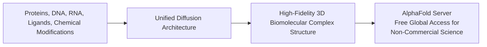

# Science in the Age of AI

**Speaker(s):** James Manyika, Pushmeet Kohli, Joëlle Barral, Anima Anandkumar · **Channel:** Google for Developers · **Date:** 2025-05-23
**Watch:** https://youtu.be/NYtQuneZMXc?si=0xRnvtYslsp-UHKV · **Format:** Keynote / Panel · **Level:** Intermediate
**Topics:** Machine Learning, LLM Fundamentals

## TL;DR

Google I/O 2025 science keynote exploring transformative AI applications across structural biology, therapeutics, medical diagnostics, and climate physics. Leaders from Google DeepMind, Google Research, and Caltech discuss **AlphaFold 3** and the free AlphaFold Server, **TxGemma** open therapeutic models, **AMIE** multimodal diagnostic conversational agents, and neural PDE solvers for extreme weather prediction.

## Contents

- [AI driving landmark advances across the scientific frontier](#ai-driving-landmark-advances-across-the-scientific-frontier)
- [AlphaFold 3 and the AlphaFold Server: modeling the entire biomolecular universe](#alphafold-3-and-the-alphafold-server-modeling-the-entire-biomolecular-universe)
- [Therapeutics and clinical AI: TxGemma and AMIE multimodal diagnostics](#therapeutics-and-clinical-ai-txgemma-and-amie-multimodal-diagnostics)
- [AI for physical sciences and climate modeling with Anima Anandkumar](#ai-for-physical-sciences-and-climate-modeling-with-anima-anandkumar)

---

## AI driving landmark advances across the scientific frontier

James Manyika opens the keynote with a fundamental perspective: AI is not merely an engine of digital productivity, but a catalytic scientific instrument akin to the microscope or telescope, enabling researchers to simulate and understand natural phenomena across astronomical and molecular scales.

---

## AlphaFold 3 and the AlphaFold Server: modeling the entire biomolecular universe

Pushmeet Kohli (VP of Science, Google DeepMind) explains the leap from AlphaFold 2 to **AlphaFold 3**:

- **Beyond Single Proteins**: Accurately predicts joint 3D structures and binding dynamics across all major biological molecule classes simultaneously.
- **AlphaFold Server**: A free, accessible web platform enabling biologists worldwide to run molecular structure predictions in seconds without dedicated supercomputer clusters.

---

## Therapeutics and clinical AI: TxGemma and AMIE multimodal diagnostics

Joëlle Barral presents breakthroughs in medical AI:
- **TxGemma**: Open-weights foundation models specialized in molecular representation learning, target identification, and therapeutic molecule design.
- **AMIE (Articulate Medical Intelligence Explorer)**: A research diagnostic agent that combines clinical conversational reasoning with multi-modal visual inspection (analyzing dermatological lesions and radiological imaging), demonstrating diagnostic accuracy matching or exceeding primary care physicians in simulated clinical trials.

---

## AI for physical sciences and climate modeling with Anima Anandkumar

Caltech Professor Anima Anandkumar details physics-informed machine learning and **Fourier Neural Operators (FNOs)**:
- **Neural PDE Solvers**: Solves complex Partial Differential Equations (fluid mechanics, wave equations, atmospheric turbulence) up to thousands of times faster than traditional numerical solvers.
- **GraphCast & Climate Forecasting**: Predicts global weather trajectories and extreme weather events 10 days in advance with superior accuracy to conventional numerical weather prediction models.

---

## Source

Full cleaned transcript: `DATA/videos/science-in-the-age-of-ai-2025.json`
Raw transcript: `RAW/videos/science-in-the-age-of-ai-2025.md`
