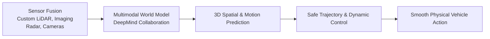

# Waymo: AI in the Physical World Powering the Future of Driving

**Speaker(s):** Aditi Roy, Dmitri Dolgov · **Channel:** Google for Developers · **Date:** 2025-05-24
**Watch:** https://youtu.be/jnUUo7xso_0?si=jYl4_yDJ1PLwELi9 · **Format:** Keynote / Fireside Chat · **Level:** Intermediate
**Topics:** Machine Learning, Product/Startup

## TL;DR

Google I/O 2025 keynote fireside chat with Waymo Co-CEO Dmitri Dolgov. Explores the 15-year evolution of autonomous driving from Google's initial self-driving project to operating over 250,000 weekly commercial driverless rides across Phoenix, San Francisco, Los Angeles, and Austin. Discusses multimodal physical AI, foundation world models, sensor fusion, and safety data demonstrating an 85% reduction in injury-causing crashes.

## Contents

- [The imperative for autonomous mobility: road safety and human error](#the-imperative-for-autonomous-mobility-road-safety-and-human-error)
- [Scaling commercial operations: 250,000+ weekly driverless rides](#scaling-commercial-operations-250000-weekly-driverless-rides)
- [Physical AI and foundation world models for autonomous driving](#physical-ai-and-foundation-world-models-for-autonomous-driving)
- [Empirical safety data and the 6th-generation Waymo Driver](#empirical-safety-data-and-the-6th-generation-waymo-driver)

---

## The imperative for autonomous mobility: road safety and human error

Worldwide, over 1.3 million people lose their lives to traffic collisions every year, representing one death every 26 seconds. The vast majority of these fatal collisions result from human error (distraction, speeding, fatigue, intoxication).

Waymo was founded over 15 years ago to eliminate traffic tragedies by building the world's most experienced, attentive, and reliable driver.

---

## Scaling commercial operations: 250,000+ weekly driverless rides

Waymo has successfully transitioned from research into commercial scale:
- Serves over 250,000 paid commercial driverless passenger rides every week.
- Operates across high-density urban environments: San Francisco, Phoenix, Los Angeles, and Austin.
- Maintains industry-leading passenger safety and customer satisfaction ratings.

---

## Physical AI and foundation world models for autonomous driving

Unlike digital agents operating in symbolic text, autonomous vehicles must perceive and act in real-time physical space:

- **Sensor Fusion**: Combines high-resolution LiDAR (3D geometric point clouds), long-range imaging radar (all-weather velocity detection), and surround cameras.
- **Multimodal World Models**: Developed with Google DeepMind to predict the behavioral trajectories of cyclists, pedestrians, emergency vehicles, and erratic drivers across varying weather conditions.

---

## Empirical safety data and the 6th-generation Waymo Driver

Over tens of millions of commercial driverless miles:
- **85% Crash Reduction**: Waymo vehicles demonstrate an 85% reduction in injury-causing crashes compared to human drivers in identical urban operating domains.
- **6th-Generation Waymo Driver**: Optimizes sensor placement, reduces hardware manufacturing costs, enhances cold-weather and winter capabilities, and accelerates global fleet deployment.

---

## Source

Full cleaned transcript: `DATA/videos/waymo-ai-physical-world-2025.json`
Raw transcript: `RAW/videos/waymo-ai-physical-world-2025.md`
