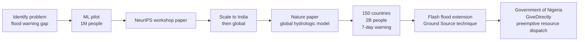
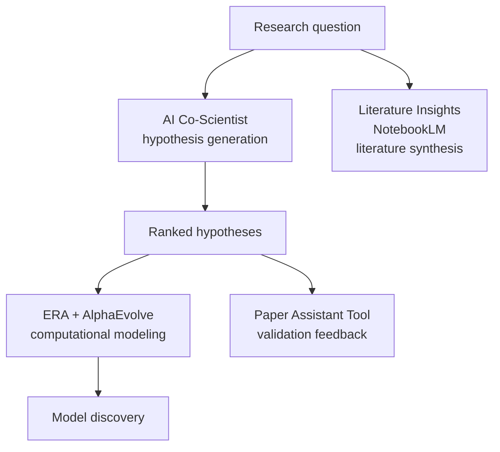

# Yossi Matias on the golden age of research

**Speaker(s):** Yossi Matias, Logan Kilpatrick - **Channel:** Google for Developers - **Date:** 2026-06-12
**Watch:** https://youtu.be/FPBwadTeph0?si=pPTO_eUXVrUf1Oq0 - **Format:** Fireside Chat - **Level:** Intermediate
**Topics:** Research/Papers - AI Agents - LLM Fundamentals

## TL;DR

Yossi Matias, VP and Head of Google Research, walks through the "magic cycle" of research from breakthrough to product impact across flood forecasting, health AI, scientific discovery tools, LLM efficiency, and quantum computing. The throughline is that AI now both accelerates research and is accelerated by research, and that this moment represents an unprecedented golden age for doing science.

## Contents

- [The mission of Google Research and the magic cycle](#the-mission-of-google-research-and-the-magic-cycle)
- [Google Earth AI and planetary intelligence](#google-earth-ai-and-planetary-intelligence)
- [MedGemma: open health AI with offline capability](#medgemma-open-health-ai-with-offline-capability)
- [AI as an amplifier of human ingenuity](#ai-as-an-amplifier-of-human-ingenuity)
- [Flood forecasting: from impossible to 150 countries](#flood-forecasting-from-impossible-to-150-countries)
- [Healthcare AI: diabetic retinopathy screening to mammography](#healthcare-ai-diabetic-retinopathy-screening-to-mammography)
- [AI Co-Scientist: hypothesis generation across disciplines](#ai-co-scientist-hypothesis-generation-across-disciplines)
- [The validation bottleneck and Paper Assistant Tool](#the-validation-bottleneck-and-paper-assistant-tool)
- [ERA and Gemini for Science](#era-and-gemini-for-science)
- [Speculative decoding and LLM efficiency research](#speculative-decoding-and-llm-efficiency-research)
- [Generative UI](#generative-ui)
- [LLM factuality research since 2021](#llm-factuality-research-since-2021)
- [Quantum computing: Willow chip and verifiable quantum advantage](#quantum-computing-willow-chip-and-verifiable-quantum-advantage)
- [Education, LearnLM, and skills for the future](#education-learnlm-and-skills-for-the-future)
- [Yossi Matias background and the research-product connection](#yossi-matias-background-and-the-research-product-connection)

## The mission of Google Research and the magic cycle

Google Research's stated mission is to make the impossible possible. Matias operationalizes this as: identify a problem that could make a meaningful difference and genuinely requires moving the state of the art, drive the breakthrough research, publish it, then apply it to reality.

He calls the resulting pattern the **magic cycle of research**: not a pipeline but a cycle, because applying research to reality always creates the next research question. The cycle has been running for over a decade at Google Research but is now accelerating, both because AI is improving the tools researchers use and because Google Research is actively contributing to those improvements.

The scope is unusually broad: foundational ML, systems, quantum computing, generative AI architectures, health AI, education, and climate. Matias points to Alan Turing as a historical model of someone who set theoretical foundations (computability, the Turing test) while also building a functioning computer and running Enigma.

## Google Earth AI and planetary intelligence

**Google Earth AI** is a platform that unifies previously separate geospatial models under an agentic AI layer:

- Flood prediction models
- **WeatherNext** storm prediction (joint work with Google DeepMind)
- Remote sensing foundation models
- Various specialized geospatial models developed over many years

Before unification, each model was already valuable independently. Earth AI makes them composable and accessible to external builders via API. One example of downstream research: a collaboration between Harvard, Boston Children's Hospital, and Mount Sinai used Earth AI to analyze measles vaccination coverage at ZIP code granularity across the United States, published in Nature.

## MedGemma: open health AI with offline capability

**MedGemma** takes health AI models developed by Google Research and packages them on **Gemma** as an open model. It was released on a platform Matias calls **High-Def**, designed specifically for health model distribution.

Key metric: more than 5 million downloads.

A Uganda case study illustrates the design intent: a developer built a maternal and neonatal health application on MedGemma that runs entirely offline. In a specific documented case, the application helped save a mother and baby in a village without internet access. The developers noted that **Gemma 4** was the first model they encountered that combined multimodality and agentic capability in a package deployable under low-resource, offline constraints, allowing frontier-level AI development from Kampala rather than requiring a large research lab.

## AI as an amplifier of human ingenuity

Matias consistently frames AI's purpose as amplifying human ingenuity rather than replacing human workers. He gives three classes of beneficiaries:

1. **Healthcare workers**: AI provides decision support without replacing clinical judgment
2. **Scientists**: AI handles literature search and hypothesis generation while humans direct research
3. **Teachers and educators**: AI handles assessment at scale while teachers focus on inspiration

A concrete example: **NeuralGCM**, a global circulation model developed with the University of Chicago, provided early weather warnings to 38 million farmers in India. At 130 million total farmers in India, tools that help farmers represent an impact at a scale that default assumptions about AI users tend to underestimate.

## Flood forecasting: from impossible to 150 countries

The flood prediction program is Matias's clearest example of the magic cycle over a long timeline.

**Starting point (early 2010s)**: A visit to a Bihar, India village hit overnight by a flood, where several people perished, motivated him to try to build a warning system. Hydrology experts told him it was too complex with too many variables. He decided to try anyway.

**Iteration**:
1. A small pilot using ML and cloud infrastructure, covering about 1 million people, showed prediction was feasible
2. A NeurIPS workshop paper stated the hypothesis publicly
3. The team scaled the pilot by 10x, then to all of India
4. A global hydrologic model was published in Nature, leveraging global data to improve predictions even in areas without local data
5. Scale reached: **150 countries, 2 billion people, up to 7 days advance warning**

**Flash flood extension**: River flood models do not help with flash floods, which are equally devastating but structurally different (fast-onset, often urban). No labeled dataset existed. The innovation was **Ground Source**: using Gemini to process public news data and distill 2.6 million labeled urban flash flood events, which trained a working prediction model. This is now part of Earth AI.

**Real-world use**: The government of Nigeria used the Earth AI API to identify which villages would be hit, then transferred funds to those villages ahead of time for evacuation. GiveDirectly pre-positioned resources similarly.

## Healthcare AI: diabetic retinopathy screening to mammography

Google Research has been working on health AI for over a decade. Three milestones:

**1. Diabetic retinopathy (2016)**
A paper in JAMA showed AI could screen for diabetic retinopathy on par with expert ophthalmologists. Retinopathy is preventable if caught, but there is a global shortage of eye specialists. By 2023-2024, the system was deployed in Bangkok clinics: patients sit in front of a camera and receive results in **two minutes** instead of waiting weeks. The faster result loop increased follow-up rates, improving outcomes beyond what pure accuracy improvements alone would have achieved.

**2. Mammography with NHS (2024-2025)**
Two Nature papers documented an NHS study using AI as a second reader for mammography in the UK:
- AI identified **25% of diagnoses that human radiologists missed**
- Returned roughly **40% of radiologist time**

**3. Language models for clinical tasks**
- **MedPaLM**: first paper showing a language model could pass medical licensing exam questions, then achieve expert-level performance
- By the time a follow-up paper appeared, **HCA Healthcare** was already piloting LLMs for end-of-shift nursing reports
- **AMI (Articulate Medical Intelligence Explorer)**: conversational AI for medical diagnostics, now in a clinical pilot with **Included Health**

Matias notes that AI adoption in healthcare is running at roughly twice the rate of other industries.

## AI Co-Scientist: hypothesis generation across disciplines

**AI Co-Scientist** is a multi-agent system for scientific research assistance. Given a research question from a scientist, it performs:

1. **Literature search**: as broad as needed, including cross-disciplinary literature that a human specialist would likely not encounter
2. **Hypothesis generation**: produces candidate hypotheses relevant to the research question
3. **Ranking and validation**: filters candidates against the literature to surface the most promising hypotheses

Matias describes it as a virtual lab performing the work that a very senior researcher would do for junior colleagues, or as a polymath in your pocket because it can bridge disciplines in ways that individual human experts rarely can.

**Key result at Imperial College**: researchers had spent nearly a decade working toward a specific bacterial hypothesis that they had not yet published. AI Co-Scientist independently reached the same hypothesis in a couple of days, and additionally surfaced hypotheses the team had not been considering. The lead researcher described working with it as collaborating with an amazing colleague.

Other active partnerships: Stanford (liver fibrosis), multiple drug repurposing programs. Some partners have already published papers based on Co-Scientist-generated hypotheses.

Matias draws an analogy to **Move 37** in AlphaGo's 2016 match against Lee Sedol: a move that no human would have played, but that proved highly effective. High-capability AI exploring hypothesis space can reach non-obvious but valid conclusions that humans would not have considered.

## The validation bottleneck and Paper Assistant Tool

As hypothesis generation accelerates, the bottleneck shifts to validation. Matias argues this makes rigorous adherence to the scientific method more important than ever, not less. Two dimensions of concern:

1. **Accuracy of claims**: ensuring that what AI generates is actually correct
2. **Calibrated confidence**: knowing not just whether a claim is true but how confident the system is - critical for agentic use

**Paper Assistant Tool (PAT)** is an experimental AI tool that receives a paper draft and provides structured feedback to the authors. Google partnered with three major venues to make PAT available before submission deadlines:
- ICML (machine learning)
- STOC (theoretical computer science)
- NeurIPS (neural information processing)

Approximately 10,000 papers were uploaded. Authors reported that PAT identified gaps in experimental design and suggested additional experiments to strengthen claims. Matias describes this as a first step toward systematic AI-assisted validation infrastructure.

## ERA and Gemini for Science

**ERA (Empirical Research Assistants)** addresses the bottleneck of building computational models. The use case: a researcher has a scoreable problem (they know what they are trying to compute and how to measure quality) and input data, but building the right model architecture and tuning its parameters is weeks or months of work.

ERA automates that search through thousands of model architectures and parameter configurations to find a good solution. The Nature paper on ERA was accompanied by the simultaneous release of eight research papers in different domains that ERA enabled, including:
- Cosmology
- Epidemiology
- Engineering
- Economics

**Gemini for Science** was announced as an integrated offering combining three tools:
- **AI Co-Scientist**: hypothesis generation
- **ERA + AlphaEvolve**: computational modeling and discovery
- **Literature Insights** (built with NotebookLM): literature search and synthesis

The vision is a world where any motivated researcher, regardless of career stage, can run a virtual lab: ask bigger questions, get literature synthesis and hypothesis generation from Co-Scientist, build and tune models with ERA, and validate against existing literature.

## Speculative decoding and LLM efficiency research

**Speculative decoding** was developed at Google Research to accelerate LLM inference. The mechanism: a smaller "draft" model rapidly generates candidate token sequences, which a larger model then verifies in parallel. This exploits the fact that verification is faster than generation.

The result: **2x or more improvement in both latency and throughput** with no quality loss. Matias calls this an algorithmic free lunch, a rare situation where efficiency gains have no accuracy cost.

The technique has become an industry standard. Matias's claim: the entire world is running LLMs as if there were at least twice as many chips, purely due to speculative decoding and its variants.

Applied to Gemma 4, a team achieved a **3x performance improvement**.

Matias frames the efficiency frontier as non-linear and expects step-function improvements at 10x or 100x to be achievable algorithmically or architecturally, though no specific timeline or approach is given.

**Further reading:** Google Research blog on speculative decoding: https://research.google/blog/looking-back-at-speculative-decoding/

## Generative UI

**GenUI (Generative UI)** uses generative AI not just to produce content but to decide how to present that content. The idea: given a piece of content, the AI determines which visual format, layout, or interaction pattern will make it most understandable and actionable.

Matias describes it as a very Google problem, connecting directly to Google's mission of organizing the world's information. The research-to-product cycle for GenUI was among the fastest Matias has seen: from initial prototype to deployment in Google Search and the Gemini app within months. AI tools were used during development to accelerate the prototyping itself. Generative UI is now a major underlying mechanism for AI Overviews and other Search experiences.

**Related:** [Sameer Samat on Android 17 and the Future of Intelligent Computing](sameer-samat-android17-2026.md) - discusses generative widgets and the shift from OS-level to intelligence-layer UX

## LLM factuality research since 2021

Google Research began factuality research in 2021 when very few in the field thought LLM factuality would become a central concern. Timeline:

- **2021**: One of the first papers on measuring LLM consistency, published with academic collaborators
- **2022**: Release of the **True benchmark** for factuality evaluation, open for other developers to test against
- **2022-2026**: Results applied incrementally to Bard, PaLM, PaLM 2, and Gemini in close collaboration with Google DeepMind
- **Ongoing**: A public factuality leaderboard encourages external models to benchmark themselves

Matias argues that factuality requirements become more nuanced as models take on agentic tasks. It is not enough to know whether a statement is correct; calibrated confidence in outputs becomes critical when models are acting on behalf of users. This directly connects to the PAT and Co-Scientist validation challenges discussed above.

## Quantum computing: Willow chip and verifiable quantum advantage

**Background**: Peter Shor (whose office at Bell Labs was adjacent to Matias's) demonstrated in the 1990s that a quantum computer could factor large integers exponentially faster than classical computers, a result that threatens current cryptographic systems. This established a concrete practical motivation for building quantum hardware. Since then, roughly 70 known quantum computational advantages over classical computing have been identified.

**Nobel Prize 2025**: Awarded for work done in the 1980s on superconducting qubits by:
- **Michel Devoret** (Google Quantum AI lab)
- **John Martinis** (formerly Google Quantum AI lab)
- **John Clarke** (Berkeley, collaborator)

The delay from 1980s work to 2025 Nobel recognition reflects how long it takes for foundational hardware work to prove out at scale.

**Willow chip (2024)**: Two milestones:

1. **Quantum error correction**: **Quantum error correction** (QEC) addresses the fact that physical qubit operations are inherently noisy and probabilistic. Unlike classical error correction, you cannot simply copy qubit states (due to the no-cloning theorem), so QEC requires more complex schemes. The Willow chip demonstrated QEC performance dramatically better than any previous system, showing that error rates decrease as the number of physical qubits increases - a key condition for scalable quantum computing.

2. **Verifiable quantum advantage**: A specific computational problem was solved 13,000 times faster than the best classical computer, with the result independently verifiable. This is distinct from earlier quantum advantage claims in that the result could be checked.

**Expected advantages**: Material simulation, quantum sensing, and generating synthetic data for training AI models on systems (like molecular dynamics) that are too computationally expensive to simulate classically.

Matias's framing: quantum will complement rather than replace classical computing. Its role is to unlock problems that are currently out of reach even with abundant classical compute.

## Education, LearnLM, and skills for the future

Matias's answer to the question "if you had a magic wand for climate, what would you use it for?" is: ensuring every child gets the right education, because educated people are the ones who will solve climate and every other problem. AI as an amplifier of human ingenuity becomes a force multiplier when applied to education.

**LearnLM**: A Gemini model variant tuned specifically for educational contexts. Capabilities include adaptive re-leveling, quiz generation, and real-time assessment. Integrated into Gemini and available for third-party developers. A Ghana high school teacher using a third-party LearnLM-based app: students went from receiving assessment feedback once or twice a week to every day; the teacher reclaimed 5 hours per week.

**Learn Your Way**: An experiment in multimodal personalized textbooks. Teaching gravity differently for a 10-year-old who loves soccer vs. a 16-year-old who plays tennis.

**AI Quest**: Developed with Stanford Education Center. Exposes children to AI opportunities as a skilling initiative.

**Vantage**: Developed with NYU. Measures and develops collaboration skills, which Matias argues will become among the most important capabilities as the human role shifts toward asking the right questions, directing AI, and validating outputs.

On fundamentals: Matias argues computational thinking and basic computer science should be taught more rigorously, not less, for the same reason mathematics remained important after calculators became ubiquitous. He also calls out soft skills as real skills that need deliberate teaching: collaboration, knowing what questions to ask, and evaluating the quality of answers.

## Yossi Matias background and the research-product connection

Matias worked at Bell Labs mathematical center during the period when Claude Shannon and Richard Hamming had previously worked there, with Paul Erdos visiting annually. His most cited theoretical work was motivated by what was then the world's largest data warehouse, and the resulting ideas helped found the field of data stream analytics that underpins modern big data infrastructure.

At Google, he spent over a decade in Search leadership, building products including Google Trends and Autocomplete.

He led **Google Duplex**, the 2018 demonstration of an AI system that made restaurant reservations by phone. He had given a TEDx talk asking whether people would ever simply talk to computers as naturally as they talk to each other. Today that question has been answered.

He explicitly rejects the framing of **technology transfer** as a term for moving research into products. His view: technology transfer implies a one-way, one-time handoff. What actually works is a bidirectional, iterative cycle where product challenges create research questions and research results create product possibilities. The same team that pushed the science on flood prediction built the system now covering 2 billion people and is also working on the next research question.

## Source

Full cleaned transcript: `DATA/videos/yossi-matias-research-golden-age-2026.json`
Raw transcript: `RAW/videos/yossi-matias-research-golden-age-2026.md`