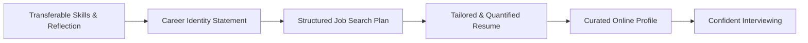

# How to Use AI for Your Job Search | Google Career Certificates

**Speaker(s):** Tony, Sydney · **Channel:** Grow with Google · **Date:** 2026-01-28
**Watch:** https://youtu.be/Iw_G_j1o6fQ?si=PriKzpvDryQEE_xp · **Format:** Course / Tutorial · **Level:** Beginner
**Topics:** Product/Startup, LLM Fundamentals

## TL;DR

A comprehensive practical guide from Google Career Certificates on utilizing generative AI tools (Gemini, Career Dreamer) across every phase of the job search. Learn how to identify transferable skills, build a career identity statement, structure focused job search roadmaps, write tailored and quantifiable resumes, curate a professional online brand, and prepare for interviews.

## Contents

- [Introduction: structuring the modern job search with AI](#introduction-structuring-the-modern-job-search-with-ai)
- [Identifying transferable skills and skills-based hiring](#identifying-transferable-skills-and-skills-based-hiring)
- [Career identity statements and the Career Dreamer tool](#career-identity-statements-and-the-career-dreamer-tool)
- [Building a customized job search plan with Gemini](#building-a-customized-job-search-plan-with-gemini)
- [Resume best practices: content, structure, and AI tailoring](#resume-best-practices-content-structure-and-ai-tailoring)
- [Building and curating a professional online presence](#building-and-curating-a-professional-online-presence)

---

## Introduction: structuring the modern job search with AI

The average US job search takes approximately 20 weeks and involves hundreds of applications. Generative AI tools serve as collaborative assistants to reduce friction, organize workflows, and build tailored materials across each milestone of the career transition journey.



---

## Identifying transferable skills and skills-based hiring

Modern employers increasingly adopt **skills-based hiring**, evaluating candidate abilities over formal pedigree or rigid job titles.

To uncover transferable skills:
1. **Reflect on Life Experiences**: Audit volunteer work, sports coaching, military service, student leadership, and previous jobs.
2. **Isolate Competencies**: Identify universal capabilities developed (e.g., conflict resolution, budget coordination, stakeholder communication).
3. **Map to Target Roles**: Translate non-traditional experiences into the functional language of prospective job descriptions.

---

## Career identity statements and the Career Dreamer tool

A **Career Identity Statement** acts as a personal North Star, articulating what you bring to the table in a concise, authentic paragraph suitable for LinkedIn bios, cover letters, and networking introductions.

**Career Dreamer** (`grow.google/careerdreamer`):
- Connects user background details with real-time labor market data from **Lightcast**.
- Decomposes everyday tasks into industry-recognized transferable skills.
- Uses Gemini to iteratively draft and refine authentic career identity statements.

---

## Building a customized job search plan with Gemini

Job seekers who follow a structured search plan are 30% more likely to secure job offers.

Using Gemini, job seekers can structure an iterative weekly roadmap:
```
Act as an experienced career coach. Help me build a realistic, step-by-step job search plan for transitioning into a Project Coordinator role. 
I have 10 hours per week to dedicate. 
Here is my Career Identity Statement: [Insert Statement]
Provide the plan as a weekly checklist covering research, networking, applications, and follow-ups.
```

---

## Resume best practices: content, structure, and AI tailoring

Recruiters spend an average of 7.4 seconds scanning a resume. Resumes must be optimized across three dimensions:

- **Measurable Content**: Replace generic descriptions with quantified business impact (e.g., "Increased new product sales by 30% over quota by closing 8 enterprise accounts in under 3 months").
- **Scannable Structure**: Concise 1-2 page layout, clear section headers, and prominent skill keywords.
- **AI-Assisted Personalization**: Iteratively aligning resume bullet points with specific target job requirements rather than blasting generic resumes.

---

## Building and curating a professional online presence

A professional online profile serves as an always-on networking engine:
- **Platform Alignment**: GitHub for software developers, Behance for creative designers, LinkedIn for general professional networking.
- **Active Engagement**: Sharing project retrospectives, discussing industry developments, and showcasing a growth mindset.
- **Privacy Audit**: Verifying that personal social media settings are appropriately partitioned from public professional identities.

---

## Source

Full cleaned transcript: `DATA/videos/ai-for-job-search-2026.json`
Raw transcript: `RAW/videos/ai-for-job-search-2026.md`
