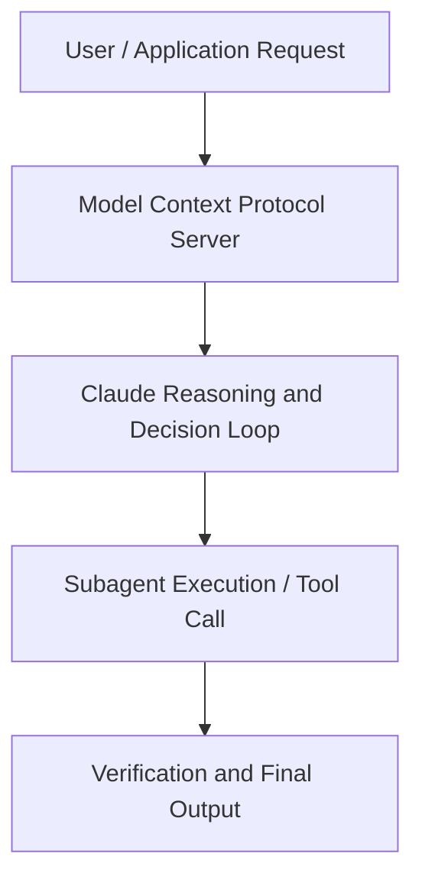

# Advancing Claude for Financial Services

**Speaker(s):** Anthropic and Partner Leaders · **Channel:** Unlisted Videos · **Date:** 2025-11-03
**Watch:** https://youtu.be/wZ-7ta1Z-yk · **Format:** Demo · **Level:** Advanced
**Topics:** Web Development, Backend/Infra

## TL;DR
This session explores advancing claude for financial services, highlighting core architecture, runtime workflows, and practical deployment patterns across Web Development, Backend/Infra. Speakers analyze technical implementations and share operational best practices for building robust systems with Anthropic, Box.

## Contents
- [Architecture and Core Concepts in Advancing Claude for Financial Services](#architecture-and-core-concepts-in-advancing-claude-for-financial-services)
- [Technical Mechanics, Implementation Patterns, and Tooling](#technical-mechanics-implementation-patterns-and-tooling)
- [Operational Workflows, Evaluation, and Production Scaling](#operational-workflows-evaluation-and-production-scaling)
- [Strategic Implications, Governance, and Key Takeaways](#strategic-implications-governance-and-key-takeaways)

## Architecture and Core Concepts in Advancing Claude for Financial Services

I'm Eleanor and I lead our industries team here at Enthropic. Hey, I'm Nick and I lead product for Claude for Financial Services. Welcome to the launch webinar for the next milestone of Claude for Financial Services. A few quick housekeeping items before we start. If a
friend or a colleague wasn't able to join today, don't worry, we'll be sending out a recording within 24 hours of today. We likely won't have time for Q&A at the end, but please submit questions throughout and we see many of you have already started submitting questions and
that's amazing. There's a widget at the right hand of your screen. Our team will be monitoring and answering questions throughout and anything we don't get to,
Nick or I or the teams we work with, we'll be sure to follow up.

**Further reading:** Official documentation for Anthropic and Anthropic platform guides.

## Technical Mechanics, Implementation Patterns, and Tooling

S, 51 secondsWe launched skills a few weeks ago. Now, skills are a really easy way for anyone, not just developers, to program Claude
sto be really great at these core workflows you all really care about. S, 5 secondsThey're essentially bundles of instructions clock can easily follow to do comprehensive research like earnings
s, 12 secondsdeep dives and initiating coverage, complex analysis like discounted cash flows and leverage bio models and
s, 19 secondscreating client ready deliverables like dozers and company profiles. S, 26 secondsSimilar to the last slide where we have built these integrations for you and these connectors out of the box, we are providing these stills as part of cloud
s, 33 secondsfor financial services. But stills can cover an entire spectrum from work that's just for you again to your team to the department to the organization
s, 41 secondsand across the financial industry as a whole. I for example send out a weekly email on Sunday nights that recaps my team's progress from the previous week
s, 50 secondsand focus areas for this week. I have a still write that now. While the team thinks I'm spending hours of my Sunday dedicated to updating them, I'm in
s, 57 secondsreality watching TV while Claude does this work for me.

**Further reading:** Official documentation for Anthropic and Anthropic platform guides.

## Operational Workflows, Evaluation, and Production Scaling

It's one of those areas where this is where the value really gets very manifest very quickly
s, 31 secondswhen you think about a lot of the workflows people have been doing here before it's been very single task or how do I do this one task using AI as
s, 40 secondsopposed to how do I just automate the entire thing? How do I make think about the entire process differently? So for a lot of us, that's caused us to
s, 48 secondsrealize that there are lots of little areas of friction that are in the way of making that real. We tend to talk about
s, 56 secondsthem as uh agentic infrastructure, things that you never thought you needed an API for before or that you never
s, 4 secondsrealized, oh, this isn't actually conducive to an automated play where there's not a human involved. So
s, 12 secondsthere's a lot of work that goes into that, you know, that infrastructure to make that real and make that viable. In terms of the human in the loop, that's
s, 20 secondsone of those things that we're we're pretty passionate about. I think one of the the failings we tend to see when people start looking at these u these
s, 28 secondsworkflows and and these different approaches for the first time is they think about it in terms of it's got to be perfect. It's it's got to 100% be
s, 36 secondsaccurate every time.

**Further reading:** Official documentation for Anthropic and Anthropic platform guides.

## Strategic Implications, Governance, and Key Takeaways

We have an
s, 8 secondsentire ministry of education team internally at anthropic just focused on the former but you know we're thinking a lot more internally about how do we
s, 15 secondsactually build the products to be useful and that understands what your workflows look like. I think you know software have the advantage of us being able to
s, 23 secondswrite code for those workflows right I think within the process of writing code we're injecting our domain expertise in terms of what best practices look like
s, 32 secondsto interact with systems like you know Salesforce and Slack but for us AI is a lot harder right there's a lot less code to write because the beauty is an AI
s, 40 secondssystem so we want to really give claw the scaffolding with the tools it has access to these skills that it can
s, 47 secondsflexibly deploy so that we start taking you So these important core workflows for our customers and breaking them down
s, 54 secondsinto smaller chunks that clock and start attack. S, 58 secondsAnd now let's move on. Andrew would love to hear from you. It feels reductionist to call it change management. S, 4 secondsBut how are you thinking about enabling your teams and driving this level of adoption and rethinking of how they come to work every day? S, 13 secondsUm we we have a two twopronged approach. S, 17 secondswe take, you know, we have a bottoms up and it's sort of a top down.

**Further reading:** Official documentation for Anthropic and Anthropic platform guides.

## Source
Full cleaned transcript: `DATA/videos/advancing-claude-for-financial-services-2025.json`
Canonical recording: https://youtu.be/wZ-7ta1Z-yk