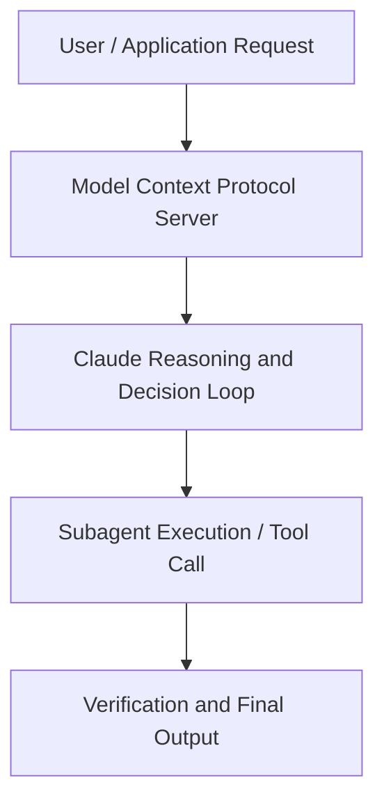

# Agent Skills: Transform Claude from Assistant to Specialized Agent

**Speaker(s):** Marius Buleandra · **Channel:** Unlisted Videos · **Date:** 2025-11-17
**Watch:** https://youtu.be/_zxeMYPHMOw · **Format:** Demo · **Level:** Advanced
**Topics:** AI Agents, Web Development

## TL;DR
This session explores agent skills: transform claude from assistant to specialized agent, highlighting core architecture, runtime workflows, and practical deployment patterns across AI Agents, Web Development. Speakers analyze technical implementations and share operational best practices for building robust systems with Anthropic, Claude.

## Contents
- [Architecture and Core Concepts in Agent Skills: Transform Claude from Assistant](#architecture-and-core-concepts-in-agent-skills-transform-claude-from-assistant)
- [Technical Mechanics, Implementation Patterns, and Tooling](#technical-mechanics-implementation-patterns-and-tooling)
- [Operational Workflows, Evaluation, and Production Scaling](#operational-workflows-evaluation-and-production-scaling)
- [Strategic Implications, Governance, and Key Takeaways](#strategic-implications-governance-and-key-takeaways)

## Architecture and Core Concepts in Agent Skills: Transform Claude from Assistant

Hello everyone, welcome to the agent skills webinar. My name is Marius and I'm part of the applied AI team here at
Antropic. Before this uh I was the YC founder building evaluation tools for voice AI agent. What I want to show
you in this presentation is how to transform the cloud that you know from a general purpose assistant that you love
and use every day to a more specialized agent that can help you with some of the more complex tasks that you have at your
company. Before we start, just a few housekeeping notes. Don't be afraid if you miss anything. This will be
recorded and this will be sent to you via email in the next 24 hours. If you have any questions uh don't wait until
the end of webinar.

**Further reading:** Official documentation for Anthropic and Anthropic platform guides.

## Technical Mechanics, Implementation Patterns, and Tooling

S, 55 secondsAnd soon we'll see a hopefully goodlooking GIF. S, 6 secondsAll right, I'm happy with the result. I think it's uh I can publish this in Slack. S, 16 secondscould claude have done this without the scale? I think the answer is yes, but it would require a lot of iteration. S, 24 secondsWith the scale, Claude knows that the requirements for Slack are 128 by 128. S, 29 secondsUm the size needs to be small and some kind of information about the loop and animation just to make this much much more suitable for Slack. S, 40 secondsAnd now that we saw the skills in action, let's talk about when to use skills.

**Further reading:** Official documentation for Anthropic and Anthropic platform guides.

## Operational Workflows, Evaluation, and Production Scaling

I want to uh pass it in a PDF with uh you know
s, 51 secondsthe legal checklist and I want back a spreadsheet with all these items and a pass fail column for each item. We already have the cloud window as I mentioned. I'm going to plug in the prompt and I'm going to
s, 6 secondswait for Claude to create the skill for me. S, 12 secondsSo Claude is going to do a few steps here. First is going to invoke the skill creator skill which is available
s, 20 secondsfor anyone to use right now. In that way you can easily bootstrap a new skill in the right folder structure uh and in
s, 29 secondsthe right format because we are asking it to generate spreadsheet it also like realize that
s, 37 secondsrealizes that it it can use the Excel skill as well. Now we're doing a little bit of uh Python uh file
s, 46 secondsgeneration and then we're going to extract some more data from the PDF that I gave it just to make sure that uh
s, 54 secondseverything is prepped and and ready to use. Now the reason we're doing a video here is because these do take a
s, 1 secondminute.

**Further reading:** Official documentation for Anthropic and Anthropic platform guides.

## Strategic Implications, Governance, and Key Takeaways

We have the issue name, we have the date, the l the link to to the GitHub and then we have the report
s, 21 secondsID. As part of this task, I can run this every single week and and have these things populated. Now we saw how
s, 29 secondsto create the skills both in cloud AI, both in cloud code. Let's see what's
s, 35 secondsin plan for the agent skills. Now uh you can use cloud AAI, cloud code,
s, 41 secondsagent SDK and the API to create and use skills. In the future uh what the team
s, 49 secondsis working on is creating more features for um authoring skills, creating, editing, discovering and and sharing
s, 57 secondsskills. We also have a focus on complementing MCP. We want to get to a place where you can use external tools
s, 5 secondsand software by a combination of skills and MCP uh servers.

**Further reading:** Official documentation for Anthropic and Anthropic platform guides.

## Source
Full cleaned transcript: `DATA/videos/agent-skills-transform-claude-from-assistant-2025.json`
Canonical recording: https://youtu.be/_zxeMYPHMOw