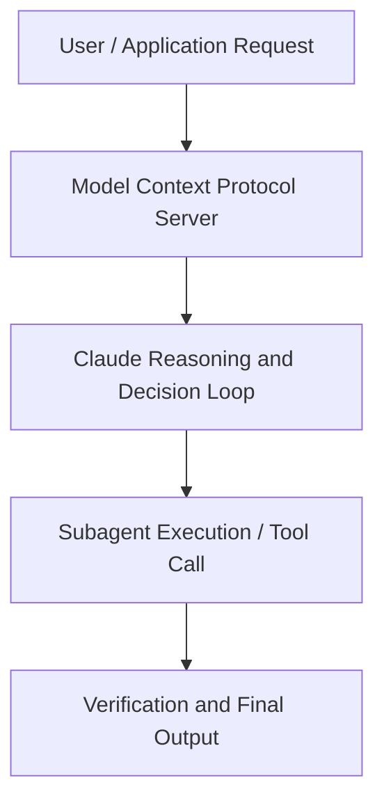

# AI agents in the enterprise: Leadership lessons and demos from Box and Anthropic

**Speaker(s):** Anthropic and Partner Leaders · **Channel:** Unlisted Videos · **Date:** 2025-03-07
**Watch:** https://youtu.be/xW6DpW42vd4 · **Format:** Demo · **Level:** Advanced
**Topics:** AI Agents, Prompt Engineering

## TL;DR
This session explores ai agents in the enterprise: leadership lessons and demos from box and anthropic, highlighting core architecture, runtime workflows, and practical deployment patterns across AI Agents, Prompt Engineering. Speakers analyze technical implementations and share operational best practices for building robust systems with Anthropic, Box.

## Contents
- [Architecture and Core Concepts in AI agents in the enterprise: Leadership lesso](#architecture-and-core-concepts-in-ai-agents-in-the-enterprise-leadership-lesso)
- [Technical Mechanics, Implementation Patterns, and Tooling](#technical-mechanics-implementation-patterns-and-tooling)
- [Operational Workflows, Evaluation, and Production Scaling](#operational-workflows-evaluation-and-production-scaling)
- [Strategic Implications, Governance, and Key Takeaways](#strategic-implications-governance-and-key-takeaways)

## Architecture and Core Concepts in AI agents in the enterprise: Leadership lesso

Hello um thank you for joining us on our our our webinar um my name is Michael gon hubber from anthropic I lead the API
platform which many of you are probably using to access the cloud models uh today I'm joined by Ben cus the CTO of
box and Barry on our applied AI team we will talk about why agents
matter um we're going to talk about Box's uh journey in agentic AI and we'll have a fire uh the firesides chat at the
end so agents are a very hot topic here at anthropic and as you imagine in the industry as a whole we've come a long
way in the in the past year since launching Claude uh 3 as a family of models at the time we presented uh the
the interaction with the models as a message as API you were able to to send a prompt to the model and and get a completion and this is more or less what
what applications were doing in a very simple way but um by the middle of the summer we were all talking about agentic
behavior and what that meant we were trying to explore the bounds of the difference between workflows and and prompt chaining and what an agent really
means um and to that end we talked to a lot of customers and what we found was that nobody really agreed on this term
agents and what it did mean it got to a point where everybody was making jokes about taking shots every time somebody in the room talk about an agent that
sort of thing um we got dramatically different um answers to this question I think even in Industry Among Us and the other vendors um we weren't using the
word consistently um what it boiled down to it seemed like most of the the the customers we talked to seem to think
that um an agent was just like any directed graph of prompts um I like to
split this into sort of three stages one is in the messages a you can send you can prompt the model for Chain of
s, 3 secondsThought reasoning um and that's like sort of the most basic step that you can do to plan the model's response in
s, 11 secondsadvance of returning a response then there are workflows where the engineer at the keyboard can Define exactly the
s, 18 secondsthe inputs and outputs um from the model to The Next Step uh to the next prompt and and that prompt will will sample
s, 26 secondsreturn an answer and that will send it to to the next prompt um again this is constrained and controllable by an
s, 32 secondsengineer and finally what we think more more frequently of as agents these days where the problem is expressed as a goal
s, 42 secondsand that goal can't really be described easily and consistently in language my favorite as an engineer is this example
s, 49 secondsof when um when an an alert that you got to your pager is an incident but if you think about simpler examples like um
s, 58 secondsplanning a birthday for my 8-year-old or something that that might mean very different things to different eight-year-olds um and you might want
s, 5 secondsthe llm to start to plan its own tasks there are two very good benchmarks that we like to look at for this um this is
s, 13 secondstow bench in retail and a more difficult one in planning an airline trip but again the goal here well the the ability
s, 20 secondsto give the agents A a goal and let the agents come up with the tasks necessary to achieve that goal and then in
s, 29 secondsfollowing those tasks self-correct their own behavior to keep themselves on track is really the the agentic loop that
s, 38 secondseverybody is trying to implement these uh now um we were just talking earlier in prepping for this webinar actually
s, 45 secondsabout one step further where agents are actually working in a multi-agent ecosystem with partial or shared context that's very very very exciting um as
s, 54 secondswell so the foundation of the agentic system is uh combined three key capabilities there's the the retrial
s, 2 secondsretrieval which is accessing external information via queries there's tools which is performing actions through apis
s, 10 secondsand and Integrations to interact with the real world or the virtual world and the memory which is storing and recalling relevant information about the
s, 17 secondssuccess or failure um the general context of of those interactions and then using that a loop to achieve a goal what's unique about our approach is that
s, 26 secondsall of these components communicate bidirectionally with the LM and we found this to be crucial for building agents that can truly operate autonomously
s, 35 secondswhile remaining reliable this is also something that has been dramatically improved by model intelligence again we started talking
s, 43 secondsabout this I want to say around I mean like in product at least at the API level uh with customers we started
s, 50 secondsgetting questions about this probably around the time of Google Cloud next last last April it matured into uh
s, 58 secondsconversations that were easy to have around June we all started talking in the same language but Sonet 3.5 version
s, 5 secondsone at that time was only smart enough for the most advanced users to build these workflows and these agenic tasks
s, 12 secondsand it was very very hard even for them um but with the Advent of Sonic 3.5 version two in October and especially with our computer use demo we were able
s, 21 secondsto show ourselves and the uh and our customers uh the ability for the llm to log on to a browser
s, 30 secondsand accomplish a goal I mean my my favorite here is in in testing we had it order us a pizza right where it had to
s, 37 secondsit chose to go to to Papa John's it scrolled around the page it self-corrected again the reason the the the threshold that we breached here was
s, 46 secondsthat in doing this and in ordering the pizza it's not that it wouldn't make mistakes everybody makes mistakes but it
s, 52 secondswas able to assess its um its quality while it was following its own um
s, 59 secondsBehavior its own plan in order to correct those mistakes in real time and the threshold over which it was able to
s, 6 secondsself-correct was above the uh mistakes it was accumulating in in the process and then our customers saw this very
s, 13 secondsvery very quickly so tricentis is a is a customer that um Works in in automated software testing and it is using
s, 22 secondscomputer use today even to reduce 4-Hour um automated testing to just 10 minutes by using this exact technology um it's a
s, 30 secondsvery very common in the in the coding use case we we just released our own research preview of Claude code but cursor GitHub co-pilot cognition repet
s, 39 secondsum a lot of our customers are building their own coding agents in different ways um with different Technologies under the hood and different expertise
s, 48 secondsto achieve uh a coding agent in in in different ways um and finally I I really like the intercom example which is
s, 56 secondsoutside of the Cod genen and and just goes to show part of the breth of the application here and the commercial application of the technology but the
s, 4 secondsthin agents can operate independently to um to take customer problems and solve those problems including transacting a
s, 12 secondsreturn on behalf of merant so I talked a little bit about our recent release of Claude 3.7 sonnet
s, 20 secondsbut again you can see here the the tow bench scores for retail and airline that that we do um take as As a matter of
s, 27 secondssuccess and our agenda Cod cing Frameworks uh rather evals so we're very very excited I hope you learn a lot from
s, 35 secondsthis webinar um but I'm going to pass it to Barry to talk a little bit about Claud code all right hello everyone my name is
s, 44 secondsBarry and I'm a member of technical staff anthropic I was one of the co-authors of our blog beaing effective agents and today is my pleasure to show
s, 52 secondsyou our coding agent Cloud cold let me uh share my screen real quick okay so CLA code is a very
slightweight coding agent that lives in your terminal so you can open it from anywhere uh I'm currently in in uh vs code and I'm opening a terminal right
s, 10 secondshere um we can just uh open it by typing in
s, 16 secondsCloud um it has a uh CH interface and this part where per with I'm going to say hi where are you and hopefully we'll
s, 25 secondsget back all cool right fantastic uh what I have here is a repo that's a sample implementation of our
s, 32 secondsblog buing effective agents and in there we have a couple of um you know Jupiter notebooks some python files and overall
s, 41 secondsis like a pretty lightweight repo but has a lot of uh U you know a lot of files in it and we can start to chat with uh these files we just say
s, 50 secondssomething like what model am I using in this repo and where am I using it
s, 2 secondswhat the model is doing right here is that it's launching a task which is a sub agent that's exploring the repo um
s, 9 secondsit's deciding independently what it wants to search what it wants to read and it's directing that process based on what has red so there's no predefined
s, 17 secondsindex and it's able to identify that we're using the uh clonet uh 35 and uh the models are use in these different
s, 26 secondsplaces so you know this is great um now let's try to get it to actually build something uh this re this repo was
s, 33 secondswritten before new model um so I want to put in that new model so let's just say this is an old
s, 41 secondsmodel i' like you to add in a your model is the default and then I'll say I'll
s, 50 secondspaste in the model string Char which is our newest 37 I'm going to give it some instruction
s, 58 secondsto maybe test the model make sure I have the right one make sure it
s, 5 secondsworks um it's worth noting here that I have a uh you know demo file which provides a web interface that um you
s, 14 secondsknow showcases agents and I want to make sure that we can use the new model in there as well uh for the uh wet
s, 22 secondsinterface at a model pick so I'm kind of doing two things here one is that I'm giving it a a high
s, 31 secondslevel plan as if I'm guiding a junior employee and then I'm just going to let it run uh you know from here was in
s, 38 secondsguard rails so click enter okay so the first thing it does is
s, 46 secondsto write a test model uhp which will test whether the model actually exists as you can see what happened just now
s, 52 secondswas that the model is um asking for permission uh this guarantees that we always
s, 59 secondsuh can have a uh human in the loop if that's desire and we yeah okay the new model is
s, 8 secondsconfirmed so the model actually run the file and and decided that the model actually exists and now it's comfortable proceeding with that change from here
s, 17 secondswe're actually going to just give it full access because this is a trusted repo and we'll just let it
s, 26 secondsrun so now it's uh you know searching through repo it's updating where where it's needed U and it's got just doing
s, 34 secondsthat iteratively on its all I'm not interacting with the code base I'm not interacting with uh you know the the model throughout this
s, 46 secondsprocess okay now it's actually doing a search to make sure all of the uh models have been switched um and then it's going to try uh try to verify it again
s, 56 secondswe're actually going to stop this process right here and then verify for eles um so let's open up that demo.

**Further reading:** Official documentation for Anthropic and Anthropic platform guides.

## Technical Mechanics, Implementation Patterns, and Tooling

S, 6 secondspy and then open this in your web page okay great now we have the new CL 3.5
s, 13 seconds3.7 son it as a part of the model picker and the uh change is complete from here you can also do a lot more uh
s, 21 secondsmaintenance test after that you can just say hey please um update the uh reading
s, 33 secondsnotice that I don't necessarily to specify where the ra me is it's able to just like find it and now can see that hey like this this this has been updated
s, 41 secondsthat the system is now using call uh 3 3.7 as a default model um cool I want to
s, 48 secondsend the demo here but um there's generally a lot more that you can do with claw code it's helped us with very large reflectors it can navigate very
s, 56 secondscomplex git operations like very nasty merges and it makes prototyping incredibly easy um in fact this entire repo uh that
s, 4 secondswould have taken me maybe like around two to three hours to do took only about 10 minutes uh this is only the start of this agentic chapter with agents uh
s, 13 secondshopefully tactical execution will become cheaper and faster so developers can focus on High level designs and verification uh the best way to
s, 21 secondsunderstand the capability is just to try it out yourself and I hope you explore and find your own ways to to make Cloud code helpful with that I'll will pass to
s, 29 secondsBen the chief technology officer of fox hi everyone um I'm Ben Kus I'm the chief technology officer at uh box and
s, 38 secondsI'm going to talk today about um AI agents in the Enterprise and and in particular um how we are building AI agents in a product to be use the
s, 45 secondsEnterprise and um we think of this as a journey where we've gone from the world of AI assistance and into the new world of of agentic AI um and so uh I'll tell
s, 54 secondsyou about uh what we've experienced uh so to start with um I'm going to give you a little bit background on box if you don't know um
s, 1 secondwhat it does what we do at box and and and what we do with AI box um so first key point is um most of the things that
s, 8 secondsI'm talking about and thinking about are um related to content um and and and by that we mean the kind of the stuff that
s, 15 secondsEnterprise uses unstructured data in particular things in files uh presentations uh PDFs uh videos audio
s, 23 secondsimages just the kind of things that people operate on that are that are um normal for an Enterprise um at box uh
s, 30 secondswe're uh very Enterprise focused uh so we have about um two-thirds of of of the Fortune 500 we have 115,000 um
s, 38 secondsEnterprise customers tens of millions of of users um hundreds of billions or trillions of of these uh pieces of of
s, 45 secondscontent um and exit hundreds of of pabes and exites of data and so on so when we're thinking about the AI challenges
s, 53 secondswe're thinking about it in a very secure and a very uh uh Enterprise Style PRI grade setting um and um uh and and one
s, 2 secondsof the key things that that we sort of focus on is this idea of um unstructured data and so for for us um and in almost all the examples I I'll talk about and
s, 10 secondsgive you is that um most of uh Enterprise most of data in general and in the Enterprise is unstructured in sort of in comparison to structured data
s, 19 secondsthat we might be like in a database somewhere um and um it is kind of a we step back for a second and say that we've been through this like big data
s, 26 secondsRevolution data analytics um over the past like 10 20 years and there's no like compared to the Past there's a great number of tools and and just the
s, 34 secondsability to process data scale is so much better than it used to be um but then the world of unstructured data was was not quite
s, 41 secondsum it was it was hard to automate many things because the data was typically required a human to kind of look at
s, 48 secondsunderstand create and so on but um uh what we with the the the um invention of these uh large language models in in
s, 55 secondsjust in general like the latest uh AI models um we're able to then suddenly start to operate directly on this unstructured data and that has been sort
s, 3 secondsof a big uh area for box of course but also for our customers typically when they start to um the customer we talked to when they rank the things that
s, 10 secondsthey're interested in around uh gener AI when they're thinking about the use cases usually along with coding um the idea of of getting more value out of
s, 18 secondstheir content is one of the higher things they rank um so um another thing you'll see for as I kind of keep talking here is that um we're very platform oriented at box from the perspective of
s, 27 secondswe view everything as like platform layers so we have our so a box we have our infrastructure layer we have our um data protection layers so we have our content services and then and then we have we think of things as an AI
s, 35 secondsplatform that provides you these capabilities including agentic capabilities and the ability to to to to make um and customize AI agents that
s, 42 secondsoperate on your content so uh with that like if you kind of um step back and you say well that's very interesting that like the way the AI can operate on on
s, 51 secondscontent um but of course the AI is only as good the the the product we have is only as good as the AI models um that power it and this is we spend a lot of
s, 59 secondstime um with uh the latest Frontier models and in particular um the ones that we think are some of the best are the anthropic models uh and so um uh uh
s, 9 secondsin general um because we have such a wide variety of content across Industries across uh uh ge geographies across lines of business and so on we
s, 17 secondsneed models that are sort of the most intelligent and sort of um we think of them as almost to the to the like level of the smarter that they are the better
s, 25 secondsresults you're going to get in general across the board so so we're always um with kind of stuff that we're thinking about always thinking about like almost always the new model is better than the
s, 33 secondsold one in terms of accomplishing specific goals that we care about so um to to highlight this so this is an example of boxi this is like one
s, 41 secondsone one sort of simple example so here I have a um a uh the document here and I'm going to ask box AI to to generate some
s, 48 secondslike a web page from this document so that here we have these like survey responses and we're going to say um somebody's going to look at this and and um then say I want to convert this into
s, 57 secondsa nice in infographic on a web page so here using the model um uh uh we use this example to highlight some of
s, 4 secondsCloud's sort of um capabilities is um just by going to this document and asking these questions we're able to actually get it to not only tell me some
s, 11 secondsuseful info about this document sunrise in a nice way here but then also to be able to um uh uh create something for me
s, 19 secondsan artifact that I can um then turn around and use in in other place in my organization um so this is uh so here you can see that like from this document
s, 28 secondsand you know matter seconds we were able to create this um this like this infographic um this is just one example that here just to kind of illustrate to
s, 36 secondsthis audience of like the kind of things that you can do with AI and your content in terms of like problems that an Enterprise might have um and uh but
s, 43 secondsthere's there's a very wide variety of what we use AI for I'm happy to go into some more detail in another time of of uh like other restructured content we
s, 51 secondshave uh corpuses of data that you can apply AI to overall use AI for a bunch of different um detecting um uh the sort of state of the documents in terms of
ssecurity on um but because this this presentation is more about um the AI agents um I wanted to then sort of highlight this relatively
s, 7 secondsstraightforward um AI use case and then um highlight uh the idea that um uh there's kind of if if you think about
s, 16 secondsthis um there's there's there's some limits to how um many people in the industry and in in many different proxy see are are sort of uh using Ai and I'm
s, 26 secondsgoing to call these the the the an AI assistant um so the thing that you just saw as one example along with you know there's hundreds of other products out there
s, 33 secondsincluding sort of like you can you can see parallels between coding assistance and so on is that um from the the customers I talk to most of them say
s, 41 secondsthese new AI features are great like I I love them kind of to the point of like um I don't want to go back um and then this uh uh I have a quote here from one
s, 49 secondsof our customers who I was talking with um and um uh he said um I thought this captured it well he said I love these features uh but my main wish is it can
s, 57 secondsdo more and and he highlighted it is kind of like having a smart assistant but I gotta explain every single detail of what I want that assistant to do
s, 6 secondswhich of course like when we're thinking about the impact of AI across industry across the the market across the world
s, 13 secondsum there's this uh uh Dynamic of um there's a lot of expectations because of the power of the underlying technology
s, 20 secondsso how can make it do more and so um this kind of you step back and think about this for a minute um is uh like how are we treating our AI
s, 29 secondsum and so we talk about Claude as um one of the like sort of Premier examples of an intelligent model in the world like
s, 36 secondsarguably one of the most intelligent things that like created um and so and if you imagine that like you think of employees in your company um so your
s, 45 secondsassistants like there's Curr fundamental exercise you can do which is all right think of the smartest employee you have in your company that like the people you work with the people you think are
s, 52 secondsreally good tons of potential okay so take that person have them come to work sit in a booth Booth do nothing let them
ssit there all day long and then only when somebody walks up to them ask them a question uh are they do they they have to answer are they have to answer immediately they can't work they can't ask for clarification doesn't matter
s, 8 secondswhat kind of weird question you you ask um and and they must get it perfect in the first try they can't hit backspace um they can't they have to have it done in three seconds otherwise you get angry
s, 17 secondswith them and if it's not a perfect answer you accuse them of hallucinating and and you fire so like of course this is a bit ridiculous to think that you
s, 24 secondswould treat a an employee this way especially like a high performing employee and so um but this is the way that most AI assistants work from the
s, 32 secondsperspective of of the AI um and so uh it's pretty obvious that a um a uh
s, 38 secondscomplex tasks require um things like more time they like people say let me get back to you um they iterate you know here's a draft let me take a look at it
s, 47 secondsum they clarify uh and they and oftentimes they work on a team and so these if this is the way that people get
s, 54 secondswork done and then you kind of have this Insight that um this is uh the the AI um the latest models can start to emulate some human behaviors um then um what we
s, 4 secondssee a box and I think um many many people um across the industry are kind of working towards this world of saying we're moving from a world of AI
s, 12 secondsassistance into AI agents and then also in into this this Ro of agentic AI routines um there's different words for
s, 19 secondsthis I use the word routine think you can think workflow you can think of multi-agent systems like we said earlier but basically in a world where there's groups of AI that are working together
s, 28 secondsto make make sure that you're able to do more complex tasks so this is how we kind of see the world so um taking this step further now
s, 37 secondsum the um we have uh sort of uh as as we were going through you know building AI assistance thinking about AI agents so
s, 45 secondson we kind of have these three insights um that I'll share here with about agentic AI um the first is is um um like Michael shared earlier we have the same
s, 53 secondssort of view so I'm glad he said it is that um almost everything that you do you can kind of think of a directed
s, 59 secondsgraph um or workflow or a flowchart um and it's it's kind of this moment of like you know I remember in school or
s, 6 secondssome you may high school or something where I learned you know like these are the flowcharts um and and then it's like yeah okay that's just an interesting you thing that people do you know see in
s, 13 secondsprogram uh project plans so on but you start to think like they're actually quite powerful um they're very like you see that these even in research papers
s, 21 secondslike these days like constantly with me talk about AI is like it's you can represent almost almost everything inside of these little kind of um
s, 29 secondsdirector graphs or our flowcharts um and so um if you think it this way um then um suddenly you can start to represent
s, 37 secondslots of complex things in a relatively simple format um and um to me the the one of the key things here is that this also allows you to have a sort of
s, 45 secondsinfinitely scalable sort of thought process about what can AI do like like when you're confined to something that has to respond to immediately there's
s, 53 secondssort of a limited set of of what can happen but when you think almost like the way that you think of an organization way think people them more
s, 1 secondthat can can make arbitr complexs arbitr complex workflows and this is one of the insights where you start to see where
s, 8 secondsthe power of the sort of abstracting this from AI perspective becomes very useful um so um and as part of this like
s, 16 secondsif you think of the nodes of the graph of like a step of a task if you will like um you start to see that um like in the same way that you work with different people in the same way that
s, 24 secondslike you if you're setting out a plan for yourself you start to to say like each step itself can be customized um and from an AI perspective you can start
s, 33 secondsto customize the goals instructions um the the tools that it can look at like where when what should you be looking at in terms of data sources and and so on
s, 41 secondsat each step of this um and then and then one of the I think one of the great innovations that companies like anthropic are bringing forward is this idea of thinking budget where you're
s, 48 secondssort of saying like it's like I know that this step of of something is going to be harder than others and so I want to like actually allocate more time for it I I like yeah like there's a big
s, 57 secondsdifference between wanting to summarize a and wanting it to analyze the risks from an m&a deal to figure out if you're in compliant with some you know
s, 5 secondscomplicated rules and so this is a world where you basically say I want to allocate time um in different cases to get better
s, 12 secondsanswers um and and the third thing that is important for companies like box um is that um we we believe that the data
s, 20 secondsretrieval is going to become agentic rather than necessarily like query based or or um or uh even even tool based so
s, 29 secondsum uh like we're we're a repository of an awful lot of very critical information from from like uh um for organizations and we do uh offer um just
s, 37 secondslike every other tool out there um the ability to um go through and and retrieve this data but at some point um
s, 43 secondsthere's a uh uh you want your AI agent to participate in the idea of go figuring out what to go get and so for
s, 52 secondsus as we're thinking about different platforms we think of it like we need to start to build agentic ways to come get the data and to go get data from other systems so box you have Enterprise
scontent uh maybe a Salesforce they have like the um a platform for your CRM and other data uh you have maybe snowflake or data bricks or somewhere that has
s, 9 secondslike a bunch of other data for you in addition to like your messages and slack and so on these is all Enterprise data and no we don't believe any one system is going to have all that data so then
s, 17 secondstherefore we're going to have to have the idea of agentic uh systems and agentic Integrations that go through and are able to kind of pull this data for a whole bunch of Enterprise tasks so um
s, 26 secondsfrom us these three uh insights are sort of help us then um go through and um uh Power how we think and how we build our
s, 35 secondsagent platforms um and then and then the key thing here for me is that uh that when you take this approach when you think of this way suddenly the kinds of
s, 44 secondscapabilities that you have from like that that you know we constantly talk about in in in the um AI world like for instance um retrieval generation
s, 52 secondssuddenly become more powerful so it used to be um for us at box is that we would do um uh ret log man generation go through look through through through you
s, 1 secondknow a whole bunch of you know like I got terabytes of files and so on and I go find the info that I want and then I say this is you know process it with AI to give you the answer um now more
s, 9 secondspowerful than that is the idea of not only do that but also check your work like have ai sit down and like think about is this the right answer is it actually getting what what we want can I
s, 17 secondsgo double check and look this data up that the answer was correct and and this is something that you could have program yourself but then um with the idea of AI
s, 25 secondsit's just a slightly more um complex routine that would then let you then power this kind of thing um and then on to some other use cases that are near and dear to our heart things like like
s, 33 secondsextracting structure from unst structure from unstructured documents or unstructured data in general like it's it's something that is very much a um uh
s, 41 secondslike there's there's an easy way to do it and then that gets you you know far but then you need an awful lot more techniques to be able to handle the complexity that comes the Enterprise so having things like multiple agents
s, 50 secondsworking together looking at the DAT in different ways looking at the OCR version versus looking at the image versus looking you know processing grading this own answers that kind of
s, 57 secondsapproach is much easier when you have the hentic sort of philosophy than if you're trying to just kind of like hardcode everything um and then on to
s, 4 secondsthe world of something that's near our heart things like um the doing research across like um uh like deep research across like big data sets um the like
s, 13 secondsinternet being one of them but also for the Enterprise like their their unst structure data uh deep search um is is is also just finding what you're looking
s, 20 secondsfor is is um something where AI can actually help it it almost can mimic the way that a human will go through look through documents see if it match what you're looking for um and then on to the
s, 28 secondsworld of of uh being able to sort of uh customize for the Enterprise the idea that they're in charge of these of these
s, 36 secondskind of of routines so um this is where we see the like just almost a step function and usefulness of of how AI
s, 45 secondsworks when you're thinking in this agentic approach versus when you were thinking in the uh AI assistant kind of like give me an answer right away for
s, 53 secondsphilosophy um I think for us and for everybody um I suspect in in the World who's dealing with um agents is um it
ssounds awesome and it sounds great and it sounds like maybe in some cases like exactly the answer but there's no end of challenges and I suspect um we and then
s, 9 secondsin addition to um lots of people in the in the um world are going to be dealing with these kind of challenges for a while till we get a gensic AI sort of like really nailed the the first thing I
s, 18 secondsthink Michael started to talk about a little bit is like there's a bit of an art of describing to AI what you want and sort of the more complex the tasks the more you can get it wrong you can
s, 26 secondskind of at some point over describe at some point you can under describe and and then this is if you get this wrong then you're going to kind of get poor results and and and I start to think of
s, 34 secondsthis like the same with people like if you just ask somebody to do something you give one sentence and it's a quite complex task it's kind of unknown whether they're going to come back with
s, 41 secondswhat you want um and uh uh and we we're all big fans of using AI actually to help with this like you know AI can
s, 49 secondsgenerate its own routin its own routine based on your instructions but then that's also um you know yet one more level of complexity to try to figure out if something goes wrong um the second
s, 58 secondschallenge which is a kind of a a big one that we've um seen for a long time in this world of like having AI agents um
s, 5 secondsiterate is that um they tend to accumulate errors um so uh with any everybody knows with any um AI model
s, 13 secondsthey're sort of uh it's not incredibly deterministic about exactly what happens um like it there's there's you know built in the system is the idea of some
s, 21 secondsvariability in the output and so therefore if you chain many of these things together you can get in some cases maybe like um you can lower the
s, 28 secondsility but you can get very what you might call random um sort of results or things that were not as as uh you expected um and this is especially for
s, 36 secondsEnterprise kind of maybe some critical use cases like this can is is shocking to people that like sometimes it works and sometimes it doesn't it's like interesting to see like like um along
s, 45 secondsthe way as you play with it like where it can go very wrong um and these and these unexpected results can can really get in the way of like usefulness of of these
s, 53 secondsagentic systems um and um there's techniques that that we can that can use to that we we've explored to help like like interestingly like there's this
s, 1 secondconcept of supervisor you can like add a supervisor to your to your agentic multi-agent system so that you're able to have it um stay on track and that has
s, 9 secondssome positives it has some downsides um like for instance the AI kind of cooperate less um when you do that um and then um also in in our world of
s, 17 secondsEnterprise um adoption is um very much uh critical like you have the most useful tool in the world but like you need to make sure that um your customers
s, 24 secondsare ready to to use it and um and one of the challenges we see here is um and I think Michael sort of discussed it uh in the beginning is a lot of people are
s, 32 secondsusing this this term agent uh agentic um and it's and then because some things are are not yet fully defined like sort
s, 40 secondsof an aligned Acron across the industry there's there's this like hype around it which um I think is is in many ways is Justified in the long term but with if
s, 47 secondsif people are expecting results to come immediately um then it is uh something where like um maybe they when they first try it because of some those issues that
s, 56 secondswe talked about there's a little bit of of um challenges they faced so uh these are the kind of challenges that we're focused on and um and the kind of
s, 3 secondschallenges I think that the uh us and then anybody building on agentic AI will need to solve as uh we are able to move forward and uh to kind of bring the
s, 11 secondspromise of AI and the promise of agentic AI to to to the world um okay so with that uh Michael I'll I'll turn over to
s, 19 secondsyou wonderful thank you so much that was great um Ben um so Ben what catalyzed the the focus on AI agents in your and
s, 28 secondsunderpinning your company strategy uh yeah so like um I think the for for us there's um so you know one of
s, 35 secondsthe things that we have the luxury of as an Enterprise company is that we can go talk to um our customers you know and many of them are you know very
s, 42 secondssophisticated and and you know they had like a lot of enterpris have their own like AI Innovation teams and and they're working on like solving this very wide
s, 50 secondsvariety of problems that they believe a could solve um and so then um as you know for something like box we we have a very general purpose set of data right
s, 59 secondsthe content and Enterprise content and all these different forms and so we we sat down and we were um and the great news is that AI models are quite generally capable right like like um
s, 7 secondsClaud 3.7 is very good at a lot of things and and so we we were trying to then connect the Dos to say like how can
s, 15 secondsyou solve all these crazy amount of different problems with this like AI when clearly um you need a some sort of
s, 23 secondsin between language to specify this like some sort of way to to to describe the world so that AI can kind of do its
s, 29 secondsthing and for us like um like we as you sit down and you think about it it kind of comes back to the the thing you mentioned in the beginning which is at
s, 37 secondssome point like um you just can describe the world our our tasks you know and processes as a directed graph and and then that like kind of small Insight
s, 46 secondsthen lets you say ah like I'm able to then um use uh uh that that that expressive ability to then solve a very
s, 54 secondsgeneric large set of problems um and then and then there are so many great uh agen of Frameworks out there that kind of have this this philosophy and so um
s, 2 secondsit's it became over the last year and two like easier to then not just sort of build something um ourselves in the corner that you know was our sort of
s, 10 secondsproprietary way to do it but a sort of standardized mechanism which is then um I think very important as we start to think about things like tool use and uh
s, 19 secondsagent agent systems and so on so um for us this this the evolution here is is when we said we want more from AI
s, 27 secondsbecause it's not quite we know it can do more we know that it's more capable than the the the features that we're providing
s, 34 secondstoday that makes total sense um and I actually like I remember this problem when I was at at data dog in my previous role we were trying to figure out going
s, 43 secondsback to my previous example like what what makes a an alert an incident right and and how do you determine these things and you know we approached it
s, 51 secondslargely the same way right we we just had to describe what the end State needed to be and and use the intelligence of the model uh to get
s, 58 secondsthere um so in the implementation though how are you from a technical perspective how are you thinking about the
s, 6 secondsarchitecture of Agents um are you using common Frameworks or or or yeah how are you thinking about this yeah um I like
s, 15 secondsin in in general um yeah one of our goals is to uh be using the sort of the latest best Frameworks out there um we we were constantly valuing all of them
s, 22 secondsand I I suggest to anybody who sort of hasn't gone down this but yet like if you just and there's plenty of of good sources on this one but um if you take a
s, 30 secondslook through the some of the top like agentic Frameworks out there um like there's um they're a little bit different in terms of like tuned for you know amount of complexity that they have
s, 39 secondsthe amount of um of sort of the attraction layer that they provide for us we typically like the ones where we have a lot more control over exactly the
s, 46 secondsdifferent steps um but uh they um uh like for the first generation we built it ourselves we we built our own agentic
s, 54 secondsframework to then does this but then we rapidly switched to the idea that like um yeah there's the community overall on
s, 1 secondmanyi are open source um in addition to these very good companies that are out there they they have very um uh we we expect them to evolve and we want to
s, 9 secondstake advantage that so we switch to a a a specific uh framework um that uh I think we we don't we don't typically talk about it although I think we're
s, 16 secondsgonna probably like do like a push on this later to kind of describe more technical details so I'll leave that for later cool and and you're talking about
s, 25 secondshaving control um and there's like you having control of Engineers but as Engineers but also the end user having control what's your approach to balancing agent automation with with
s, 34 secondshuman oversight and when to bring a human into the loop yeah um so this is a I think a very interesting world that to kind of explore going forward is that um
s, 44 secondsum from uh you know from the very early days where you had sort of the the earliest versions of like a a react agent where you know you sort of like um
s, 52 secondsuh like the agent sort of critiqued itself and and moved forward um you started to see the power of all this but then you started to see like it goes
s, 58 secondswrong like and and so um the for us um we're very intrigued by the latest models in terms of that they're able to
s, 6 secondsthemselves have their own sort of mini like agentic thinking process so that the sort of the Chain of Thought and the reasoning that that um anthropic and others provide is like is is very
s, 15 secondshelpful how you said that like um if you think about the way and again I'm G use Enterprise examples but so let's say
s, 22 secondsthat somebody has a um uh you're I talking to customer they they have this process where these like um important
s, 29 secondslike Financial details come in and they somebody needs to sit down and review these quickly they have this like time timer about like make sure they respond quickly and then um they need to then
s, 38 secondscreate an assessment and then they have somebody else review it right and so that that for this company like there's like a you know like a junior analyst who prepares the data and then they have
s, 45 secondslike a senior person kind of sit down and like double check the details right and so from a control perspective um for our customers like they they people sort
s, 54 secondsof implement this like dual step and there's like a set of instructions the analyst has and a set of instructions that for QA that the like senior um
s, 1 secondperson has and so like for us um that's kind of a important is that you're able to uh have not just one agent sit down
s, 10 secondsand think about it with one set of instructions because even sometimes we've noticed if you tell an agent most of them today even the good ones like I want you to do this and check your work
s, 19 secondsand do these four things like sometimes one of those steps is not like fully um respected and so therefore the the best
s, 26 secondsway we found is to then say all right well make another step where the only goal of this is to like do qway or to double check or to like make sure that
s, 34 secondsyou absolutely follow the three things you need to follow and so this control aspect is is for us is that I'm gonna again you just uh add a node to the
s, 43 secondsgraph that is the sort of the double-checking node and then make sure that is um is uh does exactly what you want which I think is how people
s, 51 secondsactually think about it in in an Enterprise of like they make a process and at some point if they really care they they add somebody to review it
syeah that that makes a lot of sense I'm going to steal a question actually from from the Q&A that I saw earlier that I think is very relevant here but how do you manage the context um and and guard
s, 9 secondsrails in an open-ended problem like what you're talking about um with with agents and especially at box which is quite so open yeah uh it's it's like a it's like
s, 18 secondsa funny question which is um so like a lot of people like normally like think of um like a set of content as like an Enterprise like oh the Enterprise has all his data but it's actually almost
s, 26 secondsnot true like I don't think any two people in any company have access to the same data right they all have like a different set of data and and just you
s, 34 secondsknow sort of the first principles of of like uh is never ever expose data that somebody doesn't have access to and so
s, 42 secondsthis is um for us just kind of built in and and I'd encourage anybody who's doing AI on something like you know critical content or critical messages or
s, 50 secondscritical anything that like you absolutely First Step need to to to make sure that the permissions are set properly like it respects
s, 58 secondsso for us what that means is that we have a model either where the AI agent acts on your behalf or we have a model where we're actually like sharing stuff
s, 5 secondsdirectly with the agent like you basically say here's a process you have actually six things and and and under no circumstances would we ever architect it or make it work in a way that like it
s, 14 secondshad open access like to everything we we um I would I my personal philosophy is that you would never trust AI agents to
s, 22 secondscontrol access appropriately from the perspective of like having have access everything in makes a decision about to do next um instead you restrict the
s, 30 secondsaccess to the AI agent so that it's able to then sort of like keep its um uh is able to focus on on what it has
s, 40 secondsthere um and and and so uh for us then um when we uh are building these AI agents we have a very strong sense of
s, 47 secondsexactly what they have access to um and that's important as you're thinking through the process that you're building either we're building or there or that the like a customized sort of workflow
s, 55 secondsso that um there because otherwise it is the the the number one I think concern of Enterprises in addition to
s, 2 secondsposi happen is that if you rely on an AI agent to sort of like like um control access then it will almost certainly like people like make a mistake and then
s, 11 secondsyou have a serious data leage challenge yeah that makes total sense and just like anecdotally this comes up with with customers all the time where
s, 18 secondswe talking about um you know inheriting the permissions of a human or or stipulating a service account or you know various ways of doing this but um
s, 26 secondsbut it is a very common question um well and to the um just add on to that for a sec is um this is a little bit why we made the point um of uh uh looking up
s, 36 secondsinformation and data sources is probably I'm gonna predict that it's something that is a sort of
s, 42 secondsa agentic future there because like some some sort of architectures would be like let's get all the data in one place and
s, 50 secondsyou know vectorize it make bu beddings and then and then process it and then double check the permissions as we go um but like this is a very highs scale and
s, 58 secondscomplex world like like um I sympathize with people who work at slack and have you know probably tens of trillions of messages like um and then they know way
s, 7 secondsbetter than anybody else about making sure that the like permission set is is is is um uh appropriate and and you wouldn't ever wanteded to it's very expensive to take that they didn't put
s, 15 secondsit one place and so this is like for box our version of that is files and so we we we think of it as if you want to get access to these like it's it's um we
s, 23 secondshave the AI capability such that um mean you're welcome to go look at the data but then also you can just ask our AI to go get you what you want answer any question you want and then be able to
s, 31 secondsprovide it to so we see this agentic sort of interfaces to Platforms in agentic interfaces to sash products like outl especially the Enterprise class
s, 38 secondsones as as definitely part of the future that's cool um so how do you how do you measure or evaluate I should say the the
s, 46 secondssuccess of the agents and I'm I'm curious that both in terms of trust and safety and making sure that it's behaving within the guard rails that
s, 54 secondsthat we just discussed but then also like is a providing the value that you expect to customers yeah so there's kind of two aspects of that one is is for our own
s, 3 secondsthing for the like because we we want to provide um agentic routines and AI agents um to our customers but not have
s, 12 secondsthem at all care or worry that they agents right like at some point like let's say you want to do like deep research on a bunch of data or if you wanted to like find data or if you want to like you know provide this med
s, 20 secondsextraction are these other capabilities we provide um maybe maybe they want to think about it as AI agents and it's so like you know they care details but at the end of the day they just want the
s, 28 secondsoutput and So like um it's it's it's uh it's important um no matter what for any of these things to basically have a a
s, 37 secondsinput and output and success of the output kind of approach where is the user satisfied about what happened so for something like um like if I use the
s, 45 secondsuh the the the question answer kind of approach as just either a agented grag or even just basic AI assistance like you know like you have emow sets um
s, 53 secondsthose are you know of course critical important because it's really easy to break something and not realize it but with they with um sort of mucking with the routines or with the the prompts and
s, 1 secondso um and then also uh it's uh for for customers like you know um the state of the art right now uh that we see is very
s, 10 secondsfew people um for good reason will trust AI to basically like do everything um and usually what everybody's automating
s, 18 secondsis the steps that go into a human then providing the value that that they're just doing today naturally like in the Enterprise so if I use an example of
s, 26 secondslike um uh so we like an interesting agentic routine a lot of people like is like if you're in sales and you have an RFP like you have like so you have this like
s, 34 secondsbunch of data somewhere that has all bun of the answers you have uh this qu set of questions that you know you got to answer this and get it back to the customer and it matters how much quality
s, 42 secondsand it's consistent answers and so on so like in the early days we found that people would like um you know copy paste like like we have this feature called hubs where you like query the data and
s, 50 secondsthey so they they just copy the the the the question into the into the The Hub get an answer copy back in RP and I just do that repeat and so this is like well
s, 58 secondsthat's an atic routine have the AI get the the questions have the AI like cycle through get all the answers and then create the output just a straightforward
s, 5 secondsroutine um and so like uh but the in that in that uh model like almost always even if you have an AI go through and
s, 13 secondsactually check everything the person has to go check it too and so like there's this what what we see is that um and what we recommend and it's even in our
s, 21 secondslike sort of guidance is you um don't ever if it's important the AI should not be making the decisions or having the
s, 29 secondsfinal output on this and I think you've seen that big in in many Industries in legal and and um in finance and others like that what um I kind of think of it
s, 37 secondsas like like like kind of the way that like self-driving cars work is like there's different levels at some point even though it's doing a lot you're in charge and if it if I'm driving a
s, 45 secondsself-driving car in um like level two uh and it crashes like it's kind of my fault and so I have to like um um before we get to the one that are fully
s, 52 secondsautonomous um and like really widespread we're still in the phase I think where you have help you a lot and then you're able to then um uh look at it and then
sprovide the final sort of check on the holding so looking beyond the the the
s, 10 secondsindividual agents um what opportunities or I guess challenges and opportunities uh do you see in building more and more
s, 18 secondscomplex systems of interconnected and and collaborative agents what does the future look like um so uh like uh
s, 27 secondsfor for me one of the interesting things is when you think of something as all tasks as a director graph like you said in the beginning um you start to see you start to kind of like all right some
s, 36 secondsthings are actually straightforward one or two little notes and um some things are more complex you know either a a long more complicated routine or a set of U you call it like multi-agent system
s, 44 secondswhere you have different um agents doing things you start to get the worlder you have these little groups like like a like a coordinator of a bunch of Agents
s, 53 secondsdoing tasks so at some point and then you can almost think of this like an organization is that you have um like
s, 59 secondslike you you have different levels of think of people doing different C the task might start pretty straightforward like in somebody some high level mind
s, 7 secondslike I need to create this um um we you need to figure out if we're going to uh ire this company or invest in this thing or if we're going to you know make the
s, 15 secondswe need to create a presentation like now there's actually like 20 smaller tasks in there 50 or 100 and then so you divide those up and then you have that
s, 24 secondsstep then that that little sort of mini uh workflow then divide it up and so as I I think the the the insight and the
s, 32 secondssort of the really exciting thing is that if if people start to think about these AI agents in these ways then you can actually have them do more and more complex things by having basically more
s, 41 secondsand more complex uh graphs um and in and in a way it's almost interesting to like see the way that we sort of organize Enterprises or people and processes as
s, 50 secondshumans because we kind of do the same thing we break things up we work at different levels of abstraction and sort of altitudes and then we just rely ey on
s, 57 secondsteams or other groups of people to kind of accomplish things and then kind of like um along the way do the uh making sure that it's all sort of to the
s, 5 secondsoriginal goal awesome I'm excited for all of that um I just want to also spend a little
s, 13 secondsbit of time um making sure we get to to Q&A because there's some been some great questions in the uh in the uh audience
s, 20 secondspart as well um this one stood out to me it was just now actually and I think Ben this one is most for you although um I'm
s, 28 secondsalso curious Barry but um typically uh golden data sets are used for evaluating AI use cases and manually curated um and
s, 36 secondscan be time consuming um as we're adding more complexity with these agents how does box augment these data sets um or
s, 43 secondsor an applied AI anthropic um to to evaluate these subtasks and separes there you want to go first and I'll answer
s, 51 secondsnext uh sure sounds good uh given that I give the demo for cl Cod I can talk about it in like coding perspective uh I think a lot of what we're trying to do
s, 59 secondsright now is just uh to provide deterministic checks that we can actually like you know let the kind of let the model um operate freely in so
s, 7 secondsfor for code that a lot of that is unit test a lot of that is basically existing testing infrastructures that can be basically augmented and and used to to
s, 15 secondsguard these models so I think that that can probably extend to a lot of uh you know other other EV infrastructures if you already have evation data set you
s, 22 secondscan simply augment that and then you know like I guess let the agent and let the model operate within that space and I think a lot of the failures that you
s, 30 secondssee this can can start to you can start to bring into your data set as well uh so I think a lot of it is like you do have to create that c data set to to
s, 38 secondsstart your process but after that you can Argent it with like the existing model traces and your user feedback and you just also allot very I guess
s, 46 secondsexisting infrastructure so um from our side uh there's I think um one of the keys for
s, 54 secondsus is that you need an e set that's that's um representative of what people
s, 1 secondare using your AI for and so for for us we have these like giant all sets of acoss almost every feature that we have cross industry cross types and so on and
s, 9 secondsit's in and no matter what anything that we change or we do we'll want to run against ethos set um so in that's I think if you don't do that then you're
s, 17 secondsyou're probably gonna have a problem because you're gonna suffer like you will accidentally break something you won't know until youve on the full test
s, 24 secondslike um and so step one of course this is to have the the eval sets now there's another piece of it that I think is really important which is that um I do
s, 32 secondsnot at all believe that the eval sets can tell you everything like and I I noticed that some of the engineers that we work with are like well obviously if we're going to support a use case then
s, 41 secondsyou need to have a complete eval set so we can prove that it works well which is again not a bad thought but then as we're thinking about Enterprises as
s, 48 secondswe're thinking about customized workflows as we're thinking about agentic routines and we're thinking about the idea of I mean the customer data is very proprietary like we're not
s, 56 secondsallowed to see the questions that people ask or the answers like there's and and so if somebody brings a use case to the
s, 2 secondsAI that um uh we want we don't want to say it only works in these three things that we we tested or in these 20 things we tested we want to say like it works
s, 11 secondslike this this is goes back to the platform sort of philosophy and um and because the AI models are so capable then you can use them in sort of a more
s, 19 secondsgeneric way and and I'll just sort of almost highlight it as like um I like to use the the people analogies for thinking about the AI but like like at
s, 27 secondssome point somebody goes to school and they learn and they train and they take tests on like some subject and then when you bring them in an organization and you start to to to to um uh to like
s, 37 secondsthink about what they can do you don't just have them only work on something that they studied in school yesterday you have a mechanism of like you know figuring out ways to have them work in
s, 45 secondsthe process and work with what you're doing and and you're expecting that they can kind of build upon their experiences and and and I feel like for AI in general that's uh an important um uh
s, 54 secondsnote especially when we're talking about something as generic as like Enterprise content and Enterprise use Cas and that makes sense and to to like push
s, 3 secondson this metaphor and the human um working on on a problem but how do you maintain memory state for each in uh
s, 11 secondsagent in addition to the retrieved information that that you're collecting and and how do you manage that memory um yeah it's it's it's a good
s, 19 secondsquestion because some of these like proces can take a while right and then some of them are um uh like and interestingly like some of the most critical data is um like from a data
s, 27 secondssecurity perspective or compliance perspective is actually in the thought process like of these these things so when you if you have like a multi-agent system and they're discussing the the
s, 36 secondsthe sort of task like that discussion has extremely sensitive data and so we actually treat it a box like we treat um content like it's um something that is
s, 45 secondsmanaged and um owned according to the like almost as if they were people who were documenting things in their in sort of the Box capabilities like files and
s, 54 secondsmetadata and um and the log systems that we have that are that are like existing in in um and secured and so for us like
s, 1 secondwe we just Contin down this analogy that like uh you start to think of um in the same way you you trust sensitive people you trust certain people to have
s, 9 secondssensitive data and you trust box to have like access to to your content you also trust um you apply the same principles to having the AI operate on your data on
s, 17 secondsyour behalf but in a way that is from the sort of infrastructure layer respects the gdpr uh challenges the
s, 25 secondsencryption challenges the uh the compliance challenges and so on and so on so on and and and then actually I think this is a giant world where you're going to end up with meeting a lot of um
s, 33 secondssome of the same techniques that we use for people um in terms of security and compliance and sort of legal constraints to apply to the AI agents in ways that
s, 40 secondsare to keep them as they're working on things from doing something like silly which again people have that same sort
s, 47 secondsof chob people yeah and we're thinking about this H you know every day on on the API and with customers as well I
s, 54 secondsthink this is like I'm glad we got the question because it's it's coming up more and more and I think it's more and more important um uh probably one last one but um they
s, 4 secondswas asked um are there examples do you have um customers that you can talk about and and a set of problems that they're solving with with your agents to
s, 12 secondsground this a little bit or is this yeah yeah okay yeah I uh I didn't anybody
s, 21 secondswho's interested are happy to follow up anybody from box um because a big area for us um and so trying to avoid the like tell you all about all of the
s, 29 secondsproduct details and but but of course we want you to to kind of look at it um so so I'll just I'll highlight a few examples of the kind of things we're about like um so um one of the
s, 37 secondsinteresting things is um uh like the when you look across Industries when you look across these companies a lot of people just have these like content
s, 44 secondsoriented like little mini workflows they do that take a lot of time and in many cases they're things that people like um sort of would love automation for to help them in in their current role like
s, 53 secondsand so um some examples would be um uh like the manual content process so we talked to customer in the insurance
s, 1 secondindustry and they have like um we have this this this whole um thing we could share around uh if you have a pictures of cars in accident like there's an an
s, 9 secondsanalyst whose job is to kind of go through and assess this and make this sort of um assessment about like you what's what's an estimate that you can have to go repair your car like that
s, 17 secondskind of approach is a very manual effort you review all the pictures you look at the car you go look things up you create a little report and that's the kind of thing that I think like is a content of
s, 25 secondsworkflow that that like can help it A wot similarly like I was mentioning the um the due diligence like with this idea of like a whole collection a folder the
s, 33 secondsCorpus of data you need to look for risk you have a bunch of processes you have this long checklist of things like like AI is is actually quite capable of doing that kind of things and and it's also
s, 41 secondsusually a very time constrainted very like uh um difficult job to get in from my experience any flavor of Doos
s, 49 secondseverybody s of hates the the the details of it so the details of it so having that be automated in the background mentioned RP responses like um and then
s, 57 secondsit just kind of on on from the perspective of whenever you have like a group of data like imagine a fer of info imagine a bunch of images a bunch of video bunch of like like like
s, 5 secondsPowerpoints and everything else like take a lot of people are taking that distilling it down to something and then interpreting it and and analyzing it to then be used in other places all are
s, 14 secondswhat we would call content driven workflows and then and there's like the challenge is that it's it's quite a long taale there's like an awful lot of these from working with contracts to working
s, 22 secondswith proposals to working with projects and so on and so like um this is one of the things we see as a big benefit and partly why it's not a solv problem is that it's in the world so far is that
s, 30 secondsthere's so many of these things that um other than only AI now like only evolving only seeing this like latest models are they able to like help you
s, 38 secondswith that and so so uh this is the kind of the future I think of and the same way that general purpose computer spreadsheets uh you know sort of the
s, 45 secondsinternet websites and so so on so on like like it's you you you work differently now than you did five 10 years ago and we we'll see we see that same thing will happen with the I agents
s, 54 secondsthat makes sense thank you so much for that and thank you for joining us Ben um and and to the whole audience uh we're going to follow up on questions that
s, 1 secondthat we didn't get to um and we're going to be sharing a lot more content on both our own vision for agents as well as some awesome things that customers like box are doing to utilize our models and
s, 10 secondstools to an agent uh to enable agents so stay tuned and thank you again

---.

**Further reading:** Official documentation for Anthropic and Anthropic platform guides.

## Operational Workflows, Evaluation, and Production Scaling

Technical investigation covering execution patterns, architectural primitives, and runtime configuration essential for AI agents in the enterprise: Leadership lessons and demos from Box and Anthropic.

**Further reading:** Official documentation for Anthropic and Anthropic platform guides.

## Strategic Implications, Governance, and Key Takeaways

Technical investigation covering execution patterns, architectural primitives, and runtime configuration essential for AI agents in the enterprise: Leadership lessons and demos from Box and Anthropic.

**Further reading:** Official documentation for Anthropic and Anthropic platform guides.

## Source
Full cleaned transcript: `DATA/videos/ai-agents-in-the-enterprise-leadership-2025.json`
Canonical recording: https://youtu.be/xW6DpW42vd4