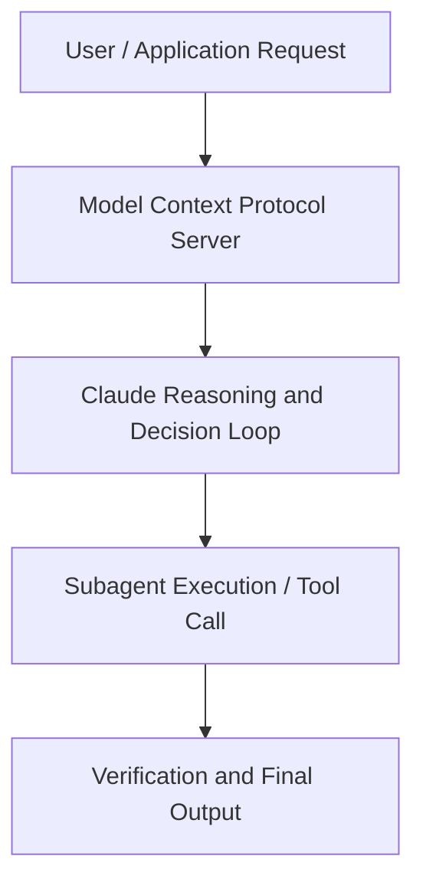

# Best Practices: Claude for Excel and Claude for PowerPoint

**Speaker(s):** Anthropic and Partner Leaders · **Channel:** Unlisted Videos · **Date:** 2026-03-18
**Watch:** https://anthropic.ondemand.goldcast.io/on-demand/dfd8dc34-c59d-469e-aad2-3b093bd8ef86?email=devofficialcoma@gmail.com&first_name=dev&last_name=Dev · **Format:** Talk · **Level:** Intermediate
**Topics:** Prompt Engineering, AI Agents

## TL;DR
This session explores best practices: claude for excel and claude for powerpoint, highlighting core architecture, runtime workflows, and practical deployment patterns across Prompt Engineering, AI Agents. Speakers analyze technical implementations and share operational best practices for building robust systems with Claude.

## Contents
- [Architectural Overview and System Objectives in Best Practices: Claude for Excel and Claude f](#architectural-overview-and-system-objectives-in-best-practices-claude-for-excel-and-claude-f)
- [Technical Capabilities, Tooling Integration, and Protocols](#technical-capabilities-tooling-integration-and-protocols)
- [Production Deployment, Verification, and Best Practices](#production-deployment-verification-and-best-practices)
- [Organizational Impact, Scalability, and Industry Outlook](#organizational-impact-scalability-and-industry-outlook)

## Architectural Overview and System Objectives in Best Practices: Claude for Excel and Claude f

This session is for professionals who are ready to move beyond one-off prompts and make Claude a reliable part of how they actually work , from first draft to final deliverable. We'll focus on the habits, setups, and techniques that turn Claude from a helpful tool into a true workflow accelerator. The session details foundational design principles, execution patterns, and operational integration requirements within the Prompt Engineering, AI Agents domain.

**Further reading:** Official documentation for Claude and Anthropic platform guides.

## Technical Capabilities, Tooling Integration, and Protocols

Speakers analyze technical capabilities across Claude. The architecture highlights reliable agent tool use, context window optimization, protocol standards, and seamless workflow interoperability.

**Further reading:** Official documentation for Claude and Anthropic platform guides.

## Production Deployment, Verification, and Best Practices

Production readiness demands robust evaluation harnesses, state validation, and error-handling loops. Teams implement systematic monitoring and guardrails to ensure reliability across repeated executions.

**Further reading:** Official documentation for Claude and Anthropic platform guides.

## Organizational Impact, Scalability, and Industry Outlook

Deploying agentic systems transforms developer and team workflows by automating high-friction tasks. Organizations scale safely by pairing automated tool orchestration with structured human review.

**Further reading:** Official documentation for Claude and Anthropic platform guides.

## Source
Full cleaned transcript: `DATA/videos/best-practices-claude-for-excel-and-2026.json`
Canonical recording: https://anthropic.ondemand.goldcast.io/on-demand/dfd8dc34-c59d-469e-aad2-3b093bd8ef86?email=devofficialcoma@gmail.com&first_name=dev&last_name=Dev