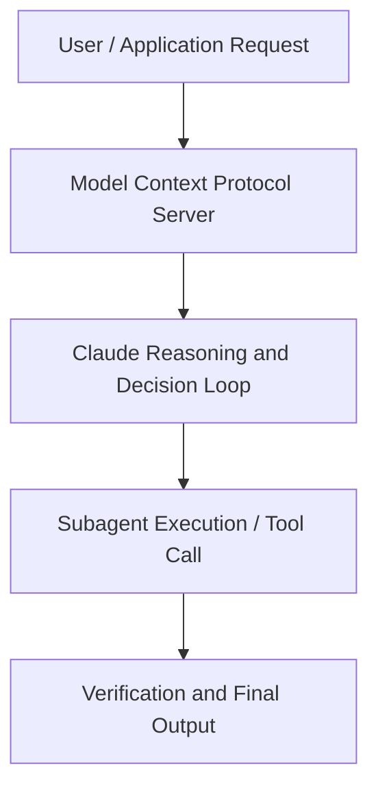

# Building for Production-Ready Use-Cases: How Lovable Scales with Claude

**Speaker(s):** Anthropic and Partner Leaders · **Channel:** Unlisted Videos · **Date:** 2025-09-24
**Watch:** https://youtu.be/WP2DVuy9cRw · **Format:** Workshop · **Level:** Advanced
**Topics:** Web Development, LLM Fundamentals

## TL;DR
This session explores building for production-ready use-cases: how lovable scales with claude, highlighting core architecture, runtime workflows, and practical deployment patterns across Web Development, LLM Fundamentals. Speakers analyze technical implementations and share operational best practices for building robust systems with Anthropic, Anthropic API.

## Contents
- [Architecture and Core Concepts in Building for Production-Ready Use-Cases: How](#architecture-and-core-concepts-in-building-for-production-ready-use-cases-how)
- [Technical Mechanics, Implementation Patterns, and Tooling](#technical-mechanics-implementation-patterns-and-tooling)
- [Operational Workflows, Evaluation, and Production Scaling](#operational-workflows-evaluation-and-production-scaling)
- [Strategic Implications, Governance, and Key Takeaways](#strategic-implications-governance-and-key-takeaways)

## Architecture and Core Concepts in Building for Production-Ready Use-Cases: How

Thank you for joining us today. I'm from Anthropic's go to market team. Today I'm joined by one of our strategic
customers, Lovable. I'm really looking forward to our content today on building production ready AI use cases and in
particular how Lovable Scales with Claude. I'm joined by Alex, Lovable's AI lead, and Priti from Anthropics applied
AI team who will be leading us through the content today. A couple housekeeping items before we dive in. Uh, this webinar will be recorded and will be
sent to you within 24 hours. So, don't worry if you miss anything.

**Further reading:** Official documentation for Anthropic and Anthropic platform guides.

## Technical Mechanics, Implementation Patterns, and Tooling

Um, so this is a very simple prompt, right, as we talked about. But let's look at adding a couple more things to that prompt to get more
s, 34 secondsinteresting visual outputs. First we can add a section here called uh use interesting fonts. We can basically
s, 41 secondsjust tell the model hey uh avoid boring generic font choices like for like these ones here for example. Instead here's
s, 48 secondssome examples of fonts that we would find more interesting and that you know viewers would find more interesting. We sort of encourage the model to use
s, 56 secondsthose fonts instead or to think about just more interesting font choices rather than the defaults that it typically chooses. So when we do
s, 3 secondsthat, we can see the same website, but Claude did in fact choose uh some more interesting fonts like you see here. So that's a little bit of a nudge in the
s, 11 secondsright direction in terms of the aesthetic quality that we want to see.

**Further reading:** Official documentation for Anthropic and Anthropic platform guides.

## Operational Workflows, Evaluation, and Production Scaling

The second
s, 10 secondsthing that I want to say for running any kind of software at scale is that everything that can go wrong will go wrong and I I want to infuse this
s, 19 secondsknowledge into any AI engineer out there. Because you just we cannot escape uh doing all these things uh
s, 26 secondsrunning tests protecting our inputs uh for example when you deal with LLMs um you know often users will chat and we'll have a text input in your app when they
s, 35 secondscan put whatever they want or they can upload some kind of media and images uh and you need to be very defensive with any inputs uh in such apps so I can
s, 44 secondsreally recommend protecting uh you know input sizes making sure on the back end that you deal with this errors when you get uh to lo context for example when
s, 53 secondssometimes you will also find issues where there are some empty messages sneaking into your your prompts or
s, 2 secondsmessages ending with new lines or whatever. And a lot of providers even for the same models have different implementations about this. What
s, 10 secondsworks on one API may not work on the other API and at scale it will happen uh hundreds or thousands of times per day. S, 17 secondsSo you you really want to look at all these errors and you build a great uh observability into your errors to see
s, 25 secondsone by one why things are failing and just fixing them in code. S, 31 secondsUm yeah next thing is prompt caching. For those who don't know prompt caching is a way for you to cache uh a set of
s, 39 secondstokens that you have already sent or to cla or that cloud has already generated uh which essentially makes them 10 times
s, 47 secondscheaper the next time you need to use them and I would say that we would not be able to build uh coding agents uh or agents in general without such
s, 55 secondstechniques because it would be too expensive. It's something extremely important for application developers to manage caching and think about how you can keep appending things to the same
s, 4 secondscache to uh to not you know have to pay 10 10 times extra essentially.

**Further reading:** Official documentation for Anthropic and Anthropic platform guides.

## Strategic Implications, Governance, and Key Takeaways

I think it's it's a combination of things. And a lot of it kind of just comes back to the stuff that I mentioned um earlier. One is you want a model that
s, 56 secondsis obviously good general purpose at software across programming languages, across frameworks, so on and so forth. S, 2 secondsObviously we've put a lot of love and care into you know making that possible. S, 6 secondsBut the second piece is is sort of where uh agentic right comes into the picture. S, 11 secondsAnd so when we think about agentic right you can kind of thinking about think about it as the transition from hey claude can write say um a localized
s, 20 secondspiece of code it can write a file to now it's actually acting like a software engineer. It's interacting on these
s, 28 secondsdifferent surfaces. So we put a lot of time and care into building Claude's interaction with you know tools with memory like those components that I
s, 36 secondstouched on earlier and then you kind of see the results and how all those uh simple kind of components come together and make a really magical experience
s, 43 secondswith our models.

**Further reading:** Official documentation for Anthropic and Anthropic platform guides.

## Source
Full cleaned transcript: `DATA/videos/building-for-production-ready-use-cases-2025.json`
Canonical recording: https://youtu.be/WP2DVuy9cRw