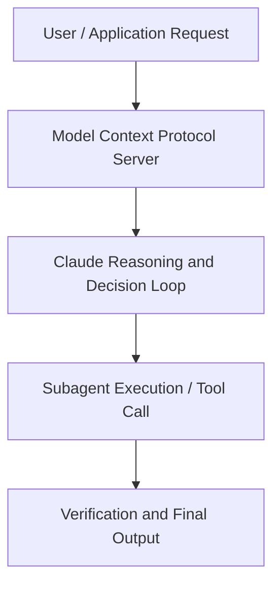

# Building on the Claude Platform: Claude Fable 5 and model orchestration patterns

**Speaker(s):** Jeremy Hadfield, Brad Abrams · **Channel:** Unlisted Videos · **Date:** 2026-07-22
**Watch:** https://anthropic.ondemand.goldcast.io/on-demand/c32e19a5-c4d7-432d-b83c-ec12c4222ab6?email=devofficialcoma@gmail.com&first_name=dev&last_name=Dev · **Format:** Talk · **Level:** Advanced
**Topics:** Web Development, Product/Startup

## TL;DR
This session explores building on the claude platform: claude fable 5 and model orchestration patterns, highlighting core architecture, runtime workflows, and practical deployment patterns across Web Development, Product/Startup. Speakers analyze technical implementations and share operational best practices for building robust systems with Anthropic, Claude.

## Contents
- [Architectural Overview and System Objectives in Building on the Claude Platform: Claude Fable](#architectural-overview-and-system-objectives-in-building-on-the-claude-platform-claude-fable)
- [Technical Capabilities, Tooling Integration, and Protocols](#technical-capabilities-tooling-integration-and-protocols)
- [Production Deployment, Verification, and Best Practices](#production-deployment-verification-and-best-practices)
- [Organizational Impact, Scalability, and Industry Outlook](#organizational-impact-scalability-and-industry-outlook)

## Architectural Overview and System Objectives in Building on the Claude Platform: Claude Fable

Join Brad Abrams and Jeremy Hadfield, members of Anthropic’s Technical Staff, for a look at how to build an eval suite from your own tasks and use it to decide which work moves to Fable 5. From there, we walk through the advisor strategy, an orchestration pattern where a smaller, cheaper model does the work and Fable 5 sets the strategy, often matching frontier-level results at a fraction of the token cost. You'll see how the pattern runs on the Claude Platform along with eval results on intelligence and cost. The session details foundational design principles, execution patterns, and operational integration requirements within the Web Development, Product/Startup domain.

**Further reading:** Official documentation for Anthropic and Anthropic platform guides.

## Technical Capabilities, Tooling Integration, and Protocols

Speakers analyze technical capabilities across Anthropic, Claude, Claude Fable 5. The architecture highlights reliable agent tool use, context window optimization, protocol standards, and seamless workflow interoperability.

**Further reading:** Official documentation for Anthropic and Anthropic platform guides.

## Production Deployment, Verification, and Best Practices

Production readiness demands robust evaluation harnesses, state validation, and error-handling loops. Teams implement systematic monitoring and guardrails to ensure reliability across repeated executions.

**Further reading:** Official documentation for Anthropic and Anthropic platform guides.

## Organizational Impact, Scalability, and Industry Outlook

Deploying agentic systems transforms developer and team workflows by automating high-friction tasks. Organizations scale safely by pairing automated tool orchestration with structured human review.

**Further reading:** Official documentation for Anthropic and Anthropic platform guides.

## Source
Full cleaned transcript: `DATA/videos/building-on-the-claude-platform-claude-2026.json`
Canonical recording: https://anthropic.ondemand.goldcast.io/on-demand/c32e19a5-c4d7-432d-b83c-ec12c4222ab6?email=devofficialcoma@gmail.com&first_name=dev&last_name=Dev