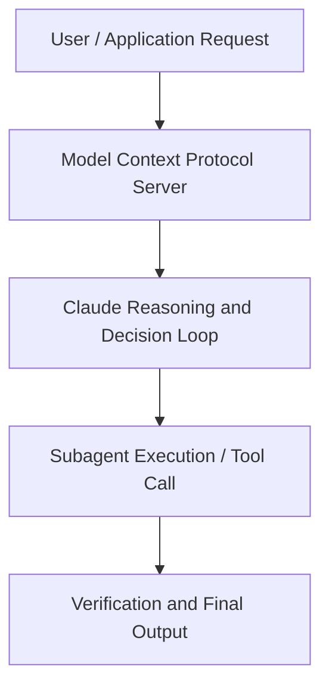

# Building Products on Claude Opus 4.6 , A Customer Success Story with Shortcut and Hex

**Speaker(s):** Anthropic and Partner Leaders · **Channel:** Unlisted Videos · **Date:** 2026-02-19
**Watch:** https://anthropic.ondemand.goldcast.io/on-demand/fd2a6fdb-4744-479d-838a-4c1665f9da7f?email=devofficialcoma@gmail.com&first_name=dev&last_name=Dev · **Format:** Talk · **Level:** Intermediate
**Topics:** LLM Fundamentals, Web Development

## TL;DR
This session explores building products on claude opus 4.6 , a customer success story with shortcut and hex, highlighting core architecture, runtime workflows, and practical deployment patterns across LLM Fundamentals, Web Development. Speakers analyze technical implementations and share operational best practices for building robust systems with Anthropic, Claude.

## Contents
- [Architectural Overview and System Objectives in Building Products on Claude Opus 4.6 , A Cust](#architectural-overview-and-system-objectives-in-building-products-on-claude-opus-46-a-cust)
- [Technical Capabilities, Tooling Integration, and Protocols](#technical-capabilities-tooling-integration-and-protocols)
- [Production Deployment, Verification, and Best Practices](#production-deployment-verification-and-best-practices)
- [Organizational Impact, Scalability, and Industry Outlook](#organizational-impact-scalability-and-industry-outlook)

## Architectural Overview and System Objectives in Building Products on Claude Opus 4.6 , A Cust

See what's possible when world-class product teams build on Claude Opus 4.6. Opus 4.6 changed the game for some of Anthropic’s startups. Join Nico, Founder of Shortcut, and Olivia, product lead at Hex, alongside Carly from Anthropic's team, for an inside look at how two innovative companies are using Opus 4.6 to power sophisticated, complex AI experiences. The session details foundational design principles, execution patterns, and operational integration requirements within the LLM Fundamentals, Web Development domain.

**Further reading:** Official documentation for Anthropic and Anthropic platform guides.

## Technical Capabilities, Tooling Integration, and Protocols

Speakers analyze technical capabilities across Anthropic, Claude, Claude Opus 4. The architecture highlights reliable agent tool use, context window optimization, protocol standards, and seamless workflow interoperability.

**Further reading:** Official documentation for Anthropic and Anthropic platform guides.

## Production Deployment, Verification, and Best Practices

Production readiness demands robust evaluation harnesses, state validation, and error-handling loops. Teams implement systematic monitoring and guardrails to ensure reliability across repeated executions.

**Further reading:** Official documentation for Anthropic and Anthropic platform guides.

## Organizational Impact, Scalability, and Industry Outlook

Deploying agentic systems transforms developer and team workflows by automating high-friction tasks. Organizations scale safely by pairing automated tool orchestration with structured human review.

**Further reading:** Official documentation for Anthropic and Anthropic platform guides.

## Source
Full cleaned transcript: `DATA/videos/building-products-on-claude-opus-46-2026.json`
Canonical recording: https://anthropic.ondemand.goldcast.io/on-demand/fd2a6fdb-4744-479d-838a-4c1665f9da7f?email=devofficialcoma@gmail.com&first_name=dev&last_name=Dev