# Building Products on Claude Opus 4.7 , A Customer Success Story with Solve Intelligence and Blitzy

**Speaker(s):** Anthropic and Partner Leaders · **Channel:** Unlisted Videos · **Date:** 2026-04-29
**Watch:** https://anthropic.ondemand.goldcast.io/on-demand/e7a2eb89-fd47-4108-a3b8-978e02db9ddc?email=devofficialcoma@gmail.com&first_name=dev&last_name=Dev · **Format:** Talk · **Level:** Intermediate
**Topics:** AI Coding Tools, Web Development

## TL;DR
This session explores building products on claude opus 4.7 , a customer success story with solve intelligence and blitzy, highlighting core architecture, runtime workflows, and practical deployment patterns across AI Coding Tools, Web Development. Speakers analyze technical implementations and share operational best practices for building robust systems with Anthropic, Claude.

## Contents
- [Architectural Overview and System Objectives in Building Products on Claude Opus 4.7 , A Cust](#architectural-overview-and-system-objectives-in-building-products-on-claude-opus-47-a-cust)
- [Technical Capabilities, Tooling Integration, and Protocols](#technical-capabilities-tooling-integration-and-protocols)
- [Production Deployment, Verification, and Best Practices](#production-deployment-verification-and-best-practices)
- [Organizational Impact, Scalability, and Industry Outlook](#organizational-impact-scalability-and-industry-outlook)

## Architectural Overview and System Objectives in Building Products on Claude Opus 4.7 , A Cust

Join founders and product leaders from Solve Intelligence and Blitzy , alongside a member of Anthropic's team , for an inside look at how two innovative companies are using Claude to power sophisticated AI experiences across two frontier domains: intellectual property and the full software development lifecycle. The session details foundational design principles, execution patterns, and operational integration requirements within the AI Coding Tools, Web Development domain.

**Further reading:** Official documentation for Anthropic and Anthropic platform guides.

## Technical Capabilities, Tooling Integration, and Protocols

Speakers analyze technical capabilities across Anthropic, Claude, Claude Opus 4. The architecture highlights reliable agent tool use, context window optimization, protocol standards, and seamless workflow interoperability.

```mermaid
flowchart TD

 A[User / Application Request] --> B[Model Context Protocol Server]

 B --> C[Claude Reasoning and Decision Loop]

 C --> D[Subagent Execution / Tool Call]

 D --> E[Verification and Final Output]

```

**Further reading:** Official documentation for Anthropic and Anthropic platform guides.

## Production Deployment, Verification, and Best Practices

Production readiness demands robust evaluation harnesses, state validation, and error-handling loops. Teams implement systematic monitoring and guardrails to ensure reliability across repeated executions.

**Further reading:** Official documentation for Anthropic and Anthropic platform guides.

## Organizational Impact, Scalability, and Industry Outlook

Deploying agentic systems transforms developer and team workflows by automating high-friction tasks. Organizations scale safely by pairing automated tool orchestration with structured human review.

**Further reading:** Official documentation for Anthropic and Anthropic platform guides.

## Source
Full cleaned transcript: `DATA/videos/building-products-on-claude-opus-47-2026.json`
Canonical recording: https://anthropic.ondemand.goldcast.io/on-demand/e7a2eb89-fd47-4108-a3b8-978e02db9ddc?email=devofficialcoma@gmail.com&first_name=dev&last_name=Dev