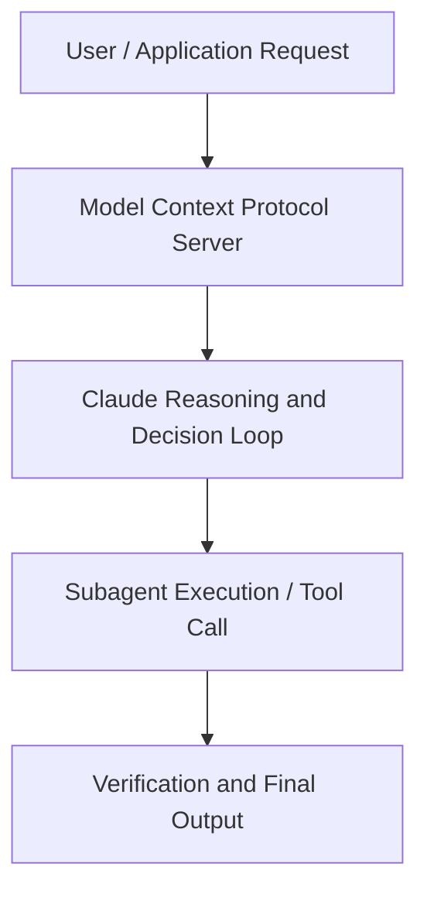

# Building the future of AI coding with MCP in VS Code and Claude

**Speaker(s):** Anthropic and Partner Leaders · **Channel:** Unlisted Videos · **Date:** 2025-07-31
**Watch:** https://youtu.be/2OWVm7B8Bo8 · **Format:** Demo · **Level:** Advanced
**Topics:** AI Coding Tools, AI Agents

## TL;DR
This session explores building the future of ai coding with mcp in vs code and claude, highlighting core architecture, runtime workflows, and practical deployment patterns across AI Coding Tools, AI Agents. Speakers analyze technical implementations and share operational best practices for building robust systems with Anthropic, Box.

## Contents
- [Architecture and Core Concepts in Building the future of AI coding with MCP in](#architecture-and-core-concepts-in-building-the-future-of-ai-coding-with-mcp-in)
- [Technical Mechanics, Implementation Patterns, and Tooling](#technical-mechanics-implementation-patterns-and-tooling)
- [Operational Workflows, Evaluation, and Production Scaling](#operational-workflows-evaluation-and-production-scaling)
- [Strategic Implications, Governance, and Key Takeaways](#strategic-implications-governance-and-key-takeaways)

## Architecture and Core Concepts in Building the future of AI coding with MCP in

Hey everyone, welcome to today's webinar. We'll be talking about the future of AI coding and agent coding. We've got a series of of folks here on the call today. There's a couple of folks from the VS Code side. And I am
on from the uh cloud and MCP side. We're really excited to bring today's webinar to you. Before we jump in, just
a couple of housekeeping notes. First, uh yes, we will be recording this webinar and we'll distribute it within
uh 24 hours via email.

**Further reading:** Official documentation for Anthropic and Anthropic platform guides.

## Technical Mechanics, Implementation Patterns, and Tooling

S, 4 secondsAnd then let's jump over here and let's have some fun. So, I'm going to start a new chat. S, 12 secondsLet's get rid of this terminal. I'll tell you what, let's make a lot of real estate. So, what do we want to do here? S, 20 secondsI've got an application that I've been working on. Um, and actually, uh, I say I've been working on it, but actually Claude has been working on it. Let me
s, 28 secondsfind it here.

**Further reading:** Official documentation for Anthropic and Anthropic platform guides.

## Operational Workflows, Evaluation, and Production Scaling

Just to highlight some customizations as you get into MCP and I
s, 31 secondsalready saw some questions around it like sometimes the LM doesn't get that I want to use which MCP and to try that out I think with uh one of these is tool
s, 40 secondssets that we have so in agent mode in VS code Bur already showed prompts I'm going to show tool sets and one I really
s, 49 secondslike in my day-to-day is this tool set that combines the GitHub tools for list notifications
s, 56 secondsdismiss and get annotation details. The way I can now use this is for example asking GitHub check my GitHub
s, 6 secondsnews um for urgent important issues. That's now that
s, 15 secondsbasically seats the agent with these three tools uh you're supposed to use to answer this question. It doesn't restrict it but it just gives it a
s, 24 secondslittle more context on and that I think is for many now we have this new habit of like being really worthy in how how
s, 31 secondswe have to talk to the agent to actually invoke explicit tools and it's nice to to guide the agent but this is I think
s, 39 secondssomething where if as an organization as you try to get MCP usage across the whole org it's nice to have that kind of
s, 46 secondsbaked in built by the experts in in the team and just uh summaries it So yeah, this is great for me to get my day
s, 53 secondsstarted. I could even now take this whole thing and then make a new prompt up here. S, 2 secondsthat's probably just for me. I put it in my user folder like uh daily summary and should be agent mode and
s, 12 secondsthen do this. Check my GitHub and then I add a tools section here.

**Further reading:** Official documentation for Anthropic and Anthropic platform guides.

## Strategic Implications, Governance, and Key Takeaways

S, 34 secondsThen eventually it will ask for sampling access. It actually does several searches across Apple docs. S, 42 secondsAnd that's a request to now summarize the answer. It has all the docs and it could send all these docs back into agent mode. But that would mean your
s, 51 secondscontext is overloaded with a bunch of documentation that might not be relevant and you just want to answer that question. In this case, the MCP now
suses sampling to boil down everything it found into a concrete, specific, succinct answer. We're going to allow
s, 8 secondsthis um your session and that's the fine print control you have again. Just to see how it looks like it it has a query for the docs.

**Further reading:** Official documentation for Anthropic and Anthropic platform guides.

## Source
Full cleaned transcript: `DATA/videos/building-the-future-of-ai-coding-2025.json`
Canonical recording: https://youtu.be/2OWVm7B8Bo8