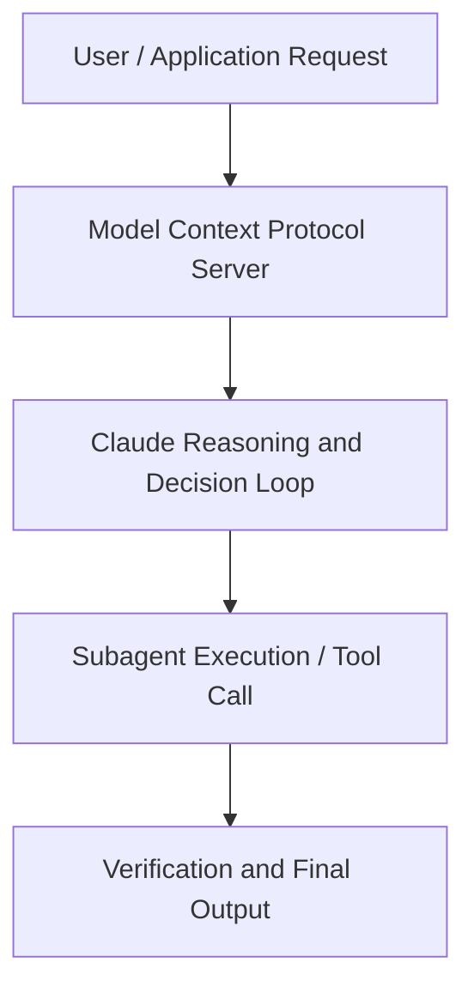

# Building with Advanced Agent Capabilities for Claude on Vertex AI

**Speaker(s):** Anthropic and Partner Leaders · **Channel:** Unlisted Videos · **Date:** 2026-02-06
**Watch:** https://youtu.be/OwQYnMWk3t8 · **Format:** Workshop · **Level:** Advanced
**Topics:** AI Agents, Web Development

## TL;DR
This session explores building with advanced agent capabilities for claude on vertex ai, highlighting core architecture, runtime workflows, and practical deployment patterns across AI Agents, Web Development. Speakers analyze technical implementations and share operational best practices for building robust systems with Anthropic, Claude.

## Contents
- [Architecture and Core Concepts in Building with Advanced Agent Capabilities for](#architecture-and-core-concepts-in-building-with-advanced-agent-capabilities-for)
- [Technical Mechanics, Implementation Patterns, and Tooling](#technical-mechanics-implementation-patterns-and-tooling)
- [Operational Workflows, Evaluation, and Production Scaling](#operational-workflows-evaluation-and-production-scaling)
- [Strategic Implications, Governance, and Key Takeaways](#strategic-implications-governance-and-key-takeaways)

## Architecture and Core Concepts in Building with Advanced Agent Capabilities for

Hello and welcome everyone to our third iteration of our joint webinar series on
uh building with agents. I'm Alex and I'm technical partner enablement lead and we're here with Ivon. I'm super nice to be here again and excited about talking at this topic today. Yeah, excited to have this conversation with all of you joining and Ivon. I'm looking forward to to some of the interactions that we're sure to have
about some of the topics we're going to discuss today. So, uh just a few housekeeping notes as we get started. You know, after um uh you know, if if you're afraid that you
might miss something in this webinar, uh we will have recordings of it for you all and it'll be distributed via email within 24 hours. And if you have
questions, you may feel free to use the the Q&A to to add those questions and uh we'll do our best to to address them as
they come in uh or at the end.

**Further reading:** Official documentation for Anthropic and Anthropic platform guides.

## Technical Mechanics, Implementation Patterns, and Tooling

I'm not going to get into all the
s, 23 secondsnitty-gritty of the details of the code, but I do want to at least share the fundamentals so you know how to think about this in your own use cases and
s, 31 secondsworkflows. Here what we're presenting is this idea of a compaction control parameter which provides automatic
s, 39 secondscontext management by basically monitoring the number of tokens that are in use per turn in a conversation and
s, 47 secondsthe model then generates these summary tags and and these summary tags are then used in up in in sort of next in
s, 55 secondsfollow-up context windows and follow-up sessions. So the idea behind this cookbook is to demonstrate how this feature
s, 4 secondsessentially enables you to decrease the amount of context that's used while still preserving your outcome that you
s, 12 secondsseek. There's a bunch of stuff here about setting up the notebook and kind of working through the working through the example. But let's talk about what
s, 20 secondsthe example actually is and show you some of the implications. In this notebook, what we're demonstrating is
s, 27 secondsessentially a workflow, an agent which processes customer support tickets. You can see that there are several
s, 34 secondstools, right? There are, I think, eight tools here that we're or seven tools uh that we're using uh or that the agent
s, 42 secondsuses.

**Further reading:** Official documentation for Anthropic and Anthropic platform guides.

## Operational Workflows, Evaluation, and Production Scaling

S, 2 secondsUh, by the way, we recently added uh this feature here for letting us know if the if the uh notebook was useful to
s, 10 secondsyou. Uh, we recommend you again check out all of these notebooks on your own. S, 14 secondsWe'll cover only the basics and fundamentals in the interest of time, but do let us know whether you found the notebook or any of the notebooks on this on this um cookbook page useful to you. S, 26 secondsAlso, I do want to highlight that this is not just, you know, text. You can go to GitHub and actually play with all of these notebooks yourself. You can you
s, 34 secondscan fork and clone them and we also accept contributions if you find any bugs. Anyway, with that said, tool search with embeddings and this is
s, 43 secondsreally about scaling claude to use up to, you know, thousands of tools potentially. The idea behind it as I
s, 50 secondsmentioned is to uh to uh give tool uh to give cloud excuse me a tool search tool
s, 57 secondswhich which returns relevant capabilities on demand and sometimes reducing context usage by up to 90%.

**Further reading:** Official documentation for Anthropic and Anthropic platform guides.

## Strategic Implications, Governance, and Key Takeaways

Um you know if you if you think about if you think
s, 19 secondsabout memory in terms of how how we process information well uh it turns out that you know if we if we overload our memory with things that that aren't
s, 27 secondsimportant sometimes we we forget other things. So if you know if you think about it in the context of agents memory
s, 35 secondsuh and and what we're about to show uh lets agents store and and consult information outside the context window. S, 42 secondsThink of it as like your notebook that you use to to write down notes for yourself uh through a file-based system. S, 48 secondsAnd the capabilities of this are quite powerful. You know you you can think of this in the context of let's say long
s, 55 secondshorizon coding agents where you know you might be loading a tremendous amount of information into context and as you do so from session to session you might
s, 4 secondswant the the agent to look at previous session state. For example, a practical uh implication of this might be if you have a long horizon coding
s, 13 secondsagent that uh that has written some tests for you and and implemented functionality to satisfy those tests and
s, 21 secondsthen the next session picks up at a clean slate. Well, how does it know what tests have passed? This is where memory can really
s, 29 secondscan really uh shine.

**Further reading:** Official documentation for Anthropic and Anthropic platform guides.

## Source
Full cleaned transcript: `DATA/videos/building-with-advanced-agent-capabilities-for-2026.json`
Canonical recording: https://youtu.be/OwQYnMWk3t8