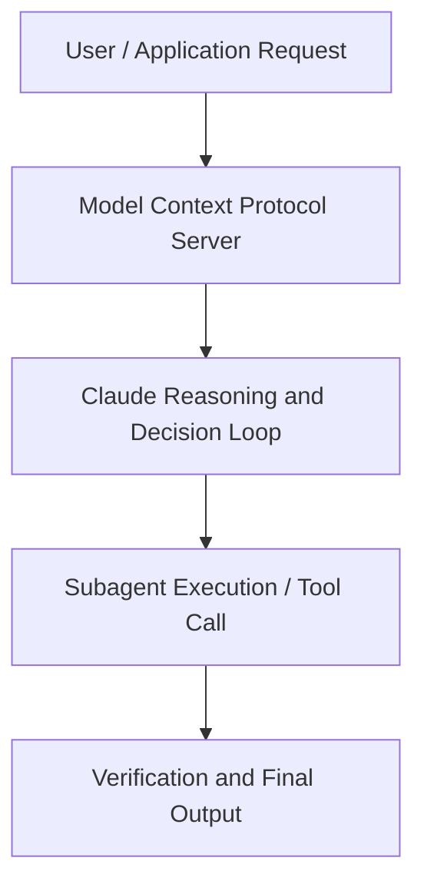

# Building with Claude Code: Inside Notion's AI development workflow

**Speaker(s):** Anthropic and Partner Leaders · **Channel:** Unlisted Videos · **Date:** 2025-12-17
**Watch:** https://youtu.be/PXtEImCuUGw · **Format:** Demo · **Level:** Intermediate
**Topics:** Product/Startup, Web Development

## TL;DR
This session explores building with claude code: inside notion's ai development workflow, highlighting core architecture, runtime workflows, and practical deployment patterns across Product/Startup, Web Development. Speakers analyze technical implementations and share operational best practices for building robust systems with Anthropic, Claude.

## Contents
- [Architecture and Core Concepts in Building with Claude Code: Inside Notion's AI](#architecture-and-core-concepts-in-building-with-claude-code-inside-notions-ai)
- [Technical Mechanics, Implementation Patterns, and Tooling](#technical-mechanics-implementation-patterns-and-tooling)
- [Operational Workflows, Evaluation, and Production Scaling](#operational-workflows-evaluation-and-production-scaling)
- [Strategic Implications, Governance, and Key Takeaways](#strategic-implications-governance-and-key-takeaways)

## Architecture and Core Concepts in Building with Claude Code: Inside Notion's AI

Welcome everyone to today's webinar building with cloud code inside notion's AI development workflow. I'm Wyatt
Hin from Anthropics applied AI team. I have the lucky job of working with teams at notion who are building at the
frontier of what's possible in AI. My work with customers like Notion on the call today help inform how we continue
to improve our models and product layers. When notion's engineers find friction points or unlock new patterns, that insight flows directly into our API
product roadmap. Um, partnerships like the one you'll see today between Notion and Anthropic make Claude better for
everyone. Um, Notion was actually one of the earliest Cloud Code design partners. Today you're going to hear about how their early collaboration with us shaped the product of Cloud Code into how they
use it across their teams.

**Further reading:** Official documentation for Anthropic and Anthropic platform guides.

## Technical Mechanics, Implementation Patterns, and Tooling

Um, and we're going to walk through their
s, 45 secondsexperience using Notion uh across their stack internally, exposing it to their customers, and then how they interconnected it and made it available
s, 54 secondswithin the rest of their AI infrastructure. Ben, do you want to uh come off mute and walk us through this? Um, I do internal developer experience at Notion. Um, just to start us off, I'm guessing many of you may be notion users already, but for
s, 11 secondsanybody who isn't, um, we make an AI powered workspace that uni unifies your knowledge, project AI, and all your teams. So, to start us off, I really
s, 20 secondswant to just quickly share just a little bit about the company for a sense of like the scale of what we work on. Um, so we build an app used by millions of
s, 28 secondsusers from, you know, individuals to giant enterprises. Our codebase is a full stack TypeScript model repo. S, 36 secondsit's very client heavy which is actually it makes it different from some applications you might have worked on.

**Further reading:** Official documentation for Anthropic and Anthropic platform guides.

## Operational Workflows, Evaluation, and Production Scaling

S, 35 secondsAnd this is done using the notion MCP. S, 38 secondsUm, if you're not aware, um, MCP is an acronym that stands for model context protocol, which essentially allows you to use the notion context and notion AI in your IDE or terminal as you code. S, 50 secondsWhen we launched notion MCP, we received a bunch of feedback and excitement um, from our product and developer community. That's because using
s, 58 secondsNotion MCP and cloud code together helps close the gap between discovery and ideation and into creating prototypes that others can play around with, which
s, 7 secondsis our step three. Notion MCP allows you to provide rich context to cloud code that you can refer to such as like
s, 14 secondsyour coding best practices, maybe some overall style and design guidelines, and even a PRD, which is what we're going to use to prototype today. But rather than
s, 23 secondstelling you about how this works, uh, let me show you. So, first we're going to use some meeting notes from a customer call to create a PRD that's
s, 31 secondsgoing to be using notion AI um powered by uh powered by um Sonnet and then we're going to use the notion MCP to
s, 39 secondsread the PRD from cloud code and then prototype our solution and finally we'll be able to test out our prototype. So,
s, 46 secondsjust to ground everyone we're going to be starting off in our PM and design prototyping environment.

**Further reading:** Official documentation for Anthropic and Anthropic platform guides.

## Strategic Implications, Governance, and Key Takeaways

S, 26 secondsUm, but there are some things like that that we really actually try to stay away from. Um, and at the end of the day, u, measuring developer productivity is is
s, 34 secondsfamously hard. But, um, all of whatever you've used to measure it before, in some ways, that's that's probably still what's what's the most important. The
s, 42 secondsone thing I would add to that is an easy introduction into these tools is the stuff I talked about around skills. Um,
s, 50 secondsthere's a lot of hard problems that can block you at the last minute. Having an easier way to resolve them or kind of
s, 58 secondsjust an expert talking you through it is has been an incredibly valuable workflow for me and has gotten a lot of people I know into this kind of tooling. Well
s, 7 secondsI guess I'm not an engineer anymore but um I think that is just generally a really exciting opportunity to get um
s, 17 secondslike PMs and people that don't classically code right into it. I think that there was a a brief phase
s, 24 secondswhere um they really wanted everybody at notion to start coding and then you know like PM's actually committing uh PRs and
s, 32 secondsthings like that but then they realize it's a lot of load on the nge team for potentially not fantastic code hence the new environment for us to go ahead and
s, 39 secondsplay around with.

**Further reading:** Official documentation for Anthropic and Anthropic platform guides.

## Source
Full cleaned transcript: `DATA/videos/building-with-claude-code-inside-notions-2025.json`
Canonical recording: https://youtu.be/PXtEImCuUGw