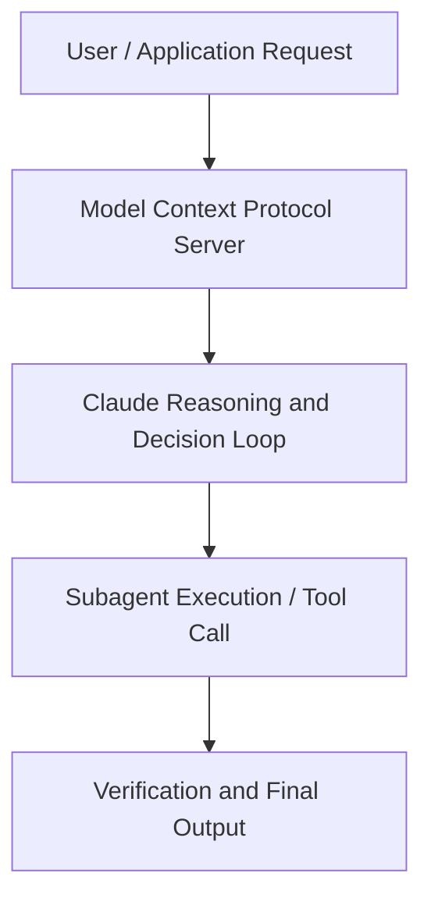

# Building with Claude in Europe: Agent Fundamentals

**Speaker(s):** Anthropic and Partner Leaders · **Channel:** Unlisted Videos · **Date:** 2025-12-03
**Watch:** https://youtu.be/bU3O67koKBI · **Format:** Talk · **Level:** Intermediate
**Topics:** AI Agents, Web Development

## TL;DR
This session explores building with claude in europe: agent fundamentals, highlighting core architecture, runtime workflows, and practical deployment patterns across AI Agents, Web Development. Speakers analyze technical implementations and share operational best practices for building robust systems with Anthropic, Box.

## Contents
- [Architecture and Core Concepts in Building with Claude in Europe: Agent Fundame](#architecture-and-core-concepts-in-building-with-claude-in-europe-agent-fundame)
- [Technical Mechanics, Implementation Patterns, and Tooling](#technical-mechanics-implementation-patterns-and-tooling)
- [Operational Workflows, Evaluation, and Production Scaling](#operational-workflows-evaluation-and-production-scaling)
- [Strategic Implications, Governance, and Key Takeaways](#strategic-implications-governance-and-key-takeaways)

## Architecture and Core Concepts in Building with Claude in Europe: Agent Fundame

Thank you so much for joining us for this agent fundamentals webinar. I am an applied AI product engineer at Anthropic and with me is Steve. I'm Steve Brian, CTO at Mesh AI and I'm excited to join you today and talk about agent fundamentals. The topic of the day is agents. We're going to talk about how we got here and how you can build your own. But before I begin, please use the chat to ask
questions throughout. We'll have some time at the end to address them. Before we get into agents, a quick introduction about Anthropic.

**Further reading:** Official documentation for Anthropic and Anthropic platform guides.

## Technical Mechanics, Implementation Patterns, and Tooling

S, 57 secondsBut here's what's really interesting about agents and agency. As you can tell by the name, Claude Code was initially
s, 4 secondsbuilt to help users code. But a byproduct of this CLI CLI bash first
s, 11 secondsapproach was that combining that agency that comes with the CLI with sufficiently intelligent
s, 20 secondsmodels, you find that something else emerges. It becomes more than just a coding tool. S, 27 secondsI for example use it to create presentations like this one, maybe some of the slides from here. We use it for
s, 34 secondsdocumentation, project management, uh new hire onboarding, large scale automations. S, 40 secondsOur team learned a lot about Agentic AI while building Claude code. This is where it gets really exciting.

**Further reading:** Official documentation for Anthropic and Anthropic platform guides.

## Operational Workflows, Evaluation, and Production Scaling

An example here we're talking about catching a financial regulation violation. You may have different modes for different
s, 36 secondssituations. Sometimes you need a quality score. Sometimes you just need to know which is better. You can do a pair-wise comparison. This is comparing two
s, 44 secondsoutputs side by side to pick which is better. Um, this is great for AB testing, you know. So, um, with investate, you know, to improve the
s, 52 secondsportfolio advisor, we could compare an old versus a new version, which one gives us better, you know, recommendations from a financial perspective.

**Further reading:** Official documentation for Anthropic and Anthropic platform guides.

## Strategic Implications, Governance, and Key Takeaways

Again, in the full example, you've got a much more detailed
s, 15 secondssystem prompt. In production, you typically uh create something much more uh complex. S, 22 secondsSo really simple there in kind of this not very long Python uh file, I've been able to define my orchestrator agent uh multiple sub agents, multiple tools. S, 31 secondsThese are tools that um I've defined, but you can use you know external MCPS as well as tools into your for your agents. You can see as we've come
s, 38 secondsback to the web interface here, it's decided to call my client profiler sub agent and get the client profile. It's called my compliance checker
s, 46 secondsum agent as well. I've got a response that tells me that um I want to should consider tactical rebalancing of
s, 55 secondsmy uh portfolio. There's an example of how we can really simply use the cloud agent SDK to build a multi- aent uh application.

**Further reading:** Official documentation for Anthropic and Anthropic platform guides.

## Source
Full cleaned transcript: `DATA/videos/building-with-claude-in-europe-agent-2025.json`
Canonical recording: https://youtu.be/bU3O67koKBI