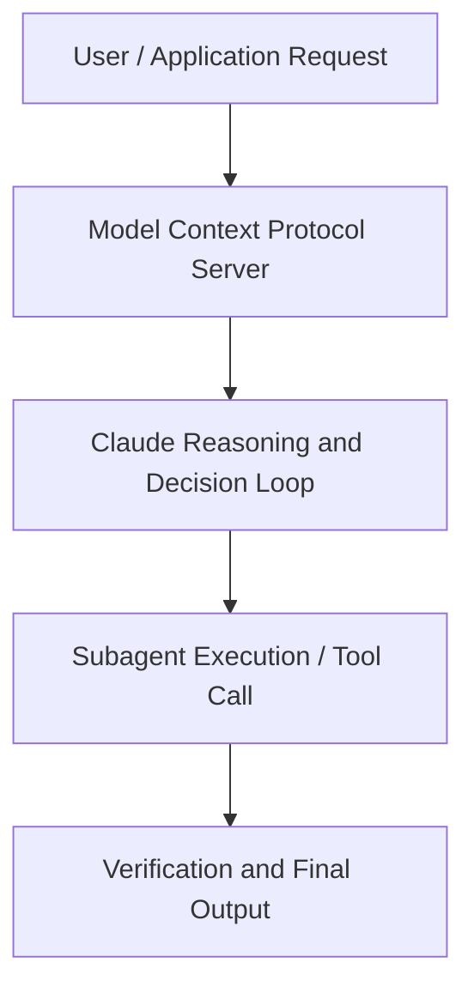

# Building with MCP and Claude Code: Sentry's 0 to 1 Story

**Speaker(s):** David Cramer, Jeremy Hadfield, Ilana Nathans · **Channel:** Unlisted Videos · **Date:** 2025-12-12
**Watch:** https://youtu.be/nKAwzQ2b7JQ · **Format:** Demo · **Level:** Beginner
**Topics:** AI Coding Tools, AI Agents

## TL;DR
This session explores building with mcp and claude code: sentry's 0 to 1 story, highlighting core architecture, runtime workflows, and practical deployment patterns across AI Coding Tools, AI Agents. Speakers analyze technical implementations and share operational best practices for building robust systems with Anthropic, Claude.

## Contents
- [Architecture and Core Concepts in Building with MCP and Claude Code: Sentry's 0](#architecture-and-core-concepts-in-building-with-mcp-and-claude-code-sentrys-0)
- [Technical Mechanics, Implementation Patterns, and Tooling](#technical-mechanics-implementation-patterns-and-tooling)
- [Operational Workflows, Evaluation, and Production Scaling](#operational-workflows-evaluation-and-production-scaling)
- [Strategic Implications, Governance, and Key Takeaways](#strategic-implications-governance-and-key-takeaways)

## Architecture and Core Concepts in Building with MCP and Claude Code: Sentry's 0

Thank you so much for joining us. I'm a member of the go to market team here at Anthropic and I am joined today by
Jeremy Hadfield from our applied AI team. We're very excited to introduce you to David Kramer who is the co-founder and now the chief product
officer at Sentry. Centry is a leading application monitoring tool for developers. They're used by over 150,000
teams including the team right here at Enthropic. A few housekeeping items before we get started. The session is
recorded and we'll distribute it via email by the end of the week. We have a questions widget so please submit your questions throughout and we'll save time
for Q&A at the end.

**Further reading:** Official documentation for Anthropic and Anthropic platform guides.

## Technical Mechanics, Implementation Patterns, and Tooling

I think that in general as the models get better it becomes less of a slot machine
s, 57 secondsand more of like a reliable and very smart intern and I think that will progress even more to the point where it's you know as effective as working
s, 7 secondswith um you know some software engineers and like it just sort of is a huge force multiplier for for most engineers. I'm
s, 14 secondscurious like how um actually I think I think that one thing that would be interesting to see is I think you have a
s, 20 secondsdemo of your Sentry MCP or of your use of cloud code and that would be super cool to see. S, 27 secondsYeah, let me um so we're going to let me jump into Sentry. I assume most people are familiar with Sentry. But let me pull that up. S, 36 secondsYep, we can see. S, 36 secondsUm I'm I'm not going to go too much in here. Sentry, we do a lot of things these days, right?

**Further reading:** Official documentation for Anthropic and Anthropic platform guides.

## Operational Workflows, Evaluation, and Production Scaling

Here's a really
s, 14 secondsgood example why GitHub has an MCP server that is like I don't know how many is it's like 40 tools. The biggest issue with MCP is when you load
s, 21 secondsit up and and Anthropic has a bunch of stuff around this recently that's really awesome. But the the biggest gripe people had is what you load up an MCP server, the more tools it had, the more
s, 30 secondsdefinitions of those tools, the more of your context window it would consume. If you've used any of these agents, you know, the more context consumed, the less you can kind of do, the more
s, 37 secondsgenerally the the less reliable it gets with results. I think personally GitHub gave MCP a bad rap because it was
s, 45 secondsjust like instantly everybody uses GitHub. I actually think it was one of the uh the less well-designed MCP services because
s, 54 secondsall they did was take their API and they mapped it to a bunch of MCP tools. It's like very very surface level. S, 2 secondsAnd so if you want to so there I have advice for using and advice for building.

**Further reading:** Official documentation for Anthropic and Anthropic platform guides.

## Strategic Implications, Governance, and Key Takeaways

So, what's crazy is um our CFO started using one of the uh like a Bolt or a lovable, one of like sort of the more
s, 51 secondssimplistic things to build, um, he's into beer and whatnot. He was building like a beer rating app cuz he has like a spreadsheet CFO stuff and he started
s, 59 secondswith one of these and it wasn't advanced enough for him and he quickly switched to like he switched to cursor in this case but um uh it was like cursor with
s, 6 secondssonnet and he was like like the app is like legitimate now and I'm like he's probably just as good of a software engineer using this as like half the
s, 14 secondssoftware engineers that are like early career and I'm like this is like phenomenal to me. Uh, and so I I just thought it was like such an interesting
s, 21 secondsthing. To be fair, I think like the skills to be effective at his job are probably not wildly different than the skills to be an effective software
s, 28 secondsengineer at like certain scales, but I think you sort of need those avenues and you need the right pushes and the unlocks and whatnot. But beyond
s, 37 secondsthat, I actually don't know how you get it from even like, okay, maybe I tried it to I actually can use it or I know how to use it or I want to use it. I
s, 44 secondsthink there's still all these like different sections of that. We we had a similar uh week here at Enthroic. And I've heard of Yeah, many customers doing the same.

**Further reading:** Official documentation for Anthropic and Anthropic platform guides.

## Source
Full cleaned transcript: `DATA/videos/building-with-mcp-and-claude-code-2025.json`
Canonical recording: https://youtu.be/nKAwzQ2b7JQ