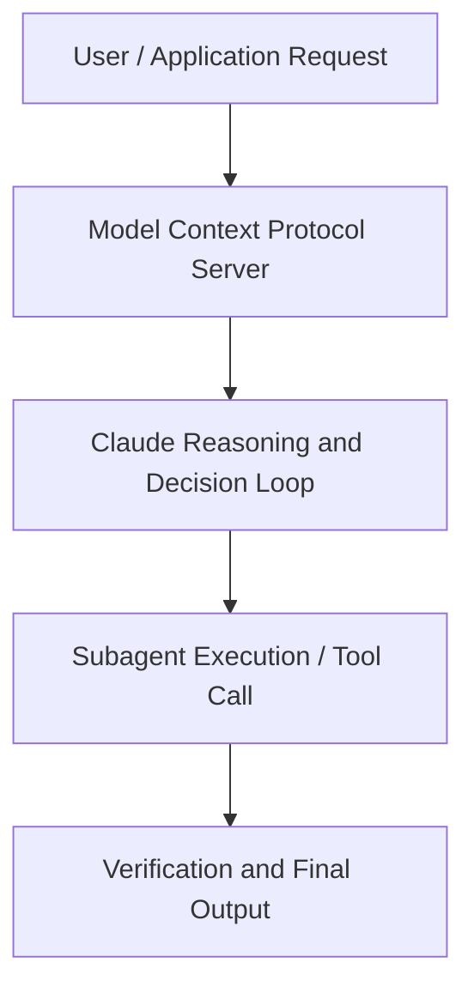

# Claude Code Best Practices: Power User Insights from Lightspeed Portfolio Companies

**Speaker(s):** Anthropic and Partner Leaders · **Channel:** Unlisted Videos · **Date:** 2025-10-23
**Watch:** https://youtu.be/sHCCXK7Xz24 · **Format:** Demo · **Level:** Advanced
**Topics:** Backend/Infra, AI Agents

## TL;DR
This session explores claude code best practices: power user insights from lightspeed portfolio companies, highlighting core architecture, runtime workflows, and practical deployment patterns across Backend/Infra, AI Agents. Speakers analyze technical implementations and share operational best practices for building robust systems with Anthropic, Box.

## Contents
- [Architecture and Core Concepts in Claude Code Best Practices: Power User Insigh](#architecture-and-core-concepts-in-claude-code-best-practices-power-user-insigh)
- [Technical Mechanics, Implementation Patterns, and Tooling](#technical-mechanics-implementation-patterns-and-tooling)
- [Operational Workflows, Evaluation, and Production Scaling](#operational-workflows-evaluation-and-production-scaling)
- [Strategic Implications, Governance, and Key Takeaways](#strategic-implications-governance-and-key-takeaways)

## Architecture and Core Concepts in Claude Code Best Practices: Power User Insigh

Welcome to cloud code best practices. We're you know going to be
sharing uh tips and tricks from power users and you know leadership at like light speeded portfolio companies and on
the cloud code team. Thanks for joining us and really excited to get started. Uh just some housekeeping
before you know we uh before we dive into it. We are going to be recording the session and so you'll get it via email. You can submit questions via
the web portal and you know uh we'll try to get to all of them but or we probably won't get to all of them but we will you know get to as many as we can. And uh
yeah give us feedback. You know this is like one of the first times we've been running this webinar.

**Further reading:** Official documentation for Anthropic and Anthropic platform guides.

## Technical Mechanics, Implementation Patterns, and Tooling

And kind of taking all that and injecting that into cloud code into look h how do
s, 8 secondsI want to approach a task like this? What that got to was essentially you know use the software itself to to extract um underlying structure. S, 17 secondsthat's kind of what you're seeing on on the right. It's essentially an RPA script which I've never written before. S, 22 secondsBut with cloud code again architecting exactly kind of what I wanted to do. I wrote a very wellperforming uh RPA
s, 29 secondsscript and you know then the the second task was again kind of extracting structure from that which which um uh again you know I think architecting it
s, 38 secondsone step removed from cloud code uh before before generating. Zooming out like a little, I think I'll just touch on kind of three of my biggest unlocks,
s, 46 secondsI think. These are not really, you know, using the Claude M MD in a great way or like MCPs, which I've explored a ton.

**Further reading:** Official documentation for Anthropic and Anthropic platform guides.

## Operational Workflows, Evaluation, and Production Scaling

I think generally um what I've seen at anthropic is that we use clear a lot more. We start from a a scrap uh from a fresh start very often. S, 46 secondsUm what I'll do often is like I'll say like if I'm working on a set of changes, so much of the state of my changes are in the codebase itself, right? S, 55 secondsAnd so like it doesn't necessarily need to have all of the like output that it's had before. I'll often like you know once I finish something I'll do
s, 2 secondsslashclear. If I wanted to like look at what I've done before I might be like hey look at my git diff history or something like that and and look through
s, 10 secondsthat. I think if you're hitting compact a lot I think think about like you know can you be resetting the state
s, 18 secondsmore? Cloud code is very very good at like you know like reading your codebase to find things out.

**Further reading:** Official documentation for Anthropic and Anthropic platform guides.

## Strategic Implications, Governance, and Key Takeaways

Um, which I think is a really neat application. So, you can sort of apply your own standards
s, 2 secondslocally as you're iterating, but you can also take those same standards and have Claude help you go out and review other folks code that way as well. We haven't
s, 10 secondsyet played with integrating that via like the GitHub app or stuff like that. S, 14 secondsBut like I see that as a sort of great natural evolution um if you can make it all work. Adam, do you want to talk a little bit about, you know, like the code you generate because that seems like not React or, you know, not Node.j. I mean, I think, yeah, the number one, it's it's kind of code, you know, it's a file format. Yeah, it was
s, 35 secondsessentially it it I I my first actually thing I tried was was writing a llinter. S, 41 secondsUm, which as one person did did not go well and eventually, you know, that was one of the repos I simply deleted um
s, 48 secondsbecause it went nowhere.

**Further reading:** Official documentation for Anthropic and Anthropic platform guides.

## Source
Full cleaned transcript: `DATA/videos/claude-code-best-practices-power-user-2025.json`
Canonical recording: https://youtu.be/sHCCXK7Xz24