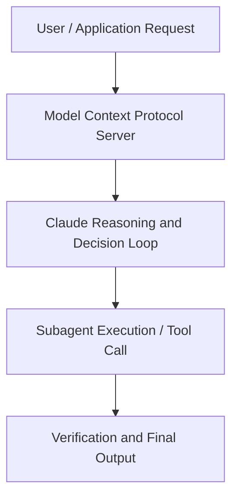

# Claude Code for Financial Services: Learn from Boris Cherny, Head of Claude Code

**Speaker(s):** Boris Cherny · **Channel:** Unlisted Videos · **Date:** 2026-01-07
**Watch:** https://youtu.be/EqW_RboD7f4 · **Format:** Demo · **Level:** Intermediate
**Topics:** AI Agents, AI Coding Tools

## TL;DR
This session explores claude code for financial services: learn from boris cherny, head of claude code, highlighting core architecture, runtime workflows, and practical deployment patterns across AI Agents, AI Coding Tools. Speakers analyze technical implementations and share operational best practices for building robust systems with Anthropic, Anthropic API.

## Contents
- [Architecture and Core Concepts in Claude Code for Financial Services: Learn fro](#architecture-and-core-concepts-in-claude-code-for-financial-services-learn-fro)
- [Technical Mechanics, Implementation Patterns, and Tooling](#technical-mechanics-implementation-patterns-and-tooling)
- [Operational Workflows, Evaluation, and Production Scaling](#operational-workflows-evaluation-and-production-scaling)
- [Strategic Implications, Governance, and Key Takeaways](#strategic-implications-governance-and-key-takeaways)

## Architecture and Core Concepts in Claude Code for Financial Services: Learn fro

Thank you so much for joining. My name is Bridget Kanty and I'm on the go to market team here at Enthropics supporting the financial services industry. I'm really excited to be
hosting this session today on cloud code for financial services. This turnout is amazing to everyone who's on Pacific time 2 that made it wow very impressive. Some quick housekeeping we're going to get into. Today's going to be recording recorded and don't you worry the recording will be sent to your inbox
within 24 hours. If you need to jump or if you want to share this webinar because it's so good you'll be able to do all that within 24 hours. Secondly,
please submit all questions in the chat today.

**Further reading:** Official documentation for Anthropic and Anthropic platform guides.

## Technical Mechanics, Implementation Patterns, and Tooling

Can we teach claude to code in Cobalt? S, 5 secondsYeah, it actually should already. If there's any issues, please file an issue on GitHub and we want to hear um but it
s, 14 secondsshould totally be able to write in cobalt already. S, 18 secondsAnd then final question I'm going to send your way for now, Boris. Then also there's so many questions coming in everyone. Thank you and we'll follow up via email. This will be my holiday
s, 26 secondsholiday break task to get these answers to you. But the final one we'll do is what guardrails do you impose on cloud code in your own development?

**Further reading:** Official documentation for Anthropic and Anthropic platform guides.

## Operational Workflows, Evaluation, and Production Scaling

S, 9 secondsUm we've packaged up the knowhow there and so it just works. S, 13 secondsAnd then there's the second category which is very powerful for organizations. They are skills that encode your specific standards and workflows. S, 22 secondsFor example, we have anthropics internal brand styling as a skill which I'll also show later. It knows our colors,
s, 30 secondstypography, how to format presentations like this one, right? So, anyone at Enthropic using cloud code gets output that match our brand automatically. S, 40 secondsAnd so, uh, for FSI use cases, imagine being able to encode your firm's code review standards, documentation
s, 49 secondstemplates, regulatory compliance checks, risk assessment frameworks. Once it's in a skill, every developer on
s, 56 secondsyour team has access to that institutional knowledge without needing to be an expert in every domain.

**Further reading:** Official documentation for Anthropic and Anthropic platform guides.

## Strategic Implications, Governance, and Key Takeaways

This is a little bit harder to control but definitely very concrete. So all that
s, 38 secondsto say to this question's point right traditional metrics like um lines of code written or commits really don't capture the real value of cloud code. S, 46 secondsthe wins are kind of in the harder to measure stuff, right? Getting up to speed on unfamiliar code bases. Um, kind of how are you able to unblock yourself
s, 54 secondswithout waiting for an engineer on your team. Many ways to go about this. No kind of one-sizefits-all that I can tell
s, 1 secondyou about, but usually a combination of these adoption metrics, um, sentiment surveys, and layering in tasks, um,
s, 9 secondstiming for specific use cases is a good place to start. Then of course over time you evolve it based on how your team actually works and um how you
s, 17 secondscalibrate against uh developer productivity in that way.

**Further reading:** Official documentation for Anthropic and Anthropic platform guides.

## Source
Full cleaned transcript: `DATA/videos/claude-code-for-financial-services-learn-2026.json`
Canonical recording: https://youtu.be/EqW_RboD7f4