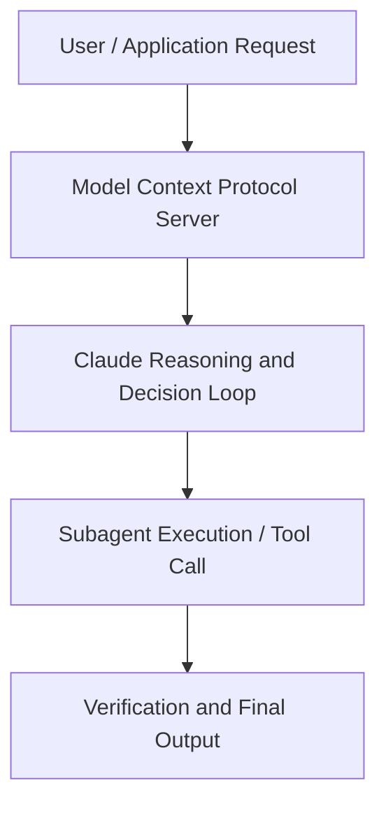

# Claude Code for Service Delivery: Learn from Boris Cherny, Head of Claude Code

**Speaker(s):** Boris Cherny · **Channel:** Unlisted Videos · **Date:** 2026-01-30
**Watch:** https://youtu.be/r82LXBH-ae0 · **Format:** Demo · **Level:** Intermediate
**Topics:** AI Coding Tools, Backend/Infra

## TL;DR
This session explores claude code for service delivery: learn from boris cherny, head of claude code, highlighting core architecture, runtime workflows, and practical deployment patterns across AI Coding Tools, Backend/Infra. Speakers analyze technical implementations and share operational best practices for building robust systems with Anthropic, Artifacts.

## Contents
- [Architecture and Core Concepts in Claude Code for Service Delivery: Learn from](#architecture-and-core-concepts-in-claude-code-for-service-delivery-learn-from)
- [Technical Mechanics, Implementation Patterns, and Tooling](#technical-mechanics-implementation-patterns-and-tooling)
- [Operational Workflows, Evaluation, and Production Scaling](#operational-workflows-evaluation-and-production-scaling)
- [Strategic Implications, Governance, and Key Takeaways](#strategic-implications-governance-and-key-takeaways)

## Architecture and Core Concepts in Claude Code for Service Delivery: Learn from

Welcome to AI's hottest webinar, cloud code and service delivery. We have a jam-packed hour
waiting for you all and excited to jump into things. First and foremost, some quick housekeeping items. There might
have been folks who haven't been able to join or you're going to watch this hour and be like, I want to send this to so many folks. You're going to receive a
recorded link after. Q&A can be submitted at any time using the question wit um widget in the webinar portal. We encourage you um we want this to be an informal session and we want it to be as helpful as possible for everyone. Please keep your questions flowing um in
the questions widget and we'll be answering them throughout this entire presentation.

**Further reading:** Official documentation for Anthropic and Anthropic platform guides.

## Technical Mechanics, Implementation Patterns, and Tooling

[clears throat] So this is one part of it. I think another part that I would call out is we're starting to see all the different roles kind of blend into one which is
s, 11 secondskind of interesting. Because for example on the quad code team which for me is like an early indicator of what happens at anthropic which is an early indicator of what happens kind of to
s, 19 secondsevery other company we're starting to see that everyone codes. On the cloud code team our engineering managers code our product
s, 27 secondsmanagers code our designers code our data scientists code our user researchers code our finance guy codes um our marketing people code. S, 35 secondseveryone codes your sales sales people code. I think at anthropic like half the GTM uses quad code. Um, and the reason
s, 44 secondsisn't that like everyone like, you know, went to went back to school and learned CS and, you know, learned to code because they were so inspired. No, like the reason is thought code just makes it
s, 52 secondsreally easy.

**Further reading:** Official documentation for Anthropic and Anthropic platform guides.

## Operational Workflows, Evaluation, and Production Scaling

And you should be able to see like lines of code committed uh lines of code written percent of code written using
s, 32 secondsquad code. So out of the box you get metrics like this. If you want something more detailed you can just use otel. So like I said we emit open
s, 39 secondstelemetry events uh for every cloud code action. So if you like you can just write a local
s, 47 secondscollector and then like slurp these events and then visualize them however you want. You can put them in any kind of data store. S, 53 secondsWe maybe have time for one or two more questions with Boris. Can I use cloud to refactor large
sprojects, extract specific packages and create a new deployable project in general effectiveness in brownfield space?

**Further reading:** Official documentation for Anthropic and Anthropic platform guides.

## Strategic Implications, Governance, and Key Takeaways

Whenever cloud initiates in a directory it turns on and starts running with the cloud MD file. In this case what we
s, 3 secondsare saying is like you know hey claude for executing on this you have to use a fourpart migration strategy which is mig which is documented in the migration
s, 12 secondsstrategy doc and it's really is like you know first and foremost create test cases. Create a comp comprehensive test suite understand obviously the
s, 19 secondslegacy codebase create comprehensive test suite according to that second is uh create golden data set. Third
s, 28 secondsis actually migrate the code and then fourth is to actually do a validation of the outputs of the old program and the
s, 36 secondsnew program uh in parallel. When we are doing code migration the way to think about this is there is three
s, 43 secondsmain elements where you have to keep an eye on and sorry I'm just going to I'm just going to enter over here while things are running in parallel. Uh the three things the way to think about this is the syntactic. Like you know when it's migrating into the legacy code base uh
s, 1 secondit has to do that in the syntactic way and the syntact. S, 6 secondsThe second is around semantic which is like you know is it able to bring the business logic into the right way uh for
s, 14 secondsthe for the target platform and then the third is idiomatic which is it's is it following the best practices of the language.

**Further reading:** Official documentation for Anthropic and Anthropic platform guides.

## Source
Full cleaned transcript: `DATA/videos/claude-code-for-service-delivery-learn-2026.json`
Canonical recording: https://youtu.be/r82LXBH-ae0