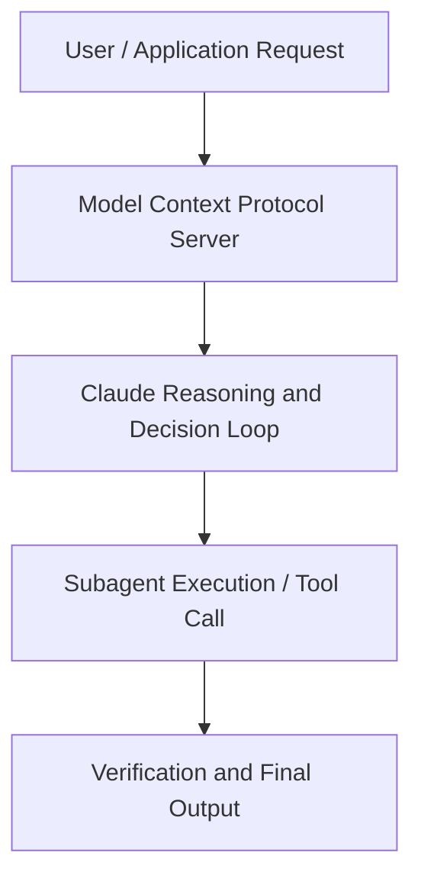

# Claude Code in financial services: From analyzing data to modernizing legacy systems

**Speaker(s):** Anthropic and Partner Leaders · **Channel:** Unlisted Videos · **Date:** 2025-08-29
**Watch:** https://youtu.be/-ORDNiVTyfI · **Format:** Demo · **Level:** Advanced
**Topics:** Backend/Infra, AI Coding Tools

## TL;DR
This session explores claude code in financial services: from analyzing data to modernizing legacy systems, highlighting core architecture, runtime workflows, and practical deployment patterns across Backend/Infra, AI Coding Tools. Speakers analyze technical implementations and share operational best practices for building robust systems with Amazon Bedrock, Anthropic.

## Contents
- [Architecture and Core Concepts in Claude Code in financial services: From analy](#architecture-and-core-concepts-in-claude-code-in-financial-services-from-analy)
- [Technical Mechanics, Implementation Patterns, and Tooling](#technical-mechanics-implementation-patterns-and-tooling)
- [Operational Workflows, Evaluation, and Production Scaling](#operational-workflows-evaluation-and-production-scaling)
- [Strategic Implications, Governance, and Key Takeaways](#strategic-implications-governance-and-key-takeaways)

## Architecture and Core Concepts in Claude Code in financial services: From analy

Thank you so much for joining us here today for our claude code and financial services webinar. By way of
introduction, I am on our go to market team here at Anthropic specifically supporting financial services firms. We're also joined by Janick on our applied AI team and Aaron who is a part of our strategic finance team who will all be talking about different ways that
they leverage cloud code and have seen customers in the financial services industry leverage cloud code as well. So, just a couple of housekeeping notes before we begin. This session will be recorded and distributed via email within 24 hours to everyone attending
the call. So, no worries if you miss something or have to hop early and can't catch the whole thing. If you have any questions, there's no need to wait till
the end of the webinar. You can just ask them right away in the submit a question widget on the right hand side of your screen and we'll answer the question as
best as possible.

**Further reading:** Official documentation for Amazon Bedrock and Anthropic platform guides.

## Technical Mechanics, Implementation Patterns, and Tooling

S, 39 secondsAnd uh you know, you would you would benefit from having the a cobaltme a
s, 46 secondsbusiness logicme who can actually help build that cloud MD. Moving on, as you can see here, something errored out
s, 53 secondsand now Claude is actually reasoning that what errored out and starting to build that. This is something that cloud does behind the scenes and uh as
s, 1 secondyou'll see later on in the next video where we'll show you some of the results that uh when we take this core application it starts building out uh
s, 10 secondsonto the results front and and starts adding those files in here. Uh I let this application run and uh once the
s, 18 secondsexecution is done here we are here on our results slide and uh I'm just going to go all the way up all the way to the
s, 25 secondstop where we started this and just show like you know what it looks like there. S, 30 secondsSo uh if you all remember we had started with a simple prompt like migrate this application using this migration guide
s, 37 secondsthat we provided. Plot went into this uh agentic loop of of thinking about what the tasks it needs to do. It lists out all the tasks, it starts working out
s, 46 secondsall those tasks. Every time it sees an error, uh it starts it it is able to reason and it's able to understand
s, 55 secondswhat's wrong and and go into a subtask to actually finish and to fix that error.

**Further reading:** Official documentation for Amazon Bedrock and Anthropic platform guides.

## Operational Workflows, Evaluation, and Production Scaling

So, here you can see the CloudMD file that Cloud set up has a bunch of fields and table schema here. S, 57 secondshas some of these dimension values that are in the tables, some key business metrics, and then some common queries that you
s, 6 secondsmight use. So, this is the Claude MD file that we're going to use for instructions for C for for queries on the data. S, 16 secondsSo, the first thing we're going to ask Claude is to do some analysis. S, 20 secondsAnd I'm going to ask Claude, can you let me know our top 10 customers and their week over week, month over month, six
s, 28 secondsmonth over six month, and year-over-year growth rates? Now, let's let Claude go to work. S, 35 secondsAnd look at that. Claude created a table for us and ran all these queries, ranked the top 10 customers, told us what tier
s, 43 secondsthey're at, what their current revenue is, and how much they've grown in those time periods that we asked for.

**Further reading:** Official documentation for Amazon Bedrock and Anthropic platform guides.

## Strategic Implications, Governance, and Key Takeaways

You can create very complex workflows, but
s, 46 secondshopefully this was just a start. Uh, but I was super excited to show you all these tips and tricks on how to utilize Claude in strategic finance and do very
s, 54 secondsreal complex data science work. Hopefully you all can now use Claude to revolutionize the way you get insights for your company. S, 4 secondsUm, now we're going to kick off the fireside chat where we're going to answer some of the questions from the Q&A. Um, but first Aaron, I wanted to
s, 12 secondsstart off with you. Um, since you're since you're warmed up already, but as a non-technical person, how did you first
s, 20 secondsstart leaning into claude code as such a technical product? I know the command line for for folks like myself who are not technical can be pretty uh
s, 28 secondsintimidating. So, curious how you kind of went about that and what your experience was like when you were first on boarding in block code.

**Further reading:** Official documentation for Amazon Bedrock and Anthropic platform guides.

## Source
Full cleaned transcript: `DATA/videos/claude-code-in-financial-services-from-2025.json`
Canonical recording: https://youtu.be/-ORDNiVTyfI