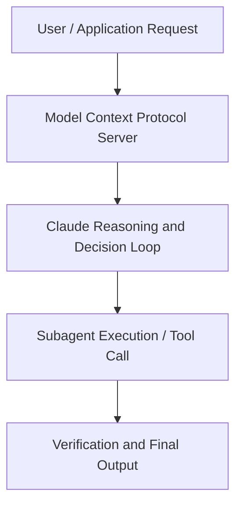

# Claude Code Live: Origin story, demos, and best practices

**Speaker(s):** Anthropic and Partner Leaders · **Channel:** Unlisted Videos · **Date:** 2025-04-23
**Watch:** https://youtu.be/8dcI0CqBQq4 · **Format:** Demo · **Level:** Intermediate
**Topics:** AI Coding Tools, AI Agents

## TL;DR
This session explores claude code live: origin story, demos, and best practices, highlighting core architecture, runtime workflows, and practical deployment patterns across AI Coding Tools, AI Agents. Speakers analyze technical implementations and share operational best practices for building robust systems with Anthropic, Anthropic API.

## Contents
- [Architecture and Core Concepts in Claude Code Live: Origin story, demos, and be](#architecture-and-core-concepts-in-claude-code-live-origin-story-demos-and-be)
- [Technical Mechanics, Implementation Patterns, and Tooling](#technical-mechanics-implementation-patterns-and-tooling)
- [Operational Workflows, Evaluation, and Production Scaling](#operational-workflows-evaluation-and-production-scaling)
- [Strategic Implications, Governance, and Key Takeaways](#strategic-implications-governance-and-key-takeaways)

## Architecture and Core Concepts in Claude Code Live: Origin story, demos, and be

Hey everyone, welcome to Cloud Code Live. We're excited to share some of our best practices, some live demos, and
also the story behind the product. One, we'll share a recording of this session within
24 hours by email. So, you'll be able to watch this again and share it more broadly. Two, um if you have any
questions during the session, please put them in the Q&A box and we'll answer them at the end. Then three, please
give us feedback. You can rate this webinar by selecting the survey widget at any point during the webinar. This
helps us make our future webinars a lot better.

**Further reading:** Official documentation for Anthropic and Anthropic platform guides.

## Technical Mechanics, Implementation Patterns, and Tooling

Okay, make the fix
s, 44 secondseasy. All right, so now Claude is going to go off do its thing. It knows what it wants to do. I
s, 52 secondsgave it permission to keep working and it's going to in a second here hopefully edit this notebook for
s, 4 secondsme. Yeah, that looks that looks good. So, I'm going to press enter. We're going to edit that cell. I wanted to make one more change as well.

**Further reading:** Official documentation for Anthropic and Anthropic platform guides.

## Operational Workflows, Evaluation, and Production Scaling

S, 21 secondsQuadMD is a special file. It's automatically read into context whenever you run quad. Um, so quad doesn't have
s, 29 secondsto manually read it. It's auto added to context every time. Essentially, it's a way to augment the system prompt with whatever other context you want to give. S, 38 secondsThere's a bunch of different kinds of quad MDs. S, 42 secondsThe simplest one is a quadmd in the root directory. Whatever directory you run quad from in the terminal um just drop a quadmd in that directory.

**Further reading:** Official documentation for Anthropic and Anthropic platform guides.

## Strategic Implications, Governance, and Key Takeaways

We don't train generative models on your code. We don't do anything like that. Um, and what one of
s, 44 secondsthe things that means is that we don't use rag. Um, and so we don't use indexing. So you don't kind of run into these issues where the code can drift out of sync or the index goes
s, 53 secondsoffline or anything like that. So every time that cloud explores your code, it'll use a gentic search, which is actually quite similar to the way that an engineer would explore the code. S, 2 secondsUm, and so in practice, what that means is at the cost of latency, it might take a little while, but cloud scales extremely well to big code bases. It
s, 10 secondsusually finds the right files even you know if you have millions of files in the codebase.

**Further reading:** Official documentation for Anthropic and Anthropic platform guides.

## Source
Full cleaned transcript: `DATA/videos/claude-code-live-origin-story-demos-2025.json`
Canonical recording: https://youtu.be/8dcI0CqBQq4