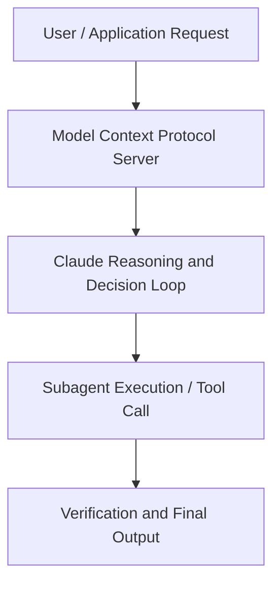

# Claude Cowork in an Hour: Where do I start?

**Speaker(s):** Anthropic and Partner Leaders · **Channel:** Unlisted Videos · **Date:** 2026-04-01
**Watch:** https://anthropic.ondemand.goldcast.io/on-demand/36bd8160-a713-4bfe-9fb0-f9df696a3835?email=devofficialcoma@gmail.com&first_name=dev&last_name=Dev · **Format:** Talk · **Level:** Beginner
**Topics:** AI Agents, Web Development

## TL;DR
This session explores claude cowork in an hour: where do i start?, highlighting core architecture, runtime workflows, and practical deployment patterns across AI Agents, Web Development. Speakers analyze technical implementations and share operational best practices for building robust systems with Claude, Claude Cowork.

## Contents
- [Architectural Overview and System Objectives in Claude Cowork in an Hour: Where do I start?](#architectural-overview-and-system-objectives-in-claude-cowork-in-an-hour-where-do-i-start)
- [Technical Capabilities, Tooling Integration, and Protocols](#technical-capabilities-tooling-integration-and-protocols)
- [Production Deployment, Verification, and Best Practices](#production-deployment-verification-and-best-practices)
- [Organizational Impact, Scalability, and Industry Outlook](#organizational-impact-scalability-and-industry-outlook)

## Architectural Overview and System Objectives in Claude Cowork in an Hour: Where do I start?

You've heard what Claude Cowork can do. You've maybe even opened it. And then, nothing. Not because it's hard to use, but because "it can do anything" is surprisingly hard to act on when you've got forty things due and no idea which one to hand over first.

This is the session for that moment. We'll run a few tasks from start to finish. You'll see the difference between a prompt that gets you something usable and one that hands the work right back to you. And you'll leave with a simple way to look at your own to-do list and know what goes to Claude Cowork next. By the end of the hour you'll know how to run your first real task and exactly where to go next.

No prerequisites. No setup. Just the answer to the question in the title. The session details foundational design principles, execution patterns, and operational integration requirements within the AI Agents, Web Development domain.

**Further reading:** Official documentation for Claude and Anthropic platform guides.

## Technical Capabilities, Tooling Integration, and Protocols

Speakers analyze technical capabilities across Claude, Claude Cowork. The architecture highlights reliable agent tool use, context window optimization, protocol standards, and seamless workflow interoperability.

**Further reading:** Official documentation for Claude and Anthropic platform guides.

## Production Deployment, Verification, and Best Practices

Production readiness demands robust evaluation harnesses, state validation, and error-handling loops. Teams implement systematic monitoring and guardrails to ensure reliability across repeated executions.

**Further reading:** Official documentation for Claude and Anthropic platform guides.

## Organizational Impact, Scalability, and Industry Outlook

Deploying agentic systems transforms developer and team workflows by automating high-friction tasks. Organizations scale safely by pairing automated tool orchestration with structured human review.

**Further reading:** Official documentation for Claude and Anthropic platform guides.

## Source
Full cleaned transcript: `DATA/videos/claude-cowork-in-an-hour-where-2026.json`
Canonical recording: https://anthropic.ondemand.goldcast.io/on-demand/36bd8160-a713-4bfe-9fb0-f9df696a3835?email=devofficialcoma@gmail.com&first_name=dev&last_name=Dev