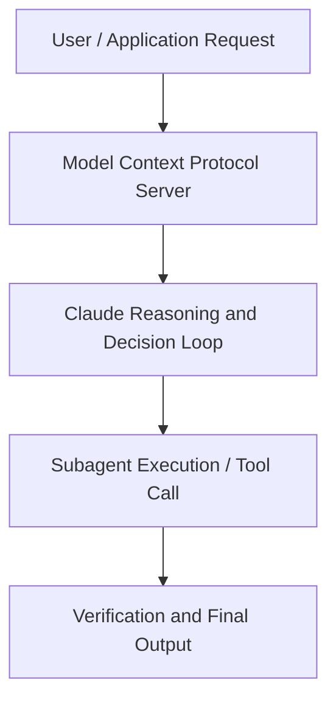

# Claude for Investing Teams

**Speaker(s):** Anthropic and Partner Leaders · **Channel:** Unlisted Videos · **Date:** 2026-07-24
**Watch:** https://anthropic.ondemand.goldcast.io/on-demand/3008911f-0ffd-4473-b176-7385ba425a7c?email=devofficialcoma@gmail.com&first_name=dev&last_name=Dev · **Format:** Talk · **Level:** Intermediate
**Topics:** AI Agents

## TL;DR
This session explores claude for investing teams, highlighting core architecture, runtime workflows, and practical deployment patterns across AI Agents. Speakers analyze technical implementations and share operational best practices for building robust systems with Claude, Claude Cowork.

## Contents
- [Architectural Overview and System Objectives in Claude for Investing Teams](#architectural-overview-and-system-objectives-in-claude-for-investing-teams)
- [Technical Capabilities, Tooling Integration, and Protocols](#technical-capabilities-tooling-integration-and-protocols)
- [Production Deployment, Verification, and Best Practices](#production-deployment-verification-and-best-practices)
- [Organizational Impact, Scalability, and Industry Outlook](#organizational-impact-scalability-and-industry-outlook)

## Architectural Overview and System Objectives in Claude for Investing Teams

Investing runs on documents: CIMs, data rooms, filings, models, memos, LP letters. This session shows investment professionals at private-markets firms how Claude handles that work in practice, across the workflows deal teams run every day.We'll walk live through deal screening, diligence, portfolio monitoring, and reporting using Claude Cowork and the Office Agents for Excel, PowerPoint, Word, and Outlook, as well as proven best practices on how to roll Claude out to investment teams at real firms like Apollo.

Speakers The session details foundational design principles, execution patterns, and operational integration requirements within the AI Agents domain.

**Further reading:** Official documentation for Claude and Anthropic platform guides.

## Technical Capabilities, Tooling Integration, and Protocols

Speakers analyze technical capabilities across Claude, Claude Cowork. The architecture highlights reliable agent tool use, context window optimization, protocol standards, and seamless workflow interoperability.

**Further reading:** Official documentation for Claude and Anthropic platform guides.

## Production Deployment, Verification, and Best Practices

Production readiness demands robust evaluation harnesses, state validation, and error-handling loops. Teams implement systematic monitoring and guardrails to ensure reliability across repeated executions.

**Further reading:** Official documentation for Claude and Anthropic platform guides.

## Organizational Impact, Scalability, and Industry Outlook

Deploying agentic systems transforms developer and team workflows by automating high-friction tasks. Organizations scale safely by pairing automated tool orchestration with structured human review.

**Further reading:** Official documentation for Claude and Anthropic platform guides.

## Source
Full cleaned transcript: `DATA/videos/claude-for-investing-teams-2026.json`
Canonical recording: https://anthropic.ondemand.goldcast.io/on-demand/3008911f-0ffd-4473-b176-7385ba425a7c?email=devofficialcoma@gmail.com&first_name=dev&last_name=Dev