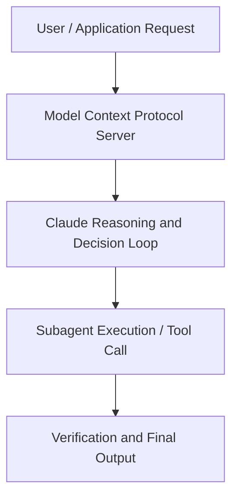

# Claude for Life Sciences: Accelerating Discovery from Hypothesis to Breakthrough

**Speaker(s):** Jonah Cool · **Channel:** Unlisted Videos · **Date:** 2025-10-28
**Watch:** https://youtu.be/Qt0fjZAukds · **Format:** Demo · **Level:** Advanced
**Topics:** Research/Papers, AI Coding Tools

## TL;DR
This session explores claude for life sciences: accelerating discovery from hypothesis to breakthrough, highlighting core architecture, runtime workflows, and practical deployment patterns across Research/Papers, AI Coding Tools. Speakers analyze technical implementations and share operational best practices for building robust systems with Anthropic, Claude.

## Contents
- [Architecture and Core Concepts in Claude for Life Sciences: Accelerating Discov](#architecture-and-core-concepts-in-claude-for-life-sciences-accelerating-discov)
- [Technical Mechanics, Implementation Patterns, and Tooling](#technical-mechanics-implementation-patterns-and-tooling)
- [Operational Workflows, Evaluation, and Production Scaling](#operational-workflows-evaluation-and-production-scaling)
- [Strategic Implications, Governance, and Key Takeaways](#strategic-implications-governance-and-key-takeaways)

## Architecture and Core Concepts in Claude for Life Sciences: Accelerating Discov

Hi everyone, welcome to the Cloud for Life Sciences webinar. I'm Jonah Cool and I'm Eric Connor Abrams and we're excited to share with you more details
about our first step into the life sciences. So first we'll go over some housekeeping items. We will be distributing a recording after the session. If we have time at the end, we'll get to them um at the end of the session. Otherwise, we'll have one of our team members follow up afterwards. Please fill out the survey in the portal. So, I'll start by reading a quote from Machines of Loving Grace, our CEO
Daario's essay about the amazing benefits that can come from the development of powerful AI.

**Further reading:** Official documentation for Anthropic and Anthropic platform guides.

## Technical Mechanics, Implementation Patterns, and Tooling

But I think life in the lab is messy and actually integrating in
s, 51 secondsand accelerating, you know, rather than just being sort of a tool bolted on um is hard, right? I think it's about as hard as it gets because you need to coordinate with lab instruments and
s, 59 secondsthere are strict data requirements and all sorts of different data formats, right? So, um, what do you think it takes for for these AI tools that we're developing together to really embed in
s, 8 secondsthe research progress from the beginning rather than being something that's sort of bolted on afterwards? Um, I think at Benchling, you know, we've spent the last decade plus getting scientists to move on to these modern cloud-based tools. That kind
s, 23 secondsof getting scientists to actually use AI requires two main things. The first one's that like AI really needs to be connected into the scientist's actual
s, 31 secondsdata. The best possible agent for let's say like analyzing data isn't useful if it requires a bunch of effort
s, 38 secondsjust to give it your input data and document its output to and I think what that means is that the AI needs to be deeply integrated not just with public
s, 47 secondsdata but also with private data in kind of um platforms like like basically um ours um sort of second thing that we're
s, 55 secondslearning is that the AI needs to be really easy to access which means it needs to be kind of embedded into the UI and the kind tools scientists use every
s, 3 secondsday. You know, these scientific models I was talking about earlier, they're already a really valuable design partner for scientists that are kind of uh
s, 12 secondsdesigning molecules, but there's this change in behavior that has to happen um that I think won't happen unless they're really embedded in the same place that
s, 20 secondsthe scientist is kind of designing DNA and protein sequence.

**Further reading:** Official documentation for Anthropic and Anthropic platform guides.

## Operational Workflows, Evaluation, and Production Scaling

That is our
s, 11 secondsinternally uh um hosted and built AI companion for all employees leveraging the cloud models behind we've launched
s, 21 secondsit and built it with our users with senopians since day one and we've reached an 80% adoption rate since the
s, 30 secondsbeginning of the year we up to 8 million conversations on our concierge AI companion
s, 38 secondsanother example is in in R&D. Um, our target discovery engines that combines advanced AI, machine learning, and
s, 47 secondsintegrating data by experimental techniques for target validation can help us unravel disease biology and
s, 54 secondsuncover new targets that we want to pursue. Today, these engines have delivered close to seven novel drug targets in just one year. S, 6 secondsSo in the end repeating it's about ambition,
s, 13 secondsstructure, scale and [clears throat] love. S, 18 secondsI I really appreciate you bringing love, Cheryl. Love lovability as well as utility. S, 27 secondsAnd I think this is also just like a great point, right? I mean so much of science is born out of that like love and dedication to discovery and having
s, 35 secondstools that you [clears throat] know help scientists you know make the most of that discovery make discoveries more rapidly you know do what they love uh
s, 43 secondsdefinitely one of our goals and I think you know really front of mind okay so I'll jump in with with the next question uh we introduced kind of an early set of
s, 50 secondsMCPs and starting to think about how claude can specifically interact with context in the life sciences and I'm really you know proud of these MCPs
s, 59 secondsgiven how they kind of touch on key pillars of the scientific process from you know knowledge bases like PubMed and
s, 7 secondsWY to tools and platforms like we heard about from Benchling and 10X Genomics to then of course data sets and Sage and
s, 15 secondsSynapse and others you know it it still is kind of starting to scratch the surface of one of the key challenges that I think we all face which is that
s, 24 secondsdata sets kind of exist in different silos and then of course the process of science from early stage stage discovery into validation into the clinic and you
s, 32 secondsknow clinical trials is similarly maybe also you know somewhat siloed and separated and so you know I'd love to get uh your thoughts on how AI how some
s, 41 secondsof these MCPs are starting to connect those previously difficult to connect data sets or stages and then perhaps an early indication of where where there's
s, 50 secondssome early surprises or what you're seeing.

**Further reading:** Official documentation for Anthropic and Anthropic platform guides.

## Strategic Implications, Governance, and Key Takeaways

For now uh of course human in the loop is
s, 3 secondssomething that is uh built into all of our processes. But in the long term I can really see the way um that we can
s, 13 secondsvalidate and monitor the potential output um I can see that needle uh moving as well. From our side it's
s, 20 secondsbeen a very positive journey um and we're really looking forward to uh the way that these models develop in the future. S, 29 secondsYeah, I think your your use case is is such a great example of how, you know, once you start integrating it in um and iterating on the technology itself and
s, 38 secondshow you use it in the context of your team, you know, you can decrease, you know, the the extent of of you know, human in the loop over time, right? S, 44 secondsObviously, not not to to zero, but um I think it's a great example of like building trust through through real use. S, 52 secondsUm, last, let's go to Scott here on uh on how you use cloud in regulatory settings. Uh, echoing what everyone said here, what I'll add is with something like cloud code, privacy, compliance,
s, 5 secondssecurity, testing, validation can be agents you add on. So, I view this as a tool to help us scale.

**Further reading:** Official documentation for Anthropic and Anthropic platform guides.

## Source
Full cleaned transcript: `DATA/videos/claude-for-life-sciences-accelerating-discovery-2025.json`
Canonical recording: https://youtu.be/Qt0fjZAukds