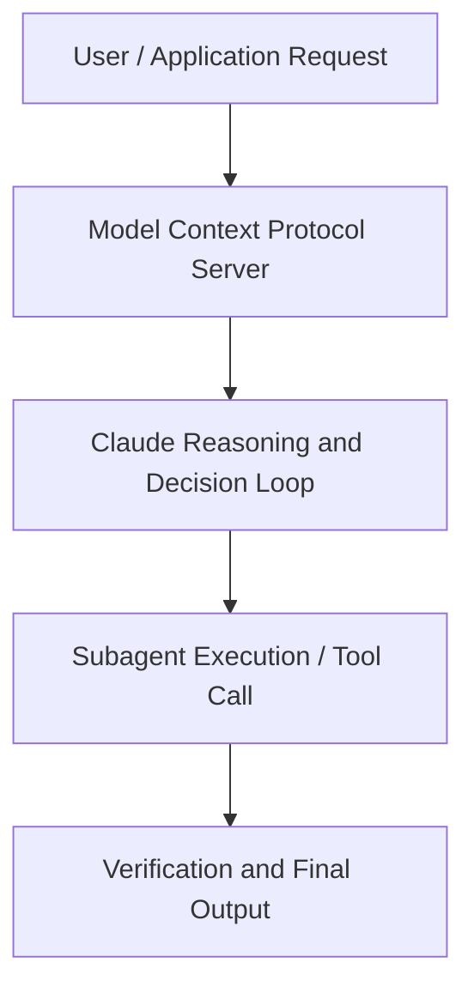

# Claude on Google Cloud: Monitoring and Securing Agents at Scale

**Speaker(s):** Anthropic and Partner Leaders · **Channel:** Unlisted Videos · **Date:** 2026-06-24
**Watch:** https://anthropic.ondemand.goldcast.io/on-demand/cb955779-9d60-44ff-bfec-f1574d711b5b?email=devofficialcoma@gmail.com&first_name=dev&last_name=Dev · **Format:** Talk · **Level:** Intermediate
**Topics:** AI Agents, Backend/Infra

## TL;DR
This session explores claude on google cloud: monitoring and securing agents at scale, highlighting core architecture, runtime workflows, and practical deployment patterns across AI Agents, Backend/Infra. Speakers analyze technical implementations and share operational best practices for building robust systems with Anthropic, Claude.

## Contents
- [Architectural Overview and System Objectives in Claude on Google Cloud: Monitoring and Securi](#architectural-overview-and-system-objectives-in-claude-on-google-cloud-monitoring-and-securi)
- [Technical Capabilities, Tooling Integration, and Protocols](#technical-capabilities-tooling-integration-and-protocols)
- [Production Deployment, Verification, and Best Practices](#production-deployment-verification-and-best-practices)
- [Organizational Impact, Scalability, and Industry Outlook](#organizational-impact-scalability-and-industry-outlook)

## Architectural Overview and System Objectives in Claude on Google Cloud: Monitoring and Securi

Autonomous agents can now take actions across systems, make decisions without manual human review, and operate at scale. That creates real questions for security and IT teams: how do you enforce what an agent is allowed to do, and how do you trace and audit what it actually did. Join Anthropic and Google Cloud for a technical session on answering both in production , building Claude agents with Claude Agent SDK, applying guardrails at every tool call, and sending traces and audit events into Google Cloud Observability. The session details foundational design principles, execution patterns, and operational integration requirements within the AI Agents, Backend/Infra domain.

**Further reading:** Official documentation for Anthropic and Anthropic platform guides.

## Technical Capabilities, Tooling Integration, and Protocols

Speakers analyze technical capabilities across Anthropic, Claude, Google Cloud. The architecture highlights reliable agent tool use, context window optimization, protocol standards, and seamless workflow interoperability.

**Further reading:** Official documentation for Anthropic and Anthropic platform guides.

## Production Deployment, Verification, and Best Practices

Production readiness demands robust evaluation harnesses, state validation, and error-handling loops. Teams implement systematic monitoring and guardrails to ensure reliability across repeated executions.

**Further reading:** Official documentation for Anthropic and Anthropic platform guides.

## Organizational Impact, Scalability, and Industry Outlook

Deploying agentic systems transforms developer and team workflows by automating high-friction tasks. Organizations scale safely by pairing automated tool orchestration with structured human review.

**Further reading:** Official documentation for Anthropic and Anthropic platform guides.

## Source
Full cleaned transcript: `DATA/videos/claude-on-google-cloud-monitoring-and-2026.json`
Canonical recording: https://anthropic.ondemand.goldcast.io/on-demand/cb955779-9d60-44ff-bfec-f1574d711b5b?email=devofficialcoma@gmail.com&first_name=dev&last_name=Dev