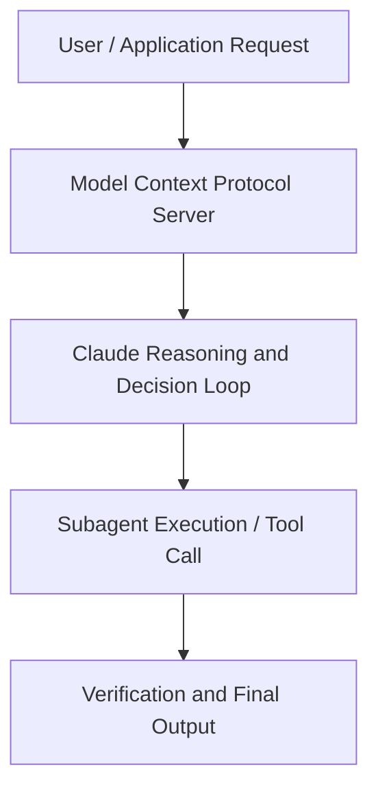

# Claude Science AMA: How to accelerate scientific discovery

**Speaker(s):** Anthropic and Partner Leaders · **Channel:** Unlisted Videos · **Date:** 2026-08-20
**Watch:** https://anthropic.ondemand.goldcast.io/on-demand/87a3f28e-cc48-4ef6-89f5-b1d295eeae95?email=devofficialcoma@gmail.com&first_name=dev&last_name=Dev · **Format:** Panel · **Level:** Intermediate
**Topics:** AI Agents

## TL;DR
This session explores claude science ama: how to accelerate scientific discovery, highlighting core architecture, runtime workflows, and practical deployment patterns across AI Agents. Speakers analyze technical implementations and share operational best practices for building robust systems with Claude.

## Contents
- [Architectural Overview and System Objectives in Claude Science AMA: How to accelerate scienti](#architectural-overview-and-system-objectives-in-claude-science-ama-how-to-accelerate-scienti)
- [Technical Capabilities, Tooling Integration, and Protocols](#technical-capabilities-tooling-integration-and-protocols)
- [Production Deployment, Verification, and Best Practices](#production-deployment-verification-and-best-practices)
- [Organizational Impact, Scalability, and Industry Outlook](#organizational-impact-scalability-and-industry-outlook)

## Architectural Overview and System Objectives in Claude Science AMA: How to accelerate scienti

This technical session provides a comprehensive engineering guide to Claude Science AMA: How to accelerate scientific discovery. The session details foundational design principles, execution patterns, and operational integration requirements within the AI Agents domain.

**Further reading:** Official documentation for Claude and Anthropic platform guides.

## Technical Capabilities, Tooling Integration, and Protocols

Speakers analyze technical capabilities across Claude. The architecture highlights reliable agent tool use, context window optimization, protocol standards, and seamless workflow interoperability.

**Further reading:** Official documentation for Claude and Anthropic platform guides.

## Production Deployment, Verification, and Best Practices

Production readiness demands robust evaluation harnesses, state validation, and error-handling loops. Teams implement systematic monitoring and guardrails to ensure reliability across repeated executions.

**Further reading:** Official documentation for Claude and Anthropic platform guides.

## Organizational Impact, Scalability, and Industry Outlook

Deploying agentic systems transforms developer and team workflows by automating high-friction tasks. Organizations scale safely by pairing automated tool orchestration with structured human review.

**Further reading:** Official documentation for Claude and Anthropic platform guides.

## Source
Full cleaned transcript: `DATA/videos/claude-science-ama-how-to-accelerate-2026.json`
Canonical recording: https://anthropic.ondemand.goldcast.io/on-demand/87a3f28e-cc48-4ef6-89f5-b1d295eeae95?email=devofficialcoma@gmail.com&first_name=dev&last_name=Dev