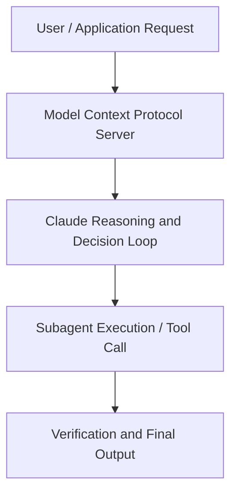

# Deploying Cowork across the Enterprise , with PayPal

**Speaker(s):** Anthropic and Partner Leaders · **Channel:** Unlisted Videos · **Date:** 2026-04-16
**Watch:** https://anthropic.ondemand.goldcast.io/on-demand/8c9b1a0b-1455-4b63-8a72-ec7ca117423b?email=devofficialcoma@gmail.com&first_name=dev&last_name=Dev · **Format:** Talk · **Level:** Intermediate
**Topics:** Product/Startup, AI Agents

## TL;DR
This session explores deploying cowork across the enterprise , with paypal, highlighting core architecture, runtime workflows, and practical deployment patterns across Product/Startup, AI Agents. Speakers analyze technical implementations and share operational best practices for building robust systems with Claude, PayPal.

## Contents
- [Architectural Overview and System Objectives in Deploying Cowork across the Enterprise , with](#architectural-overview-and-system-objectives-in-deploying-cowork-across-the-enterprise-with)
- [Technical Capabilities, Tooling Integration, and Protocols](#technical-capabilities-tooling-integration-and-protocols)
- [Production Deployment, Verification, and Best Practices](#production-deployment-verification-and-best-practices)
- [Organizational Impact, Scalability, and Industry Outlook](#organizational-impact-scalability-and-industry-outlook)

## Architectural Overview and System Objectives in Deploying Cowork across the Enterprise , with

This technical session provides a comprehensive engineering guide to Deploying Cowork across the Enterprise , with PayPal. The session details foundational design principles, execution patterns, and operational integration requirements within the Product/Startup, AI Agents domain.

**Further reading:** Official documentation for Claude and Anthropic platform guides.

## Technical Capabilities, Tooling Integration, and Protocols

Speakers analyze technical capabilities across Claude, PayPal. The architecture highlights reliable agent tool use, context window optimization, protocol standards, and seamless workflow interoperability.

**Further reading:** Official documentation for Claude and Anthropic platform guides.

## Production Deployment, Verification, and Best Practices

Production readiness demands robust evaluation harnesses, state validation, and error-handling loops. Teams implement systematic monitoring and guardrails to ensure reliability across repeated executions.

**Further reading:** Official documentation for Claude and Anthropic platform guides.

## Organizational Impact, Scalability, and Industry Outlook

Deploying agentic systems transforms developer and team workflows by automating high-friction tasks. Organizations scale safely by pairing automated tool orchestration with structured human review.

**Further reading:** Official documentation for Claude and Anthropic platform guides.

## Source
Full cleaned transcript: `DATA/videos/deploying-cowork-across-the-enterprise-with-2026.json`
Canonical recording: https://anthropic.ondemand.goldcast.io/on-demand/8c9b1a0b-1455-4b63-8a72-ec7ca117423b?email=devofficialcoma@gmail.com&first_name=dev&last_name=Dev