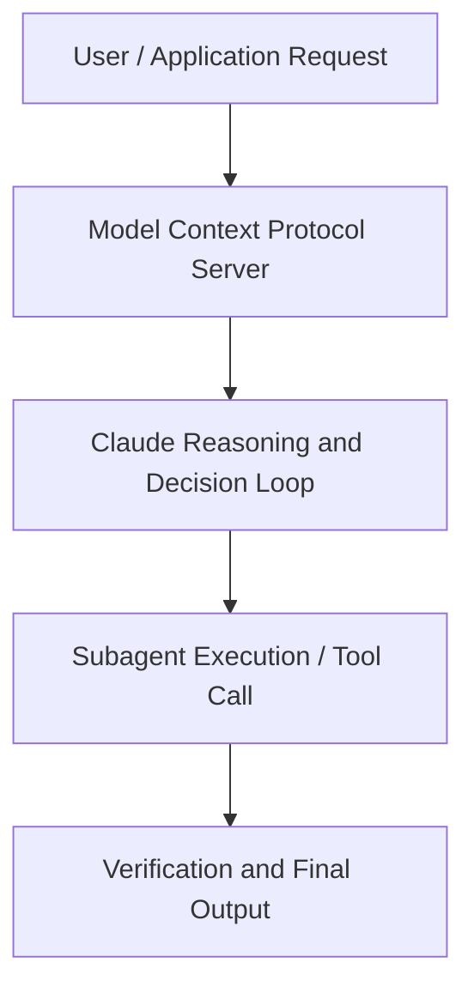

# Deploying Multi-Agent Systems Using MCP and A2A with Claude on Vertex AI

**Speaker(s):** Anthropic and Partner Leaders · **Channel:** Unlisted Videos · **Date:** 2025-09-10
**Watch:** https://youtu.be/Yul3Y3TBPHg · **Format:** Workshop · **Level:** Advanced
**Topics:** AI Agents, Web Development

## TL;DR
This session explores deploying multi-agent systems using mcp and a2a with claude on vertex ai, highlighting core architecture, runtime workflows, and practical deployment patterns across AI Agents, Web Development. Speakers analyze technical implementations and share operational best practices for building robust systems with Anthropic, Artifacts.

## Contents
- [Architecture and Core Concepts in Deploying Multi-Agent Systems Using MCP and A](#architecture-and-core-concepts-in-deploying-multi-agent-systems-using-mcp-and-a)
- [Technical Mechanics, Implementation Patterns, and Tooling](#technical-mechanics-implementation-patterns-and-tooling)
- [Operational Workflows, Evaluation, and Production Scaling](#operational-workflows-evaluation-and-production-scaling)
- [Strategic Implications, Governance, and Key Takeaways](#strategic-implications-governance-and-key-takeaways)

## Architecture and Core Concepts in Deploying Multi-Agent Systems Using MCP and A

Thank you so much for joining us today for this webinar about deploying multi-agent systems. I'm on the marketing team at Enthropic. I'll be your moderator today and I'll get us kicked off with some housekeeping items. First off, this session will be recorded. We'll distribute it via email within the next 24 hours. Also, you can
submit questions throughout the entire webinar. Use the question widget in the webinar portal for that. Then third,
please give us feedback.

**Further reading:** Official documentation for Anthropic and Anthropic platform guides.

## Technical Mechanics, Implementation Patterns, and Tooling

An agent is a piece of software. We mentioned that it's
s, 35 secondsnothing more than models using tools in a loop. If you think about that loop, how many times does you know how many iterations of that loop occur? What is the latency between a particular tool invocation and a tool response? Think about all of
s, 52 secondsthose things as you're designing your agents to ensure that you have the results you want. You're probably
s, 59 secondslaughing right now when I say think like your agents. Put yourself in the shoes of a
s, 6 secondspiece of software that has nothing more than the context that it's provided. So this is also just empathy with your
s, 13 secondsAI system.

**Further reading:** Official documentation for Anthropic and Anthropic platform guides.

## Operational Workflows, Evaluation, and Production Scaling

S, 8 secondsSo analyze with loop and there's a bunch of kind of setup and configuration code that you can see here
s, 16 secondsbut at the end of the day there's nothing more than a loop and that loop is being called uh sort of right here. S, 24 secondsSo in line 440 so run agent boot right and you can see here that context accumulates each iteration uh continues
s, 32 secondsuntil sufficient information or max iterations and so let's like look at that code here together first of course you have a system prompt which is
s, 40 secondscritical and important in order for the model to make the best possible decisions and you can see here that you know the system prompt says hey you're
s, 47 secondstrading analysts you know it analyze you analyze stocks for both bull and bearish perspectives And again consider what
s, 54 secondsthat means in the context of ever growing context windows. You have access to various tools. In this case there are four or five. S, 5 secondsBut if you multiply that by an order of magnitude and you went to 40 or 50 or you know 50 to 100 it may not scale so
s, 12 secondswell. However up until those limits we found that it's actually quite reasonable to have a monolithic agent. S, 18 secondsSo here again you can see that system prompt and you can see that we're instructing the agent to analyze from both perspectives. First gather bullish
s, 25 secondsindicators then gather bearish indicators finally synthesizing a recommendation.

**Further reading:** Official documentation for Anthropic and Anthropic platform guides.

## Strategic Implications, Governance, and Key Takeaways

Compared to before this is what changed. Uh
s, 28 secondsanother aspect that this um new pattern enable is that before with agent engine you were you were deploying your MCP uh
s, 38 secondsserver in a separate environment. You have to manage two environment. Now with a custom installation script you package everything in just one unique uh
s, 47 secondsservices that can run on vert.xai agent engine and I will uh um and it will enables you to deploy the uh the agent
s, 55 secondsitself. Of course this approach has a pros and cons. We know that but it's just uh you know our first attempt to
s, 2 secondssupport MCP on agent engine. We are so h like we are happy to receive feedback from you if you want to have like a one unique platform that it will allows you
s, 11 secondsnot only to deploy you know agents but also uh MCP server. The other thing uh the second announcement that I have and
s, 18 secondsthen we jump on the demo is that um is related to 8way.

**Further reading:** Official documentation for Anthropic and Anthropic platform guides.

## Source
Full cleaned transcript: `DATA/videos/deploying-multi-agent-systems-using-mcp-2025.json`
Canonical recording: https://youtu.be/Yul3Y3TBPHg