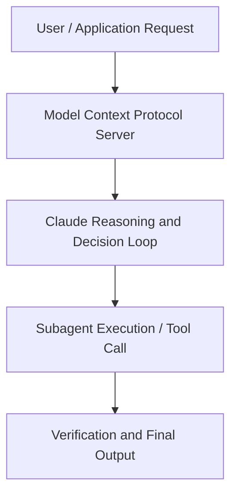

# From 0 to 1: How Zingage Built AI-Powered Home Care on Claude

**Speaker(s):** Anthropic and Partner Leaders · **Channel:** Unlisted Videos · **Date:** 2026-02-26
**Watch:** https://anthropic.ondemand.goldcast.io/on-demand/034e5271-8c4f-41f6-947d-0d3b18878425?email=devofficialcoma@gmail.com&first_name=dev&last_name=Dev · **Format:** Talk · **Level:** Intermediate
**Topics:** Web Development, Research/Papers

## TL;DR
This session explores from 0 to 1: how zingage built ai-powered home care on claude, highlighting core architecture, runtime workflows, and practical deployment patterns across Web Development, Research/Papers. Speakers analyze technical implementations and share operational best practices for building robust systems with Anthropic, Claude.

## Contents
- [Architectural Overview and System Objectives in From 0 to 1: How Zingage Built AI-Powered Hom](#architectural-overview-and-system-objectives-in-from-0-to-1-how-zingage-built-ai-powered-hom)
- [Technical Capabilities, Tooling Integration, and Protocols](#technical-capabilities-tooling-integration-and-protocols)
- [Production Deployment, Verification, and Best Practices](#production-deployment-verification-and-best-practices)
- [Organizational Impact, Scalability, and Industry Outlook](#organizational-impact-scalability-and-industry-outlook)

## Architectural Overview and System Objectives in From 0 to 1: How Zingage Built AI-Powered Hom

Join Victor Hunt, alongside Araba Koomson and William Hu from Anthropic, as they share real-world implementation strategies and practical insights for building AI-powered products in healthcare and life sciences. The session details foundational design principles, execution patterns, and operational integration requirements within the Web Development, Research/Papers domain.

**Further reading:** Official documentation for Anthropic and Anthropic platform guides.

## Technical Capabilities, Tooling Integration, and Protocols

Speakers analyze technical capabilities across Anthropic, Claude. The architecture highlights reliable agent tool use, context window optimization, protocol standards, and seamless workflow interoperability.

**Further reading:** Official documentation for Anthropic and Anthropic platform guides.

## Production Deployment, Verification, and Best Practices

Production readiness demands robust evaluation harnesses, state validation, and error-handling loops. Teams implement systematic monitoring and guardrails to ensure reliability across repeated executions.

**Further reading:** Official documentation for Anthropic and Anthropic platform guides.

## Organizational Impact, Scalability, and Industry Outlook

Deploying agentic systems transforms developer and team workflows by automating high-friction tasks. Organizations scale safely by pairing automated tool orchestration with structured human review.

**Further reading:** Official documentation for Anthropic and Anthropic platform guides.

## Source
Full cleaned transcript: `DATA/videos/from-0-to-1-how-zingage-2026.json`
Canonical recording: https://anthropic.ondemand.goldcast.io/on-demand/034e5271-8c4f-41f6-947d-0d3b18878425?email=devofficialcoma@gmail.com&first_name=dev&last_name=Dev