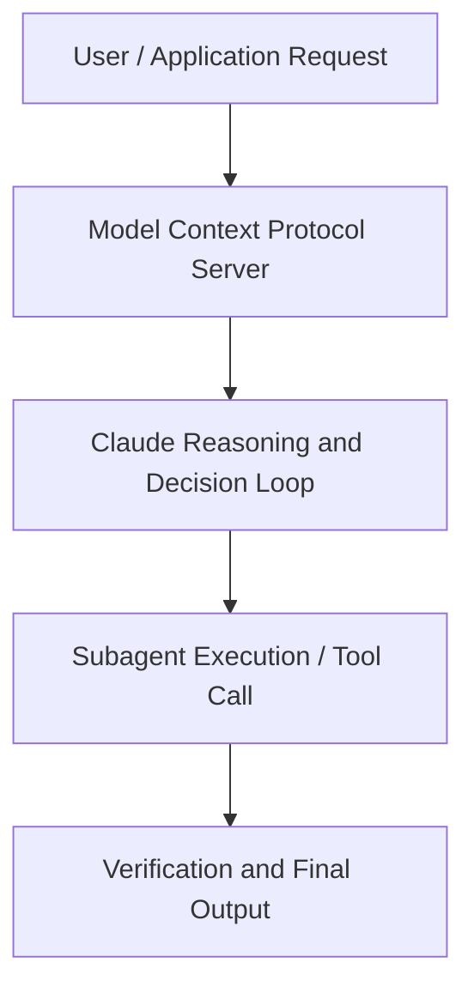

# How Anthropic and Asana Transform Work at Scale with AI Agents

**Speaker(s):** Tony Chang · **Channel:** Unlisted Videos · **Date:** 2025-08-18
**Watch:** https://youtu.be/Uxz16pu2L78 · **Format:** Talk · **Level:** Intermediate
**Topics:** AI Agents, Web Development

## TL;DR
This session explores how anthropic and asana transform work at scale with ai agents, highlighting core architecture, runtime workflows, and practical deployment patterns across AI Agents, Web Development. Speakers analyze technical implementations and share operational best practices for building robust systems with Anthropic, Asana.

## Contents
- [Architecture and Core Concepts in How Anthropic and Asana Transform Work at Sca](#architecture-and-core-concepts-in-how-anthropic-and-asana-transform-work-at-sca)
- [Technical Mechanics, Implementation Patterns, and Tooling](#technical-mechanics-implementation-patterns-and-tooling)
- [Operational Workflows, Evaluation, and Production Scaling](#operational-workflows-evaluation-and-production-scaling)
- [Strategic Implications, Governance, and Key Takeaways](#strategic-implications-governance-and-key-takeaways)

## Architecture and Core Concepts in How Anthropic and Asana Transform Work at Sca

Welcome to our webinar on transforming work at scale with AI agents. Today we're going to show you how to move beyond AI experiments to productionready systems that transform
work. You'll see Asana's journey with 170,000 plus customers and learn about multi-agent architectures. We've got two fantastic speakers today. First up, Tony Chang, who runs AI Studio at ASA and has taken them from basic AI features to complex agentic workflows. Tony will discuss ASA's AI transformation and give a live demo of their agents in action. We also have
John Seek from Anthropic's applied AI team who brings insights from multiple enterprise implementations. We'll wrap
with a panel Q&A where you can ask both speakers your questions.

**Further reading:** Official documentation for Anthropic and Anthropic platform guides.

## Technical Mechanics, Implementation Patterns, and Tooling

This
s, 52 secondsagentic loop that is the plan act reflect loop continues till the time LLM gets to a point where it understands
swhat is a good output and that's what you see as an outcome. That's what uh
s, 7 secondsagent group happens and because of this action of agents to be able to plan act
s, 13 secondsand reflect what it really does is it gives the agents sort of a superpower
s, 20 secondsright and agents really excel at certain things which is open-ended problems with unpredictable next steps. You don't know and and research is a great example
s, 29 secondsof this or core refactoring is a great example of this which is where you don't know what you kind of know the final output right but you don't know what the
s, 38 secondssteps would need to be kind of working towards that. That's where really good at that uh variable workflows that can't be prescripted. If you knew all
s, 45 secondsthe steps that needed to be taken you would already written a code for that right that's how software evolved and developed over the last 20 30 40 years. S, 54 secondsUh but agents are very good at taking those workflows where we can't really know what the next steps could be because there could be multiple of
s, 1 secondthose. They're very good at adapting and exploring new ideas that are closely related and and essentially track
s, 8 secondsprogress based on that. Understanding where based on again that environmental feedback where they need to go, what they need to do is they are very good at
s, 15 secondsthat.

**Further reading:** Official documentation for Anthropic and Anthropic platform guides.

## Operational Workflows, Evaluation, and Production Scaling

Give it a single uh prompt and then have it do the exact same thing every time. This is an
s, 30 secondsexample of a workflow step where you don't really need to uh assign this out to an AI agent to do complex thinking
s, 39 secondsbecause you're really just uh performing the same work every single time. But let's say I have something a little bit
s, 48 secondsmore complex. Um, and let's say I'm working on this marketing campaign and I need to go and figure out what should my
s, 56 secondsnext quarter's marketing calendar look like. Um, it's not necessarily easy
s, 3 secondsfor a human person to go do that. That's kind of the type of work that you'll get more ROI through uh an AI
s, 11 secondsagent where you can let them spend a little more time thinking and reasoning about it and coming up with a plan and executing on it. That will save uh
s, 20 secondsyour team time. Uh in Asana here uh I have a couple of AI agents that I've
s, 27 secondscreated.

**Further reading:** Official documentation for Anthropic and Anthropic platform guides.

## Strategic Implications, Governance, and Key Takeaways

But if it is something that like
s, 20 secondsyou know you can easily uh mitigate then probably you can think about using agents for that. Again this is just to give a guideline of how you should think about it. To make it a little
s, 28 secondsbit more practical giving an example of why coding is a great agent use case. S, 34 secondsThink about it this way right like you know writing code is a complex process going from a design doc to a PR. There
s, 42 secondsis a lot that happens in that in that process and and agents are really good at that and like you know go figure out what needs to be built go scale it out and and and kind of work on that space. S, 52 secondsIs it a high value task? Absolutely it is a high value task right we all know like you know how much it takes to really build robust code and I think
s, 1 secondthere is a lot of value that can be added especially for use cases where you have to do refactoring of code especially for use cases where you have
s, 7 secondsto do uh more uh detailed uh architecture development or something like that
s, 14 secondsis it viable yes like you know cloud code I kind of mentioned it earlier but cloud in general is great at coding at coding right we have great ratings on
s, 23 secondsbbench And finally what is the cost of error like you know relatively low we can add unit test we can have CI steps right you
s, 30 secondsknow everything in that process which would make it uh a little bit more robust and stronger so that's there and
s, 38 secondsas you think about building this I think there are some of the core principles that you can bring into the bring into
s, 45 secondsyour equation and at enthropic we have a core value which is which is says that you know do the simplest thing that works
s, 53 secondsAnd that's what I would kind of say here which is identify your problem and implement the simplest solution that you can do to address that need. The way
sto probably go about it is start small, start simple, scale up, focus on high value use cases where you can truly
s, 7 secondsdefine the value.

**Further reading:** Official documentation for Anthropic and Anthropic platform guides.

## Source
Full cleaned transcript: `DATA/videos/how-anthropic-and-asana-transform-work-2025.json`
Canonical recording: https://youtu.be/Uxz16pu2L78