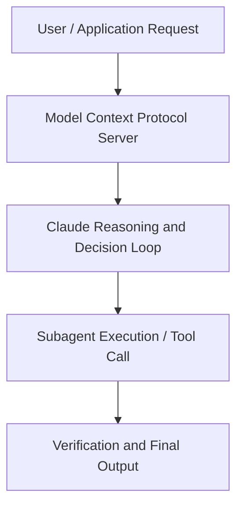

# How Anthropic works with Claude Tag in Slack

**Speaker(s):** Anthropic and Partner Leaders · **Channel:** Unlisted Videos · **Date:** 2026-07-09
**Watch:** https://anthropic.ondemand.goldcast.io/on-demand/529a2144-e333-47a2-8a9e-d10693853ba6?email=devofficialcoma@gmail.com&first_name=dev&last_name=Dev · **Format:** Talk · **Level:** Intermediate
**Topics:** Web Development, Prompt Engineering

## TL;DR
This session explores how anthropic works with claude tag in slack, highlighting core architecture, runtime workflows, and practical deployment patterns across Web Development, Prompt Engineering. Speakers analyze technical implementations and share operational best practices for building robust systems with Anthropic, Claude.

## Contents
- [Architectural Overview and System Objectives in How Anthropic works with Claude Tag in Slack](#architectural-overview-and-system-objectives-in-how-anthropic-works-with-claude-tag-in-slack)
- [Technical Capabilities, Tooling Integration, and Protocols](#technical-capabilities-tooling-integration-and-protocols)
- [Production Deployment, Verification, and Best Practices](#production-deployment-verification-and-best-practices)
- [Organizational Impact, Scalability, and Industry Outlook](#organizational-impact-scalability-and-industry-outlook)

## Architectural Overview and System Objectives in How Anthropic works with Claude Tag in Slack

Anthropic has run on @Claude in Slack for the past year. It now opens roughly 65% of our pull requests and sits in channels across engineering, GTM, support, and data science. In this session, the people who built and use Claude Tag show exactly how they work with it: the channels it lives in, the prompts they use. The session details foundational design principles, execution patterns, and operational integration requirements within the Web Development, Prompt Engineering domain.

**Further reading:** Official documentation for Anthropic and Anthropic platform guides.

## Technical Capabilities, Tooling Integration, and Protocols

Speakers analyze technical capabilities across Anthropic, Claude, Slack. The architecture highlights reliable agent tool use, context window optimization, protocol standards, and seamless workflow interoperability.

**Further reading:** Official documentation for Anthropic and Anthropic platform guides.

## Production Deployment, Verification, and Best Practices

Production readiness demands robust evaluation harnesses, state validation, and error-handling loops. Teams implement systematic monitoring and guardrails to ensure reliability across repeated executions.

**Further reading:** Official documentation for Anthropic and Anthropic platform guides.

## Organizational Impact, Scalability, and Industry Outlook

Deploying agentic systems transforms developer and team workflows by automating high-friction tasks. Organizations scale safely by pairing automated tool orchestration with structured human review.

**Further reading:** Official documentation for Anthropic and Anthropic platform guides.

## Source
Full cleaned transcript: `DATA/videos/how-anthropic-works-with-claude-tag-2026.json`
Canonical recording: https://anthropic.ondemand.goldcast.io/on-demand/529a2144-e333-47a2-8a9e-d10693853ba6?email=devofficialcoma@gmail.com&first_name=dev&last_name=Dev