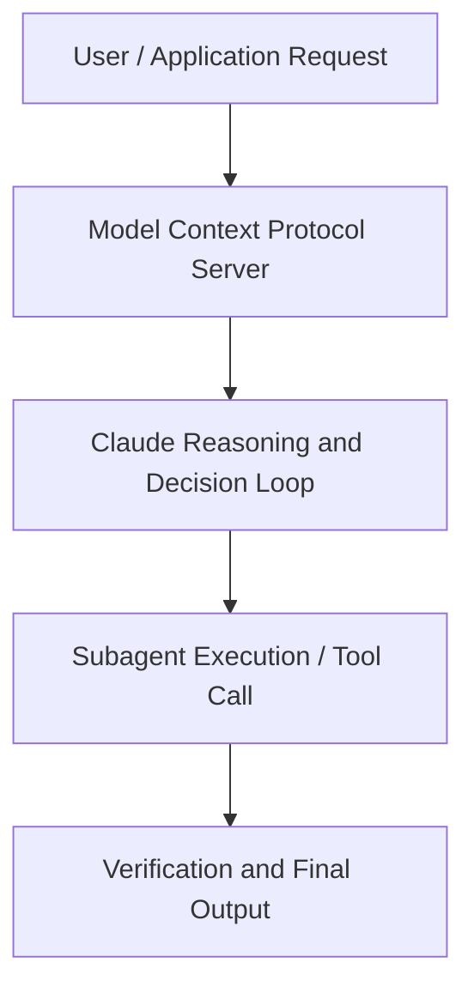

# How Anthropic's marketing team uses Claude Cowork

**Speaker(s):** Austin Lau · **Channel:** Unlisted Videos · **Date:** 2026-06-04
**Watch:** https://anthropic.ondemand.goldcast.io/on-demand/f2cff452-0e2c-4492-bae0-a735e7399269?email=devofficialcoma@gmail.com&first_name=dev&last_name=Dev · **Format:** Demo · **Level:** Intermediate
**Topics:** AI Agents, AI Coding Tools

## TL;DR
This session explores how anthropic's marketing team uses claude cowork, highlighting core architecture, runtime workflows, and practical deployment patterns across AI Agents, AI Coding Tools. Speakers analyze technical implementations and share operational best practices for building robust systems with Anthropic, Claude.

## Contents
- [Architectural Overview and System Objectives in How Anthropic's marketing team uses Claude Co](#architectural-overview-and-system-objectives-in-how-anthropics-marketing-team-uses-claude-co)
- [Technical Capabilities, Tooling Integration, and Protocols](#technical-capabilities-tooling-integration-and-protocols)
- [Production Deployment, Verification, and Best Practices](#production-deployment-verification-and-best-practices)
- [Organizational Impact, Scalability, and Industry Outlook](#organizational-impact-scalability-and-industry-outlook)

## Architectural Overview and System Objectives in How Anthropic's marketing team uses Claude Co

Austin Lau from Anthropic's growth team will share how he decides what belongs in Cowork versus chat, then demo three of the workflows he runs every week in Cowork: a morning briefing, a Google Ads search term audit, and a live reporting dashboard. The session details foundational design principles, execution patterns, and operational integration requirements within the AI Agents, AI Coding Tools domain.

**Further reading:** Official documentation for Anthropic and Anthropic platform guides.

## Technical Capabilities, Tooling Integration, and Protocols

Speakers analyze technical capabilities across Anthropic, Claude, Claude Cowork. The architecture highlights reliable agent tool use, context window optimization, protocol standards, and seamless workflow interoperability.

**Further reading:** Official documentation for Anthropic and Anthropic platform guides.

## Production Deployment, Verification, and Best Practices

Production readiness demands robust evaluation harnesses, state validation, and error-handling loops. Teams implement systematic monitoring and guardrails to ensure reliability across repeated executions.

**Further reading:** Official documentation for Anthropic and Anthropic platform guides.

## Organizational Impact, Scalability, and Industry Outlook

Deploying agentic systems transforms developer and team workflows by automating high-friction tasks. Organizations scale safely by pairing automated tool orchestration with structured human review.

**Further reading:** Official documentation for Anthropic and Anthropic platform guides.

## Source
Full cleaned transcript: `DATA/videos/how-anthropics-marketing-team-uses-claude-2026.json`
Canonical recording: https://anthropic.ondemand.goldcast.io/on-demand/f2cff452-0e2c-4492-bae0-a735e7399269?email=devofficialcoma@gmail.com&first_name=dev&last_name=Dev