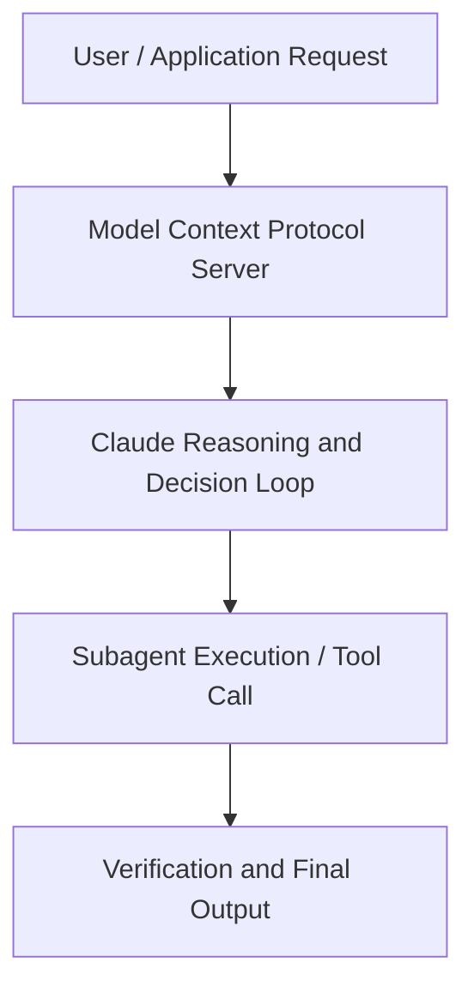

# How Anthropic’s sales team run their week with Cowork

**Speaker(s):** Travis Bryant, Brittney Tong · **Channel:** Unlisted Videos · **Date:** 2026-05-26
**Watch:** https://anthropic.ondemand.goldcast.io/on-demand/8928734f-e18b-4d7e-82af-a58cf01a288e?email=devofficialcoma@gmail.com&first_name=dev&last_name=Dev · **Format:** Talk · **Level:** Intermediate
**Topics:** AI Agents, Product/Startup

## TL;DR
This session explores how anthropic’s sales team run their week with cowork, highlighting core architecture, runtime workflows, and practical deployment patterns across AI Agents, Product/Startup. Speakers analyze technical implementations and share operational best practices for building robust systems with Anthropic, Claude.

## Contents
- [Architectural Overview and System Objectives in How Anthropic’s sales team run their week wit](#architectural-overview-and-system-objectives-in-how-anthropics-sales-team-run-their-week-wit)
- [Technical Capabilities, Tooling Integration, and Protocols](#technical-capabilities-tooling-integration-and-protocols)
- [Production Deployment, Verification, and Best Practices](#production-deployment-verification-and-best-practices)
- [Organizational Impact, Scalability, and Industry Outlook](#organizational-impact-scalability-and-industry-outlook)

## Architectural Overview and System Objectives in How Anthropic’s sales team run their week wit

Two members of Anthropic's sales team, Travis Bryant, Head of US Mid-Market GTM, and Brittney Tong, Growth Account Executive, will show some of the Claude Cowork workflows they use every week. You'll see a daily briefing that assembles your data before your first meeting, a Friday forecast pulled from Salesforce and BigQuery in the format leadership already expects, and an overnight workflow that scored 4,000 accounts so AEs knew where to focus. The session details foundational design principles, execution patterns, and operational integration requirements within the AI Agents, Product/Startup domain.

**Further reading:** Official documentation for Anthropic and Anthropic platform guides.

## Technical Capabilities, Tooling Integration, and Protocols

Speakers analyze technical capabilities across Anthropic, Claude, Claude Cowork. The architecture highlights reliable agent tool use, context window optimization, protocol standards, and seamless workflow interoperability.

**Further reading:** Official documentation for Anthropic and Anthropic platform guides.

## Production Deployment, Verification, and Best Practices

Production readiness demands robust evaluation harnesses, state validation, and error-handling loops. Teams implement systematic monitoring and guardrails to ensure reliability across repeated executions.

**Further reading:** Official documentation for Anthropic and Anthropic platform guides.

## Organizational Impact, Scalability, and Industry Outlook

Deploying agentic systems transforms developer and team workflows by automating high-friction tasks. Organizations scale safely by pairing automated tool orchestration with structured human review.

**Further reading:** Official documentation for Anthropic and Anthropic platform guides.

## Source
Full cleaned transcript: `DATA/videos/how-anthropics-sales-team-run-their-2026.json`
Canonical recording: https://anthropic.ondemand.goldcast.io/on-demand/8928734f-e18b-4d7e-82af-a58cf01a288e?email=devofficialcoma@gmail.com&first_name=dev&last_name=Dev