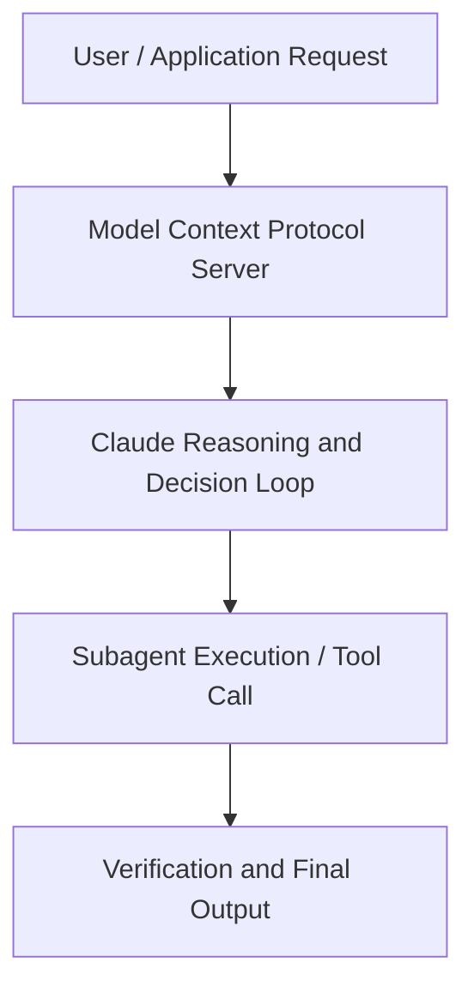

# How Cursor is pioneering new coding frontiers with Claude Opus 4

**Speaker(s):** Anthropic and Partner Leaders · **Channel:** Unlisted Videos · **Date:** 2025-06-06
**Watch:** https://youtu.be/gbypf30v6o0 · **Format:** Demo · **Level:** Advanced
**Topics:** AI Coding Tools, Web Development

## TL;DR
This session explores how cursor is pioneering new coding frontiers with claude opus 4, highlighting core architecture, runtime workflows, and practical deployment patterns across AI Coding Tools, Web Development. Speakers analyze technical implementations and share operational best practices for building robust systems with Anthropic, Claude.

## Contents
- [Architecture and Core Concepts in How Cursor is pioneering new coding frontiers](#architecture-and-core-concepts-in-how-cursor-is-pioneering-new-coding-frontiers)
- [Technical Mechanics, Implementation Patterns, and Tooling](#technical-mechanics-implementation-patterns-and-tooling)
- [Operational Workflows, Evaluation, and Production Scaling](#operational-workflows-evaluation-and-production-scaling)
- [Strategic Implications, Governance, and Key Takeaways](#strategic-implications-governance-and-key-takeaways)

## Architecture and Core Concepts in How Cursor is pioneering new coding frontiers

Welcome to our webinar on how cursor is pioneering uh the frontiers of
coding with uh Claude and Opus 4. Uh, my team and I collaborate
with our research or on bringing Claude to life for end users and developers. Before we get started, a
little bit of housekeeping. Um, if you are afraid you're missing something from this webinar or if you would like a
recording, uh, don't worry. We will be sending out the recording within 24 hours. If you have any questions, you
should see, um, a submit question widget on the right hand side of your screen. Uh, and we'll answer them as part of the fireside chat later in the session. Um, and finally, um, we've been doing a
couple of these webinars, uh, at Anthropic.

**Further reading:** Official documentation for Anthropic and Anthropic platform guides.

## Technical Mechanics, Implementation Patterns, and Tooling

I can go to the next file and it'll also
s, 50 secondspredict an edit for me um right over here. S, 58 secondsUm, so one of the reasons that TAB ends up working pretty well is we've trained kind of a custom model for this, um, with a slightly different architecture
s, 7 secondsdesign for next edits. We find that there's this really wide spectrum of how people should be using AI to code. S, 14 secondsTAB is kind of on one end of the spectrum where if you really understand um, your code and exactly what comes next, you'll want to use it. But more
s, 23 secondsand more we're finding a lot of the um features where you're less in the driver's seat and using models like opus or sonnet um you can get a lot more done
s, 31 secondsthan you could in the past. That kind of goes to the next feature and that would be uh command k and this is
s, 39 secondsbasically uh selecting some region of code and then having sonnet or opus kind of give uh an edit to it. So, I'll just
s, 46 secondsdo something super trivial like um profile for time how long this
s, 53 secondstakes. And so if you want again a fairly precise edit um this is a great feature for doing that.

**Further reading:** Official documentation for Anthropic and Anthropic platform guides.

## Operational Workflows, Evaluation, and Production Scaling

We found that these models are really good at following instructions really well. S, 30 secondsand what that means is I think there there are two big things that fall out of that. One is if you want to make really complex changes to a codebase,
s, 38 secondsyou can just describe them pretty verbosely to the rule and it will follow through more often than not. If you
s, 46 secondswant to change this widget, move this widget over there like I want this new graph, I want this new feature on my front end, whatever it might be. S, 54 secondswhereas before you might say like make it prettier. In the past that with these models like they respond better to sort of more precise guidance on what should
s, 3 secondsI you actually do. The other side effect that can be relevant when porting prompts here is
s, 9 secondsthat uh occasionally we found people with 3.7 prompts or or prompts from older models in general uh have things
s, 18 secondslike conflicting instructions or unclear instructions in their prompt. The model would kind of like gloss over before and not notice.

**Further reading:** Official documentation for Anthropic and Anthropic platform guides.

## Strategic Implications, Governance, and Key Takeaways

Then two, I think it's something you actually hit on earlier, which is users and whether it's uh in software development or other
s, 11 secondsfields, it's it's hard to know what is the first thing you start with with these systems. So having some way to like know exactly what are the best
s, 20 secondspractices um in an organic fashion, right? Do you start by giving the models the hardest question possible or
s, 27 secondsdo you figure out a way of like probing at the boundaries of like what the models can do? It's very hard to do that kind of like in a very formatted
s, 36 secondsonboarding process. Usually it's easier if you see somebody else uh making uh making the models work for them. Yeah, I
s, 45 secondsthink like the API of it is a colleague is a really interesting one and I think that's kind of like a default path given how these models are going or kind of acts as this junior junior colleague. S, 55 secondsBut I'm not sure if it's like the best possible API. I think you could do a lot better than that because like in
s, 2 secondsorgs like orgs kind of generally productivity scales sublinearly with headcount.

**Further reading:** Official documentation for Anthropic and Anthropic platform guides.

## Source
Full cleaned transcript: `DATA/videos/how-cursor-is-pioneering-new-coding-2025.json`
Canonical recording: https://youtu.be/gbypf30v6o0