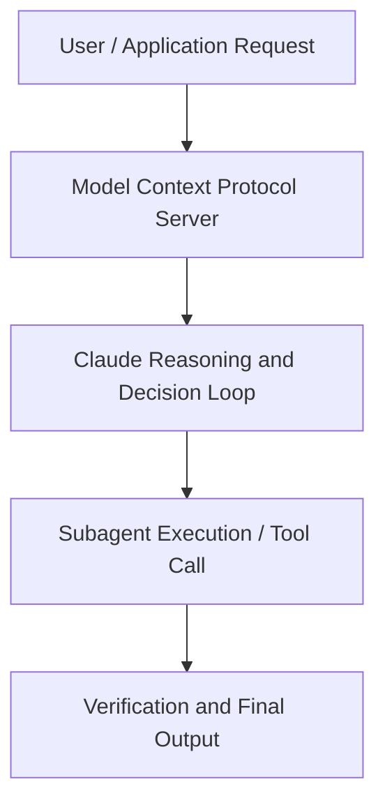

# How finance teams use Claude Cowork

**Speaker(s):** Anthropic and Partner Leaders · **Channel:** Unlisted Videos · **Date:** 2026-06-02
**Watch:** https://anthropic.ondemand.goldcast.io/on-demand/bb248461-9b1b-489a-94f9-53ca3aeddc71?email=devofficialcoma@gmail.com&first_name=dev&last_name=Dev · **Format:** Talk · **Level:** Intermediate
**Topics:** Product/Startup, AI Agents

## TL;DR
This session explores how finance teams use claude cowork, highlighting core architecture, runtime workflows, and practical deployment patterns across Product/Startup, AI Agents. Speakers analyze technical implementations and share operational best practices for building robust systems with Anthropic, Claude.

## Contents
- [Architectural Overview and System Objectives in How finance teams use Claude Cowork](#architectural-overview-and-system-objectives-in-how-finance-teams-use-claude-cowork)
- [Technical Capabilities, Tooling Integration, and Protocols](#technical-capabilities-tooling-integration-and-protocols)
- [Production Deployment, Verification, and Best Practices](#production-deployment-verification-and-best-practices)
- [Organizational Impact, Scalability, and Industry Outlook](#organizational-impact-scalability-and-industry-outlook)

## Architectural Overview and System Objectives in How finance teams use Claude Cowork

Watch Claude take on the finance work that eats up your close and your quarter. We'll show how FP&A and controllership teams (including Anthropic’s own finance team!) are using Claude Cowork across forecasting, variance, close, and consolidations , and answer your questions on what it looks like to actually roll it out. The session details foundational design principles, execution patterns, and operational integration requirements within the Product/Startup, AI Agents domain.

**Further reading:** Official documentation for Anthropic and Anthropic platform guides.

## Technical Capabilities, Tooling Integration, and Protocols

Speakers analyze technical capabilities across Anthropic, Claude, Claude Cowork. The architecture highlights reliable agent tool use, context window optimization, protocol standards, and seamless workflow interoperability.

**Further reading:** Official documentation for Anthropic and Anthropic platform guides.

## Production Deployment, Verification, and Best Practices

Production readiness demands robust evaluation harnesses, state validation, and error-handling loops. Teams implement systematic monitoring and guardrails to ensure reliability across repeated executions.

**Further reading:** Official documentation for Anthropic and Anthropic platform guides.

## Organizational Impact, Scalability, and Industry Outlook

Deploying agentic systems transforms developer and team workflows by automating high-friction tasks. Organizations scale safely by pairing automated tool orchestration with structured human review.

**Further reading:** Official documentation for Anthropic and Anthropic platform guides.

## Source
Full cleaned transcript: `DATA/videos/how-finance-teams-use-claude-cowork-2026.json`
Canonical recording: https://anthropic.ondemand.goldcast.io/on-demand/bb248461-9b1b-489a-94f9-53ca3aeddc71?email=devofficialcoma@gmail.com&first_name=dev&last_name=Dev