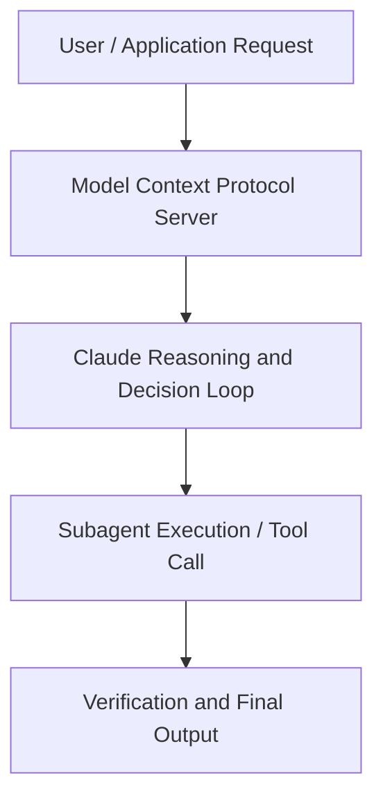

# How to ship and scale agents with Claude Managed Agents

**Speaker(s):** Anthropic and Partner Leaders · **Channel:** Unlisted Videos · **Date:** 2026-07-16
**Watch:** https://anthropic.ondemand.goldcast.io/on-demand/b984ba77-76c8-41b5-a527-0d6da8a7b2dd?email=devofficialcoma@gmail.com&first_name=dev&last_name=Dev · **Format:** Talk · **Level:** Intermediate
**Topics:** AI Agents, AI Coding Tools

## TL;DR
This session explores how to ship and scale agents with claude managed agents, highlighting core architecture, runtime workflows, and practical deployment patterns across AI Agents, AI Coding Tools. Speakers analyze technical implementations and share operational best practices for building robust systems with Anthropic, Claude.

## Contents
- [Architectural Overview and System Objectives in How to ship and scale agents with Claude Mana](#architectural-overview-and-system-objectives-in-how-to-ship-and-scale-agents-with-claude-mana)
- [Technical Capabilities, Tooling Integration, and Protocols](#technical-capabilities-tooling-integration-and-protocols)
- [Production Deployment, Verification, and Best Practices](#production-deployment-verification-and-best-practices)
- [Organizational Impact, Scalability, and Industry Outlook](#organizational-impact-scalability-and-industry-outlook)

## Architectural Overview and System Objectives in How to ship and scale agents with Claude Mana

Build and ship a working incident-investigator agent on Anthropic's Managed Agents platform: define an Agent, Environment, and Session, stream events, and wire up custom tools, all in six functions. You'll leave with a running agent, the mental model for the server-side loop, and a roadmap to production features. The session details foundational design principles, execution patterns, and operational integration requirements within the AI Agents, AI Coding Tools domain.

**Further reading:** Official documentation for Anthropic and Anthropic platform guides.

## Technical Capabilities, Tooling Integration, and Protocols

Speakers analyze technical capabilities across Anthropic, Claude, Claude Managed Agents. The architecture highlights reliable agent tool use, context window optimization, protocol standards, and seamless workflow interoperability.

**Further reading:** Official documentation for Anthropic and Anthropic platform guides.

## Production Deployment, Verification, and Best Practices

Production readiness demands robust evaluation harnesses, state validation, and error-handling loops. Teams implement systematic monitoring and guardrails to ensure reliability across repeated executions.

**Further reading:** Official documentation for Anthropic and Anthropic platform guides.

## Organizational Impact, Scalability, and Industry Outlook

Deploying agentic systems transforms developer and team workflows by automating high-friction tasks. Organizations scale safely by pairing automated tool orchestration with structured human review.

**Further reading:** Official documentation for Anthropic and Anthropic platform guides.

## Source
Full cleaned transcript: `DATA/videos/how-to-ship-and-scale-agents-2026.json`
Canonical recording: https://anthropic.ondemand.goldcast.io/on-demand/b984ba77-76c8-41b5-a527-0d6da8a7b2dd?email=devofficialcoma@gmail.com&first_name=dev&last_name=Dev