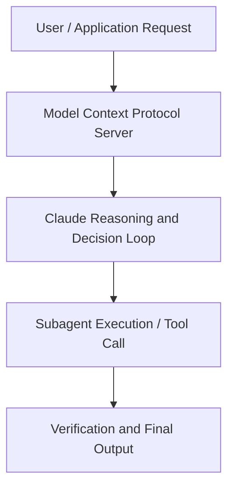

# How to transform work with Claude for Excel and Claude for PowerPoint

**Speaker(s):** Anthropic and Partner Leaders · **Channel:** Unlisted Videos · **Date:** 2026-02-12
**Watch:** https://anthropic.ondemand.goldcast.io/on-demand/f9227a1c-f9f0-4776-9ad7-9da93621f61f?email=devofficialcoma@gmail.com&first_name=dev&last_name=Dev · **Format:** Talk · **Level:** Intermediate
**Topics:** Web Development, LLM Fundamentals

## TL;DR
This session explores how to transform work with claude for excel and claude for powerpoint, highlighting core architecture, runtime workflows, and practical deployment patterns across Web Development, LLM Fundamentals. Speakers analyze technical implementations and share operational best practices for building robust systems with Claude, Claude Opus 4.

## Contents
- [Architectural Overview and System Objectives in How to transform work with Claude for Excel a](#architectural-overview-and-system-objectives-in-how-to-transform-work-with-claude-for-excel-a)
- [Technical Capabilities, Tooling Integration, and Protocols](#technical-capabilities-tooling-integration-and-protocols)
- [Production Deployment, Verification, and Best Practices](#production-deployment-verification-and-best-practices)
- [Organizational Impact, Scalability, and Industry Outlook](#organizational-impact-scalability-and-industry-outlook)

## Architectural Overview and System Objectives in How to transform work with Claude for Excel a

With significant new improvements such as Claude Opus 4.6, Cowork, Claude for Excel and Claude for PowerPoint, Claude is now purpose-built for the workflows that matter most for finance analysts, consultants, and many more. Now anyone can move from raw data to building polished, publication-ready outputs with a strong thinking partner in Claude.

Get an exclusive first look at what's possible, where you’ll hear directly from customers on delivering analyst-grade outputs with greater speed, precision, and quality than ever before The session details foundational design principles, execution patterns, and operational integration requirements within the Web Development, LLM Fundamentals domain.

**Further reading:** Official documentation for Claude and Anthropic platform guides.

## Technical Capabilities, Tooling Integration, and Protocols

Speakers analyze technical capabilities across Claude, Claude Opus 4. The architecture highlights reliable agent tool use, context window optimization, protocol standards, and seamless workflow interoperability.

**Further reading:** Official documentation for Claude and Anthropic platform guides.

## Production Deployment, Verification, and Best Practices

Production readiness demands robust evaluation harnesses, state validation, and error-handling loops. Teams implement systematic monitoring and guardrails to ensure reliability across repeated executions.

**Further reading:** Official documentation for Claude and Anthropic platform guides.

## Organizational Impact, Scalability, and Industry Outlook

Deploying agentic systems transforms developer and team workflows by automating high-friction tasks. Organizations scale safely by pairing automated tool orchestration with structured human review.

**Further reading:** Official documentation for Claude and Anthropic platform guides.

## Source
Full cleaned transcript: `DATA/videos/how-to-transform-work-with-claude-2026.json`
Canonical recording: https://anthropic.ondemand.goldcast.io/on-demand/f9227a1c-f9f0-4776-9ad7-9da93621f61f?email=devofficialcoma@gmail.com&first_name=dev&last_name=Dev