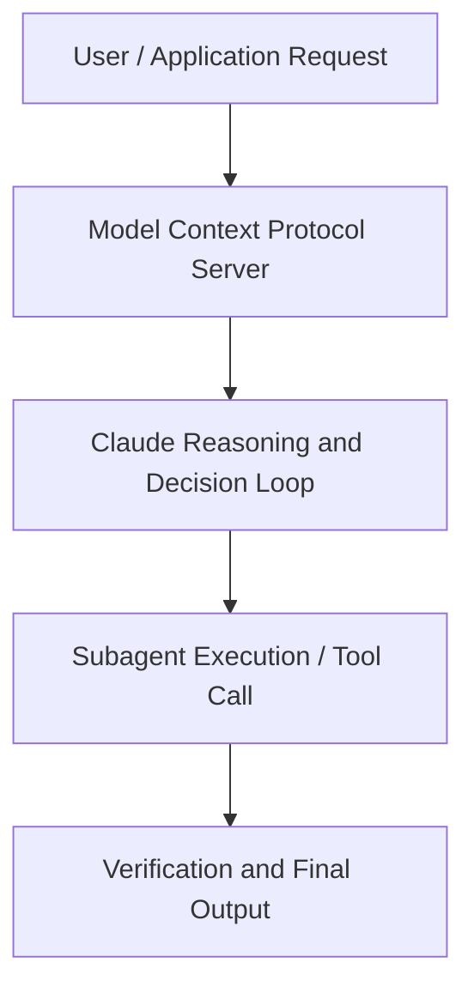

# How Warp builds self improving agents on Claude

**Speaker(s):** Zach Lloyd · **Channel:** Unlisted Videos · **Date:** 2026-05-13
**Watch:** https://anthropic.ondemand.goldcast.io/on-demand/63497838-a5c5-4daa-897b-f646174d573e?email=devofficialcoma@gmail.com&first_name=dev&last_name=Dev · **Format:** Demo · **Level:** Intermediate
**Topics:** AI Agents, AI Coding Tools

## TL;DR
This session explores how warp builds self improving agents on claude, highlighting core architecture, runtime workflows, and practical deployment patterns across AI Agents, AI Coding Tools. Speakers analyze technical implementations and share operational best practices for building robust systems with Anthropic, Claude.

## Contents
- [Architectural Overview and System Objectives in How Warp builds self improving agents on Clau](#architectural-overview-and-system-objectives-in-how-warp-builds-self-improving-agents-on-clau)
- [Technical Capabilities, Tooling Integration, and Protocols](#technical-capabilities-tooling-integration-and-protocols)
- [Production Deployment, Verification, and Best Practices](#production-deployment-verification-and-best-practices)
- [Organizational Impact, Scalability, and Industry Outlook](#organizational-impact-scalability-and-industry-outlook)

## Architectural Overview and System Objectives in How Warp builds self improving agents on Clau

Join Warp founder Zach Lloyd and Anthropic Applied AI for a technical look at self-improvement loops: how to capture human feedback signals, turn them into skill updates, and expand agents from one-off helpers into systems that compound across your org. Live demos include Warp’s PR review agent and the social listening bot they use to bring agentic workflows into community management. The session details foundational design principles, execution patterns, and operational integration requirements within the AI Agents, AI Coding Tools domain.

**Further reading:** Official documentation for Anthropic and Anthropic platform guides.

## Technical Capabilities, Tooling Integration, and Protocols

Speakers analyze technical capabilities across Anthropic, Claude. The architecture highlights reliable agent tool use, context window optimization, protocol standards, and seamless workflow interoperability.

**Further reading:** Official documentation for Anthropic and Anthropic platform guides.

## Production Deployment, Verification, and Best Practices

Production readiness demands robust evaluation harnesses, state validation, and error-handling loops. Teams implement systematic monitoring and guardrails to ensure reliability across repeated executions.

**Further reading:** Official documentation for Anthropic and Anthropic platform guides.

## Organizational Impact, Scalability, and Industry Outlook

Deploying agentic systems transforms developer and team workflows by automating high-friction tasks. Organizations scale safely by pairing automated tool orchestration with structured human review.

**Further reading:** Official documentation for Anthropic and Anthropic platform guides.

## Source
Full cleaned transcript: `DATA/videos/how-warp-builds-self-improving-agents-2026.json`
Canonical recording: https://anthropic.ondemand.goldcast.io/on-demand/63497838-a5c5-4daa-897b-f646174d573e?email=devofficialcoma@gmail.com&first_name=dev&last_name=Dev