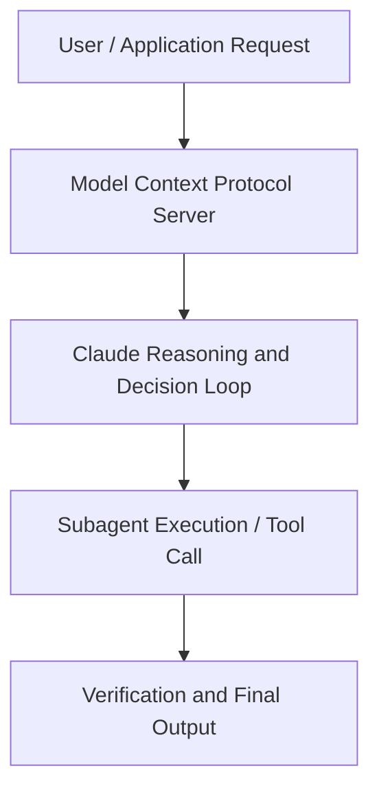

# Mastering Async Agents: Production Insights from Cognition Labs

**Speaker(s):** Anthropic and Partner Leaders · **Channel:** Unlisted Videos · **Date:** 2025-08-18
**Watch:** https://youtu.be/9oc0PYAzGg8 · **Format:** Workshop · **Level:** Advanced
**Topics:** AI Agents, Web Development

## TL;DR
This session explores mastering async agents: production insights from cognition labs, highlighting core architecture, runtime workflows, and practical deployment patterns across AI Agents, Web Development. Speakers analyze technical implementations and share operational best practices for building robust systems with Anthropic, Claude.

## Contents
- [Architecture and Core Concepts in Mastering Async Agents: Production Insights f](#architecture-and-core-concepts-in-mastering-async-agents-production-insights-f)
- [Technical Mechanics, Implementation Patterns, and Tooling](#technical-mechanics-implementation-patterns-and-tooling)
- [Operational Workflows, Evaluation, and Production Scaling](#operational-workflows-evaluation-and-production-scaling)
- [Strategic Implications, Governance, and Key Takeaways](#strategic-implications-governance-and-key-takeaways)

## Architecture and Core Concepts in Mastering Async Agents: Production Insights f

Hey everyone, welcome to this webinar on mastering async agents with cognition and
anthropic. Um, I'm Jeremy and I'm an applied AI lead at Enthropic and we have Walden here. Walden, do you want to introduce yourself? I'm one of the co-founders at Cognition. Um, so as we dive into it, just some housekeeping things. Um, if you're afraid you'll miss anything, don't worry
at all. Um, a recording of this webinar will be distributed um, over email within 24 hours to all the attendees and we'll post it as well. You can submit
questions at any time um, using the questions widget in the webinar portal um, and we'll answer it towards the end.

**Further reading:** Official documentation for Anthropic and Anthropic platform guides.

## Technical Mechanics, Implementation Patterns, and Tooling

Especially if you notice that the the models don't do it on their own. S, 46 secondsUm a few other tips here. Tool selection is really important for agents. So, we're seeing that agents are using more
s, 53 secondsand more tools. Our vision for the future is that eventually agents will be both general and capable enough to be
sable to use virtually any tool and be able to use dozens of different tools, even up to hundreds to accomplish different tasks and select the right
s, 8 secondsone. But today, uh, models are not perfect at choosing the right tool for the right context. Often you really
s, 16 secondshave to instruct them on which tool to use for different situations. So, you know, should they use the Slack search
s, 22 secondstool versus the web search tool versus a Google Drive search tool or encoding agents?

**Further reading:** Official documentation for Anthropic and Anthropic platform guides.

## Operational Workflows, Evaluation, and Production Scaling

Going back
s, 50 secondsto the the slides here, I think um one thing that we often get asked is really how can you push the
s, 59 secondstypes of tasks that these agents can work on because not everything is going to just be a quick task that you can immediately do. So one framework
s, 7 secondswhich I really like to use when thinking about these things is kind of as using these agents as a first draft maker. S, 15 secondsso if you were to draw analogies to other domains, if you think about, you know, journalism or the culinary industry, a lot of times you'll have
s, 24 secondscertain people with the job of kind of like doing the foundational work of collecting information, collecting ingredients, putting them together, um,
s, 31 secondsand basically, you know, creating the first draft of a dish or creating a first draft of an article, just making sure all the fundamental pieces are
s, 38 secondsthere. Then you have another individual who's just more generally has a higher level responsibility of making
s, 45 secondssure that things are cohesive that you verify everything, make sure it's all polished and basically finalize it for
s, 53 secondsactual, you know, publishing or sending it to to the restaurant eater uh the restaurant visitors. In in these
scases, uh you can imagine that it's it could it will be very similar to what we do in coding where eventually we're going to have a world where you have
s, 8 secondsautonomous coding agents basically going out and writing a lot of first drafts for you. You can give them initial plans. You can tell them how you would
s, 15 secondswrite the code yourself. Um, but then let it go do the actual work and still use the human as a final reviewer
s, 23 secondsbecause at the end of the day, you know, if your code crashes or if a feature doesn't look great, that'll be on you as
s, 30 secondsa person.

**Further reading:** Official documentation for Anthropic and Anthropic platform guides.

## Strategic Implications, Governance, and Key Takeaways

So, seems like it's going to the page and testing
s, 20 secondshis changes for us. So, this looks like it still will still need to continue progressing in the background, but you can imagine that, hey, as you know, this
s, 29 secondspresentation is over, I can go back and review these changes and basically prepare them to merge into the code. You can see that uh Devon actually has the
s, 37 secondsthe PR here in the end. So, I'll probably be reviewing this after after this presentation. All right, going into one of the last things here. As you kind
s, 46 secondsof saw in the demo, Devon shares a plan of the work that's going to do quite early on as as it's investigating the
s, 54 secondscode. I think planning is actually one of these uh very important things to talk about when it comes to developing a
sasync agent. Planning is not just about, you know, having some some nice UI.

**Further reading:** Official documentation for Anthropic and Anthropic platform guides.

## Source
Full cleaned transcript: `DATA/videos/mastering-async-agents-production-insights-from-2025.json`
Canonical recording: https://youtu.be/9oc0PYAzGg8