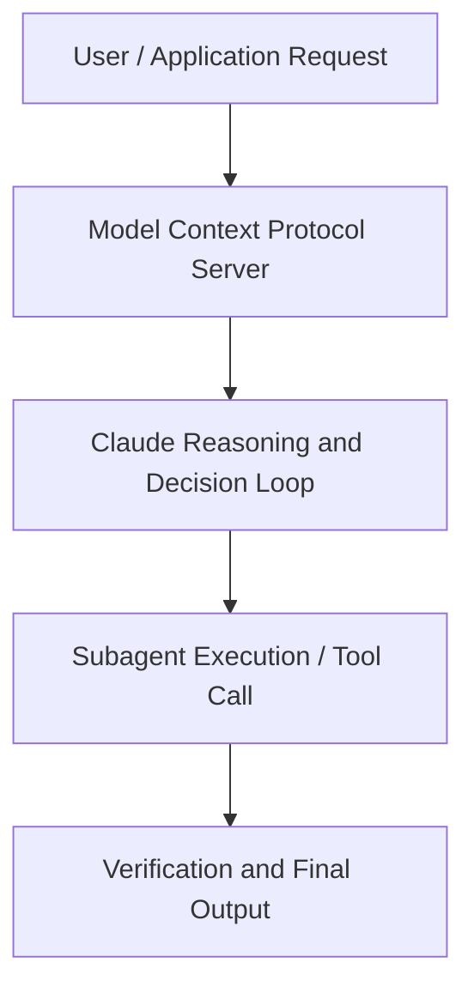

# Plan First, Ship Faster: How CodeRabbit Built Agent Orchestration on Claude

**Speaker(s):** Anthropic and Partner Leaders · **Channel:** Unlisted Videos · **Date:** 2026-04-08
**Watch:** https://anthropic.ondemand.goldcast.io/on-demand/90b5f908-1202-448f-a85e-185adfa521cd?email=devofficialcoma@gmail.com&first_name=dev&last_name=Dev · **Format:** Talk · **Level:** Advanced
**Topics:** AI Agents, Web Development

## TL;DR
This session explores plan first, ship faster: how coderabbit built agent orchestration on claude, highlighting core architecture, runtime workflows, and practical deployment patterns across AI Agents, Web Development. Speakers analyze technical implementations and share operational best practices for building robust systems with Claude, CodeRabbit.

## Contents
- [Architectural Overview and System Objectives in Plan First, Ship Faster: How CodeRabbit Built](#architectural-overview-and-system-objectives-in-plan-first-ship-faster-how-coderabbit-built)
- [Technical Capabilities, Tooling Integration, and Protocols](#technical-capabilities-tooling-integration-and-protocols)
- [Production Deployment, Verification, and Best Practices](#production-deployment-verification-and-best-practices)
- [Organizational Impact, Scalability, and Industry Outlook](#organizational-impact-scalability-and-industry-outlook)

## Architectural Overview and System Objectives in Plan First, Ship Faster: How CodeRabbit Built

AI-generated code ships fast but breaks alignment, CodeRabbit's data shows it produces 1.7x more issues than human-written code, mostly from mismatched intent. In this webinar, CodeRabbit VP of AI David Loker walks through how they built an orchestration layer on Claude that structures and validates requirements before coding agents execute, turning vague specs into reviewable plans. You'll walk away with a practical framework for reducing rework and building smarter intent-first workflows into your own AI development pipelines. The session details foundational design principles, execution patterns, and operational integration requirements within the AI Agents, Web Development domain.

**Further reading:** Official documentation for Claude and Anthropic platform guides.

## Technical Capabilities, Tooling Integration, and Protocols

Speakers analyze technical capabilities across Claude, CodeRabbit. The architecture highlights reliable agent tool use, context window optimization, protocol standards, and seamless workflow interoperability.

**Further reading:** Official documentation for Claude and Anthropic platform guides.

## Production Deployment, Verification, and Best Practices

Production readiness demands robust evaluation harnesses, state validation, and error-handling loops. Teams implement systematic monitoring and guardrails to ensure reliability across repeated executions.

**Further reading:** Official documentation for Claude and Anthropic platform guides.

## Organizational Impact, Scalability, and Industry Outlook

Deploying agentic systems transforms developer and team workflows by automating high-friction tasks. Organizations scale safely by pairing automated tool orchestration with structured human review.

**Further reading:** Official documentation for Claude and Anthropic platform guides.

## Source
Full cleaned transcript: `DATA/videos/plan-first-ship-faster-how-coderabbit-2026.json`
Canonical recording: https://anthropic.ondemand.goldcast.io/on-demand/90b5f908-1202-448f-a85e-185adfa521cd?email=devofficialcoma@gmail.com&first_name=dev&last_name=Dev