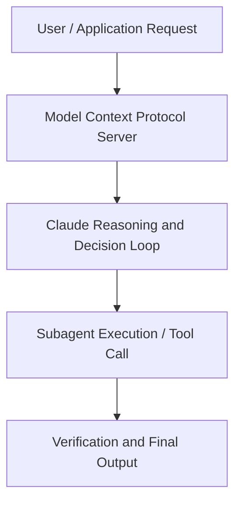

# Production-Grade Agents on Claude Sonnet 5: Live with Zed and ClickHouse

**Speaker(s):** Anthropic and Partner Leaders · **Channel:** Unlisted Videos · **Date:** 2026-07-13
**Watch:** https://anthropic.ondemand.goldcast.io/on-demand/254ffbff-c79e-421c-8e7b-2ca054e58b05?email=devofficialcoma@gmail.com&first_name=dev&last_name=Dev · **Format:** Talk · **Level:** Intermediate
**Topics:** AI Coding Tools, AI Agents

## TL;DR
This session explores production-grade agents on claude sonnet 5: live with zed and clickhouse, highlighting core architecture, runtime workflows, and practical deployment patterns across AI Coding Tools, AI Agents. Speakers analyze technical implementations and share operational best practices for building robust systems with Anthropic, Claude.

## Contents
- [Architectural Overview and System Objectives in Production-Grade Agents on Claude Sonnet 5: L](#architectural-overview-and-system-objectives-in-production-grade-agents-on-claude-sonnet-5-l)
- [Technical Capabilities, Tooling Integration, and Protocols](#technical-capabilities-tooling-integration-and-protocols)
- [Production Deployment, Verification, and Best Practices](#production-deployment-verification-and-best-practices)
- [Organizational Impact, Scalability, and Industry Outlook](#organizational-impact-scalability-and-industry-outlook)

## Architectural Overview and System Objectives in Production-Grade Agents on Claude Sonnet 5: L

Join Neel at Zed, and Ryadh at ClickHouse, alongside Musa, a member of Anthropic's Technical Staff, for an inside look at how they're running real agentic workloads on Claude Sonnet 5 , in production, at scale. The session details foundational design principles, execution patterns, and operational integration requirements within the AI Coding Tools, AI Agents domain.

**Further reading:** Official documentation for Anthropic and Anthropic platform guides.

## Technical Capabilities, Tooling Integration, and Protocols

Speakers analyze technical capabilities across Anthropic, Claude, Claude Sonnet 5. The architecture highlights reliable agent tool use, context window optimization, protocol standards, and seamless workflow interoperability.

**Further reading:** Official documentation for Anthropic and Anthropic platform guides.

## Production Deployment, Verification, and Best Practices

Production readiness demands robust evaluation harnesses, state validation, and error-handling loops. Teams implement systematic monitoring and guardrails to ensure reliability across repeated executions.

**Further reading:** Official documentation for Anthropic and Anthropic platform guides.

## Organizational Impact, Scalability, and Industry Outlook

Deploying agentic systems transforms developer and team workflows by automating high-friction tasks. Organizations scale safely by pairing automated tool orchestration with structured human review.

**Further reading:** Official documentation for Anthropic and Anthropic platform guides.

## Source
Full cleaned transcript: `DATA/videos/production-grade-agents-on-claude-sonnet-2026.json`
Canonical recording: https://anthropic.ondemand.goldcast.io/on-demand/254ffbff-c79e-421c-8e7b-2ca054e58b05?email=devofficialcoma@gmail.com&first_name=dev&last_name=Dev