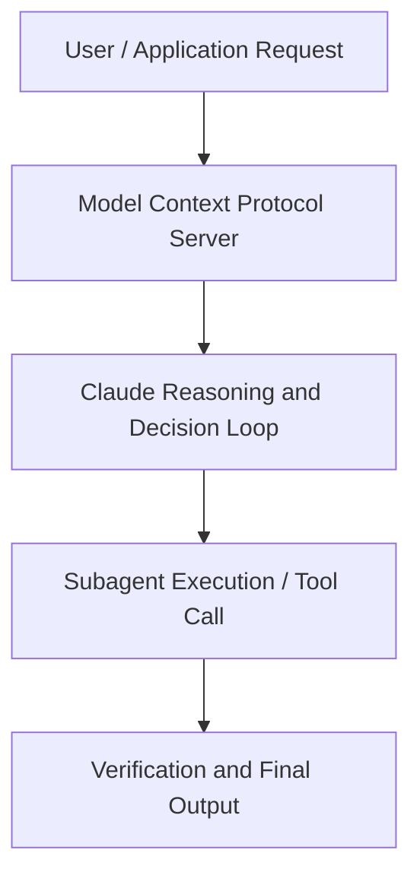

# Scaling AI Agent Development at Netflix: Production Insights with Claude Sonnet 4.5

**Speaker(s):** Claude Sonnet · **Channel:** Unlisted Videos · **Date:** 2025-12-03
**Watch:** https://youtu.be/N91ANP_AvxY · **Format:** Demo · **Level:** Advanced
**Topics:** AI Coding Tools, AI Agents

## TL;DR
This session explores scaling ai agent development at netflix: production insights with claude sonnet 4.5, highlighting core architecture, runtime workflows, and practical deployment patterns across AI Coding Tools, AI Agents. Speakers analyze technical implementations and share operational best practices for building robust systems with Anthropic, Claude.

## Contents
- [Architecture and Core Concepts in Scaling AI Agent Development at Netflix: Prod](#architecture-and-core-concepts-in-scaling-ai-agent-development-at-netflix-prod)
- [Technical Mechanics, Implementation Patterns, and Tooling](#technical-mechanics-implementation-patterns-and-tooling)
- [Operational Workflows, Evaluation, and Production Scaling](#operational-workflows-evaluation-and-production-scaling)
- [Strategic Implications, Governance, and Key Takeaways](#strategic-implications-governance-and-key-takeaways)

## Architecture and Core Concepts in Scaling AI Agent Development at Netflix: Prod

Uh, welcome to today's webinar, scaling AI agent development at Netflix production
insights with Claude Sonnet 4.5. I'm a product manager at Anthropic. Uh, I work on the research
team and get the privilege of helping to develop some of our core models. Most notably recently, I was the product lead
for Sonnet 4.5 and Haiku 4.5. Uh, and so I'm really excited today to get the opportunity to uh speak with the Netflix
team here and dig into all the incredible things that they're doing with these models. Uh, so one, uh,
questions can be submitted at any time using the questions widget in the webinar portal that's off to your right hand side. Uh, second, uh, please give
us feedback. Uh, we would love to know what you think.

**Further reading:** Official documentation for Anthropic and Anthropic platform guides.

## Technical Mechanics, Implementation Patterns, and Tooling

I think that kind of that collaboration with us as humans is what
s, 23 secondsallows us to scale. Human productivity uh and develop some really amazing use cases. With that, I'm going to go ahead and hand it over to
s, 31 secondsthe Netflix team so we can hear more about what they have done in building out their Genai platform and how they have been able to apply Sonnet 4.5 and
s, 40 secondscloud code uh internally. When Eric Adam and I started talking about the most effective way to talk about developer productivity at
s, 48 secondsNetflix, uh we sort of realized that in order to tell the story most usefully, um we should probably start by talking about some of the AI specialized tooling
s, 56 secondsthat we built in our platform and that we gave access to the developer productivity team too to do the awesome work they're going to talk to you about. S, 3 secondsAnd that really leads us to the Netflix genai platform. First and foremost, I kind of want to speak to our team's
s, 10 secondsfocus, providing exceptional tools for Netflix teams to build things powered by AI. There's a little bit of subtlety to
s, 17 secondsthe phrasing of this mission, building tools for teams to build things that are powered by AI. That's distinct from what
s, 27 secondsthe developer productivity team is focused on, which is how we can best use AI to build pretty much anything you can imagine.

**Further reading:** Official documentation for Anthropic and Anthropic platform guides.

## Operational Workflows, Evaluation, and Production Scaling

That as claude
s, 8 secondscode starts up essentially it queries our back end. There's some resolution to give a computed profile back. It's
s, 16 secondsnot as simple as like there's just one profile defined across the business. S, 20 secondsLike there are global profiles, but we we're able to compute that into a profile that represents something appropriate for the team the developer
s, 28 secondssits in, the codebase they're currently looking at, security factors, etc. S, 33 secondsThere's lots of things that can go into that resolution. S, 37 secondsSo as basically in that startup process, you get the profile, it is then configured. Like we drop just in time
s, 45 secondsthe configuration for MCP tools and anything else. Like plugins or commands we can we can deal with all of this for for the assistant so that when
s, 52 secondscl code just comes up it's just ready to go.

**Further reading:** Official documentation for Anthropic and Anthropic platform guides.

## Strategic Implications, Governance, and Key Takeaways

Maybe like digging into some of the technical details that you
s, 2 secondsshared. Can you talk about how the context delivery architecture handles conflicting or outdated documentation? S, 9 secondsLike what if the agent just gets bad context? What do you do to detect that? S, 13 secondsHow do you correct that? Can you expand on that a bit? Yeah, I have a funny story about that. Uh turns out the first thing I built with Sonnet 4.5 uh
s, 24 secondswas AI workflow quality tools which include docs faithfulness checks which evaluate these instructions and the
s, 31 secondsdocumentation claims and look for these conflicts and we were able to identify some real conflicts in some of our
s, 38 secondsworkflows and documentation that we had to address.

**Further reading:** Official documentation for Anthropic and Anthropic platform guides.

## Source
Full cleaned transcript: `DATA/videos/scaling-ai-agent-development-at-netflix-2025.json`
Canonical recording: https://youtu.be/N91ANP_AvxY