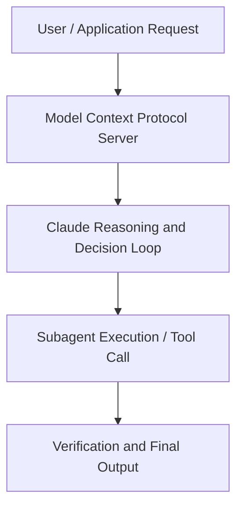

# Scaling Development with Remote Agents: Best Practices and Deep Dive with Augment Code

**Speaker(s):** Leor Newman · **Channel:** Unlisted Videos · **Date:** 2025-07-08
**Watch:** https://youtu.be/MUbUyMZPLQ0 · **Format:** Workshop · **Level:** Advanced
**Topics:** AI Agents, Web Development

## TL;DR
This session explores scaling development with remote agents: best practices and deep dive with augment code, highlighting core architecture, runtime workflows, and practical deployment patterns across AI Agents, Web Development. Speakers analyze technical implementations and share operational best practices for building robust systems with Anthropic, Box.

## Contents
- [Architecture and Core Concepts in Scaling Development with Remote Agents: Best](#architecture-and-core-concepts-in-scaling-development-with-remote-agents-best)
- [Technical Mechanics, Implementation Patterns, and Tooling](#technical-mechanics-implementation-patterns-and-tooling)
- [Operational Workflows, Evaluation, and Production Scaling](#operational-workflows-evaluation-and-production-scaling)
- [Strategic Implications, Governance, and Key Takeaways](#strategic-implications-governance-and-key-takeaways)

## Architecture and Core Concepts in Scaling Development with Remote Agents: Best

Welcome everyone to the scaling development with remote agents webinar. My name is Cal and I'm very honored today to be joined by Leor Newman, member of technical staff at Augment
Code for this presentation and discussion. Before we get going, um few things. One, this we are recording this session um and you will get a link to it in the
next 24 hours. You have if you have to leave early or if you want to share this with a friend or a teammate, it will be available to you. There will be a Q&A portion on the back half of this webinar. So you can submit questions as they come up in the
webinar portal. I believe it is on the right.

**Further reading:** Official documentation for Anthropic and Anthropic platform guides.

## Technical Mechanics, Implementation Patterns, and Tooling

Uh, and thanks everyone for joining us. I'm a technical staff at
s, 22 secondsAugment. I'm also a product lead for remote agents and I'm very excited to share with you what they are, what they
s, 29 secondsdo and how we build them. At Augment, we build for real software engineers at scale and production. We're built for
s, 38 secondsprofessionals working on large code bases. One of the things that makes augment code different is our context
s, 45 secondsengine. We're able to retrieve the relevant context from your codebase to the best coding model. In this case,
s, 52 secondscloud core to give you the best results for you and your team.

**Further reading:** Official documentation for Anthropic and Anthropic platform guides.

## Operational Workflows, Evaluation, and Production Scaling

Instead of guessing at what might be the best approach, we can rapidly prototype, iterate, test, and converge on real
s, 4 secondsdecision based on real metrics. At Augment, today we constantly have prototypes floating around. Many of the features in a product that you see today
s, 13 secondsbegan as a prototype built with an agent. By trying multiple approaches simultaneously, uh we can quickly converge using real data and best
s, 21 secondsapproaches to productionize without arguing about what what approach might be the best. S, 29 secondsIn the future, we'll invest in agent orchestration and allow agents to communicate with each other. This will
s, 36 secondsunlock longer and more complex tasks and allow for context sharing between agents. Thanks to Entropic and everyone
s, 44 secondson the call for sharing uh your time with us. We're happy to bring it back to call and take questions from the audience.

**Further reading:** Official documentation for Anthropic and Anthropic platform guides.

## Strategic Implications, Governance, and Key Takeaways

So, I think that's a super interesting uh psychological topic uh because like we have seen what you're describing, we have seen that even in
s, 48 secondsour in our team internally uh more senior developers are actually taking more time to adopt these tools than uh
s, 56 secondsyounger developers. And uh on the other hand we are seeing a small percentage of more senior developers
s, 4 secondsthat are very eager to try the bleeding edge stuff. And what we've seen with them is that like these senior
s, 12 secondsdevelopers are able to actually leverage them to a much further extent than the junior developers because they're able
s, 19 secondsto do a lot more in a lot less time. The review process is more efficient. S, 25 secondsthey can uh leverage uh the the the agents to sort of explore the codebase and give them insights. I I think
s, 34 secondsthat we will see gradually that senior developers are catching up in terms of understanding how to leverage the tools
s, 41 secondsfor their use cases but we're we're seeing some of that stuck in the old ways. S, 46 secondsYeah, that sounds similar to uh some of that's similar to what we see in anthropics. Now as part of uh technical onboarding we have a whole session set aside for using cloud code.

**Further reading:** Official documentation for Anthropic and Anthropic platform guides.

## Source
Full cleaned transcript: `DATA/videos/scaling-development-with-remote-agents-best-2025.json`
Canonical recording: https://youtu.be/MUbUyMZPLQ0