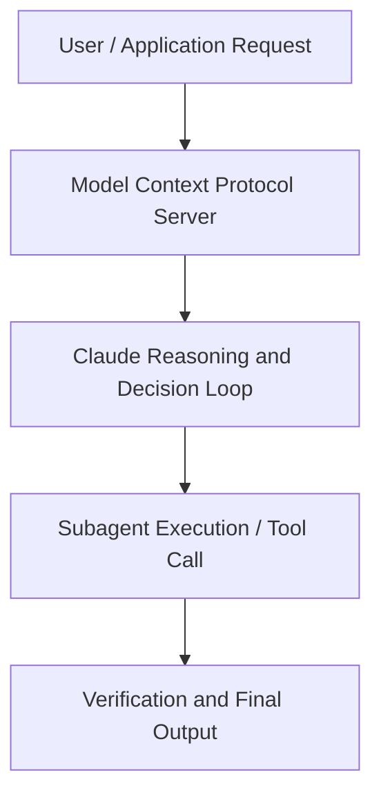

# Securing & Governing Claude: the Compliance API and Security Integrations

**Speaker(s):** Anthropic and Partner Leaders · **Channel:** Unlisted Videos · **Date:** 2026-06-05
**Watch:** https://anthropic.ondemand.goldcast.io/on-demand/d81d3156-fa4d-4449-8075-058399dd543e?email=devofficialcoma@gmail.com&first_name=dev&last_name=Dev · **Format:** Talk · **Level:** Intermediate
**Topics:** Backend/Infra, Web Development

## TL;DR
This session explores securing & governing claude: the compliance api and security integrations, highlighting core architecture, runtime workflows, and practical deployment patterns across Backend/Infra, Web Development. Speakers analyze technical implementations and share operational best practices for building robust systems with Anthropic, Claude.

## Contents
- [Architectural Overview and System Objectives in Securing & Governing Claude: the Compliance A](#architectural-overview-and-system-objectives-in-securing-governing-claude-the-compliance-a)
- [Technical Capabilities, Tooling Integration, and Protocols](#technical-capabilities-tooling-integration-and-protocols)
- [Production Deployment, Verification, and Best Practices](#production-deployment-verification-and-best-practices)
- [Organizational Impact, Scalability, and Industry Outlook](#organizational-impact-scalability-and-industry-outlook)

## Architectural Overview and System Objectives in Securing & Governing Claude: the Compliance A

Join Anthropic’s Product team to learn about recent launches to help you secure and govern Claude across your organization. In 30 minutes, we’ll show how the Claude Compliance API gives Primary Owners programmatic access to their organization’s usage data , activity events, chats, files, and projects , and how Claude plugs into the security stack your team already runs. Built for Enterprise plan admins and security, compliance, and governance teams, with a preview of what’s coming and time for Q&A. The session details foundational design principles, execution patterns, and operational integration requirements within the Backend/Infra, Web Development domain.

**Further reading:** Official documentation for Anthropic and Anthropic platform guides.

## Technical Capabilities, Tooling Integration, and Protocols

Speakers analyze technical capabilities across Anthropic, Claude, Projects. The architecture highlights reliable agent tool use, context window optimization, protocol standards, and seamless workflow interoperability.

**Further reading:** Official documentation for Anthropic and Anthropic platform guides.

## Production Deployment, Verification, and Best Practices

Production readiness demands robust evaluation harnesses, state validation, and error-handling loops. Teams implement systematic monitoring and guardrails to ensure reliability across repeated executions.

**Further reading:** Official documentation for Anthropic and Anthropic platform guides.

## Organizational Impact, Scalability, and Industry Outlook

Deploying agentic systems transforms developer and team workflows by automating high-friction tasks. Organizations scale safely by pairing automated tool orchestration with structured human review.

**Further reading:** Official documentation for Anthropic and Anthropic platform guides.

## Source
Full cleaned transcript: `DATA/videos/securing-governing-claude-the-compliance-api-2026.json`
Canonical recording: https://anthropic.ondemand.goldcast.io/on-demand/d81d3156-fa4d-4449-8075-058399dd543e?email=devofficialcoma@gmail.com&first_name=dev&last_name=Dev