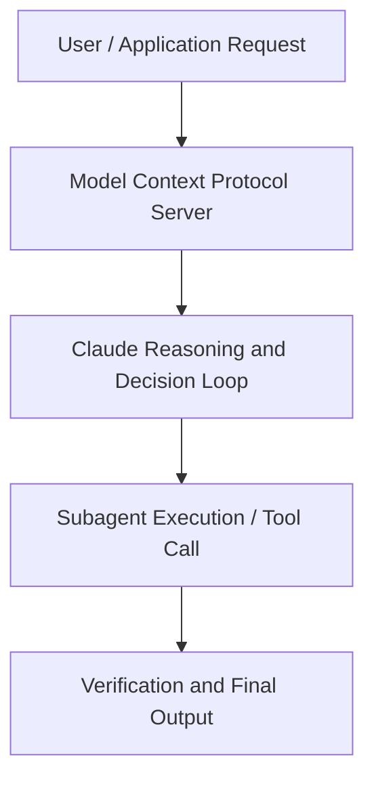

# Ship Code Faster with Claude Code on Vertex AI

**Speaker(s):** Anthropic and Partner Leaders · **Channel:** Unlisted Videos · **Date:** 2026-04-29
**Watch:** https://anthropic.ondemand.goldcast.io/on-demand/8ece3570-86d5-4165-bfbe-f9a221c7502d?email=devofficialcoma@gmail.com&first_name=dev&last_name=Dev · **Format:** Demo · **Level:** Intermediate
**Topics:** AI Coding Tools, Backend/Infra

## TL;DR
This session explores ship code faster with claude code on vertex ai, highlighting core architecture, runtime workflows, and practical deployment patterns across AI Coding Tools, Backend/Infra. Speakers analyze technical implementations and share operational best practices for building robust systems with Claude, Claude Code.

## Contents
- [Architectural Overview and System Objectives in Ship Code Faster with Claude Code on Vertex A](#architectural-overview-and-system-objectives-in-ship-code-faster-with-claude-code-on-vertex-a)
- [Technical Capabilities, Tooling Integration, and Protocols](#technical-capabilities-tooling-integration-and-protocols)
- [Production Deployment, Verification, and Best Practices](#production-deployment-verification-and-best-practices)
- [Organizational Impact, Scalability, and Industry Outlook](#organizational-impact-scalability-and-industry-outlook)

## Architectural Overview and System Objectives in Ship Code Faster with Claude Code on Vertex A

Explore how to build and access Claude Code on Vertex AI to accelerate your development workflows. In this technical webinar, we'll walk through Claude Code's capabilities and how to set it up on Vertex AI. Through live demonstrations, you'll see how Claude Code handles real coding tasks end to end so you can start building with confidence on Vertex AI. We’ll also answer some of the top developer community questions for building with Claude on Vertex AI. The session details foundational design principles, execution patterns, and operational integration requirements within the AI Coding Tools, Backend/Infra domain.

**Further reading:** Official documentation for Claude and Anthropic platform guides.

## Technical Capabilities, Tooling Integration, and Protocols

Speakers analyze technical capabilities across Claude, Claude Code, Vertex AI. The architecture highlights reliable agent tool use, context window optimization, protocol standards, and seamless workflow interoperability.

**Further reading:** Official documentation for Claude and Anthropic platform guides.

## Production Deployment, Verification, and Best Practices

Production readiness demands robust evaluation harnesses, state validation, and error-handling loops. Teams implement systematic monitoring and guardrails to ensure reliability across repeated executions.

**Further reading:** Official documentation for Claude and Anthropic platform guides.

## Organizational Impact, Scalability, and Industry Outlook

Deploying agentic systems transforms developer and team workflows by automating high-friction tasks. Organizations scale safely by pairing automated tool orchestration with structured human review.

**Further reading:** Official documentation for Claude and Anthropic platform guides.

## Source
Full cleaned transcript: `DATA/videos/ship-code-faster-with-claude-code-2026-2.json`
Canonical recording: https://anthropic.ondemand.goldcast.io/on-demand/8ece3570-86d5-4165-bfbe-f9a221c7502d?email=devofficialcoma@gmail.com&first_name=dev&last_name=Dev