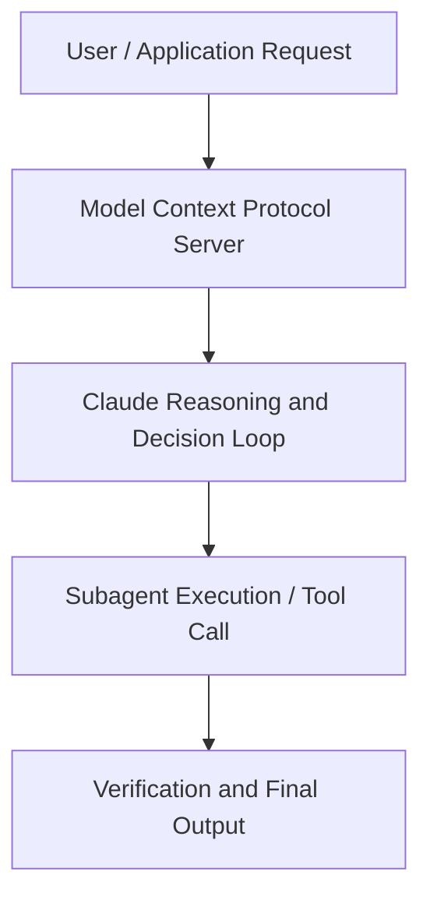

# The Future of AI at Work: Introducing Cowork

**Speaker(s):** Boris Cherny, Mikaela Grace, Nicole Sim · **Channel:** Unlisted Videos · **Date:** 2026-02-10
**Watch:** https://youtu.be/zfWfczd6keE · **Format:** Demo · **Level:** Beginner
**Topics:** Web Development, AI Agents

## TL;DR
This session explores the future of ai at work: introducing cowork, highlighting core architecture, runtime workflows, and practical deployment patterns across Web Development, AI Agents. Speakers analyze technical implementations and share operational best practices for building robust systems with Anthropic, Box.

## Contents
- [Architecture and Core Concepts in The Future of AI at Work: Introducing Cowork](#architecture-and-core-concepts-in-the-future-of-ai-at-work-introducing-cowork)
- [Technical Mechanics, Implementation Patterns, and Tooling](#technical-mechanics-implementation-patterns-and-tooling)
- [Operational Workflows, Evaluation, and Production Scaling](#operational-workflows-evaluation-and-production-scaling)
- [Strategic Implications, Governance, and Key Takeaways](#strategic-implications-governance-and-key-takeaways)

## Architecture and Core Concepts in The Future of AI at Work: Introducing Cowork

Thank you so much for joining today to chat about co-work. I believe this is our biggest webinar
ever. I work in product marketing here at Enthropic and I lead
the marketing launch of co-work. Fun fact, this was a project that I was tasked with, you know, five days before launch, a timeline which would not have
been possible if I wasn't heavily using co-work. Just a few quick housekeeping notes before we begin. So if you're afraid to step
away, if you're afraid to, you know, turn away for a little bit, do not worry. A recording of this webinar will be distributed via email um within 24
hours. You have any questions, don't wait till the end of the webinar.

**Further reading:** Official documentation for Anthropic and Anthropic platform guides.

## Technical Mechanics, Implementation Patterns, and Tooling

The way we do it is just like really simple. We have a
s, 47 secondsspreadsheet. Every, you know, row is a thing that we're we're doing this week and then next to every row is an engineer's name. So what I do now a
s, 55 secondscouple times a week is if a engineer didn't fill out their status, I ask co-work, can you open the spreadsheet and then can you like message every engineer on Slack if they didn't fill it
s, 3 secondsout? And you know while I go you know get a tea um I don't have to sit there and wait. S, 11 secondsthis is the second aha moment. Then the third one is do stuff in parallel. S, 15 secondsThis is something that we saw people doing with quad code and it was actually very surprising because the agent kind of takes a long time to work right like
s, 23 secondsit has to read the context.

**Further reading:** Official documentation for Anthropic and Anthropic platform guides.

## Operational Workflows, Evaluation, and Production Scaling

Yeah, I mean I work a lot with
s, 17 secondswith large enterprise and so I'm really excited about just the ability to come to you where you work. It's like I've
s, 26 secondsgot a complicated Excel model on my desktop or in the files and I can actually just have Claude work with that directly, change it directly, make new
s, 33 secondsversions, do pretty complicated analyses um on my desktop where I live. I think that that's a really just like wonderful feature that makes everyone's lives just
s, 41 secondsa little bit easier. Um, and then I've seen some really playful ones um that kind of they're about in some way
s, 49 secondsgetting to know Claude. Um, so I saw a video somewhere where someone had asked Claude like what it might let it go shopping with the browser extension and asked what it wanted to buy, you know. S, 59 secondsUm, and I think that that kind of thing where you know you can play with Claude, understand where where it would go and what it's up to is a very fun sort of use case. One closing question before we move on to the next section. So, where do you see co-work in five years?

**Further reading:** Official documentation for Anthropic and Anthropic platform guides.

## Strategic Implications, Governance, and Key Takeaways

It'll all be in kind of reasonable and easy to edit text
s, 57 secondsboxes and icons that you can separate from the other text on the page without having to do any gymnastics. S, 4 secondsSo Claude has given us everything we need and we are ready for our MBR. We've done a lot of modeling and we understand our sales. S, 12 secondsThere we have it. Claude as our as a co-orker. Nicole, do you want to hop to Q&A or you're on it? I guess next section, let's jump into maybe a quick section on just how to get started and then we'll go into Q&A. I know there are a lot of questions coming as well.

**Further reading:** Official documentation for Anthropic and Anthropic platform guides.

## Source
Full cleaned transcript: `DATA/videos/the-future-of-ai-at-work-2026.json`
Canonical recording: https://youtu.be/zfWfczd6keE