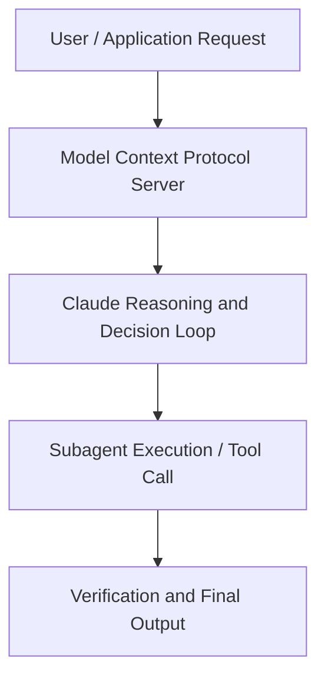

# Transform Legacy Systems into Strategic Assets: Code Modernization with AI

**Speaker(s):** Anthropic and Partner Leaders · **Channel:** Unlisted Videos · **Date:** 2025-11-13
**Watch:** https://youtu.be/8qtSeQuNv0o · **Format:** Talk · **Level:** Intermediate
**Topics:** AI Coding Tools, Web Development

## TL;DR
This session explores transform legacy systems into strategic assets: code modernization with ai, highlighting core architecture, runtime workflows, and practical deployment patterns across AI Coding Tools, Web Development. Speakers analyze technical implementations and share operational best practices for building robust systems with Anthropic, Claude.

## Contents
- [Architecture and Core Concepts in Transform Legacy Systems into Strategic Asset](#architecture-and-core-concepts-in-transform-legacy-systems-into-strategic-asset)
- [Technical Mechanics, Implementation Patterns, and Tooling](#technical-mechanics-implementation-patterns-and-tooling)
- [Operational Workflows, Evaluation, and Production Scaling](#operational-workflows-evaluation-and-production-scaling)
- [Strategic Implications, Governance, and Key Takeaways](#strategic-implications-governance-and-key-takeaways)

## Architecture and Core Concepts in Transform Legacy Systems into Strategic Asset

Mustafa and I'm the head of partner marketing at Enthropic and I'm genuinely pumped to be hosting this session today
on code modernization with Enthropic and our partners Deoid. Just a quick set of housekeeping notes and I'm sure I'll make it painless. I promise first we're recording this bad
boy. If you need to step away or your cat walks across your keyboard, don't stress it. We'll get you the full
recording in your mailbox within 24 hours. Second, please, please, please ask questions. The questions widget on the right hand side of your screen, use it. We got some really smart
people here today.

**Further reading:** Official documentation for Anthropic and Anthropic platform guides.

## Technical Mechanics, Implementation Patterns, and Tooling

Claude analyzed the program
s, 24 secondsformerly known as CBAC4C and identified complex cobalt patterns like line break processing and
s, 32 secondsmulti-file coordination. Claude developed a migration plan for this feature with five phases. Two, translate
s, 41 secondsdata models from copy books to Java classes. Three, build the IO layer compatible with the original file formats. Four, convert business logic
s, 50 secondswhile preserving Cobalt specific behaviors. Finally create a dual test harness. One using GNU Cobalt 3.2.0
s, 57 secondsfor the original codebase and one in Java 17. The resulting Java code went beyond a simple syntax translation.

**Further reading:** Official documentation for Anthropic and Anthropic platform guides.

## Operational Workflows, Evaluation, and Production Scaling

Now with the newer platform, this is where the new approach, the groundbreaking things come up. We're able to go do the scan and discovery of
s, 42 secondsthe entire platform across the board and be able to scan it to figure it out how many applications are there. What's with each of the
s, 51 secondsinterfaces and dependency between this application? If we have modify one of them, what's the what's the impact of fallout radius both from interfaces from
sa data and dependency of the application functional flow? We're able to articulate all of that in a very high
s, 7 secondsrich fidelity way. That changes a confidence to the you know clients and business stakeholders to say what they needed. Think about this approach is
s, 16 secondsmoving from risk mitigation to business value first. We prioritize application core to business what it takes to do number one.

**Further reading:** Official documentation for Anthropic and Anthropic platform guides.

## Strategic Implications, Governance, and Key Takeaways

That changes a confidence building measure. How do we bring them along? That's the way we approach it. When we go to the
sboardroom, we try to share the risk number one. Number two, we find a way to build a confidence in a quicker time frame than taking a multiple years to
s, 9 secondsshow the road map. That's that's the way we are approaching. This is like the final question for the fireside and then we'll open up to uh the listeners questions. S, 19 secondsUm you know this is one of my favorite topics to talk about.

**Further reading:** Official documentation for Anthropic and Anthropic platform guides.

## Source
Full cleaned transcript: `DATA/videos/transform-legacy-systems-into-strategic-assets-2025.json`
Canonical recording: https://youtu.be/8qtSeQuNv0o